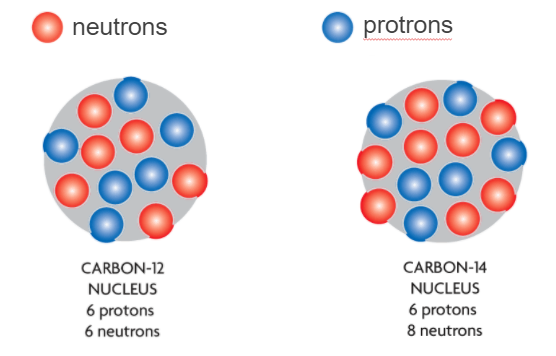
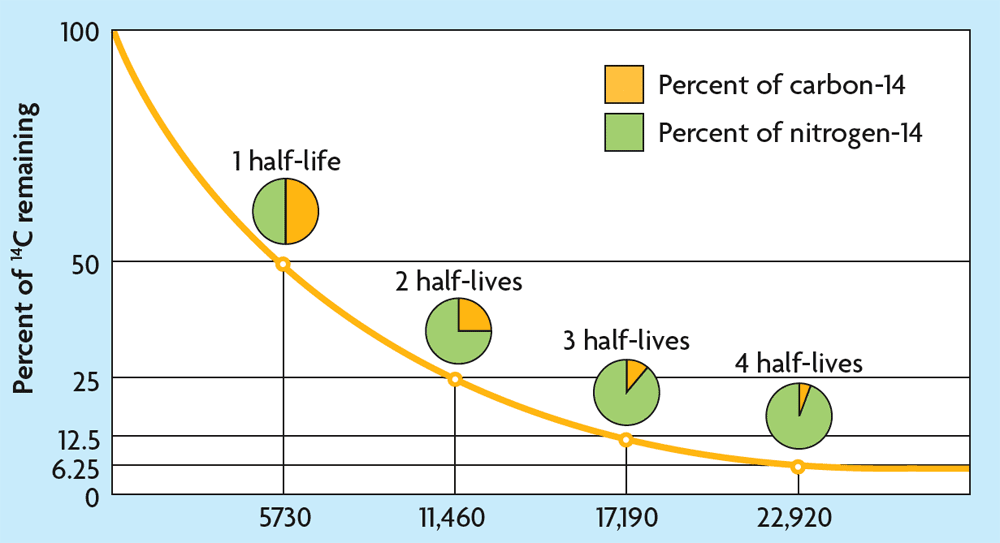
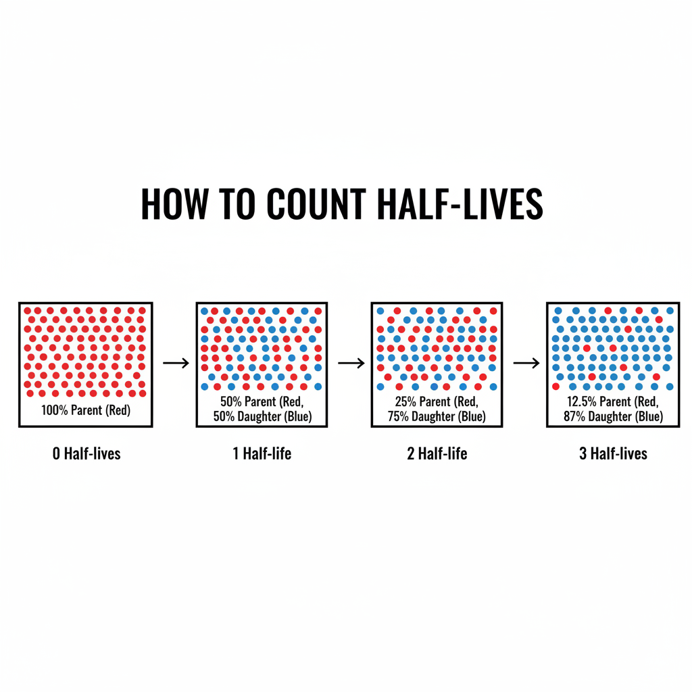
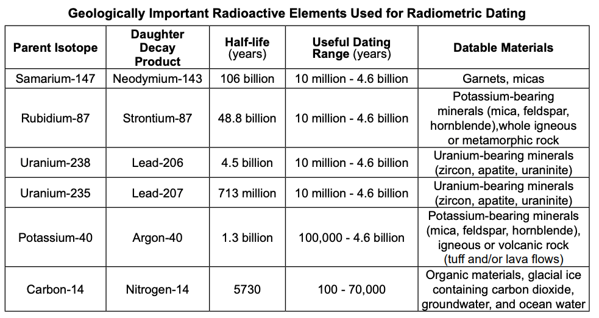
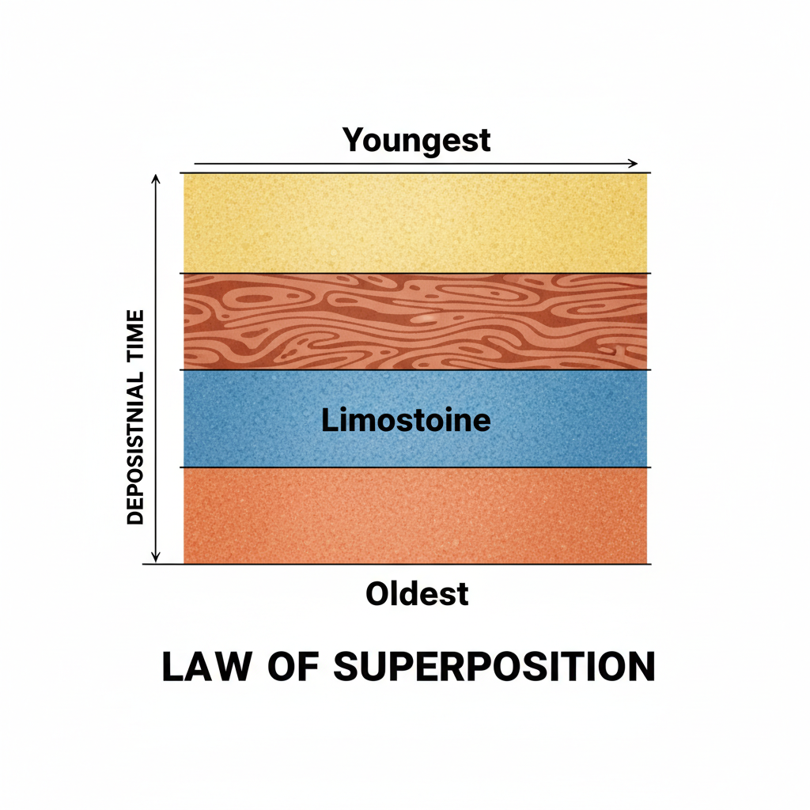
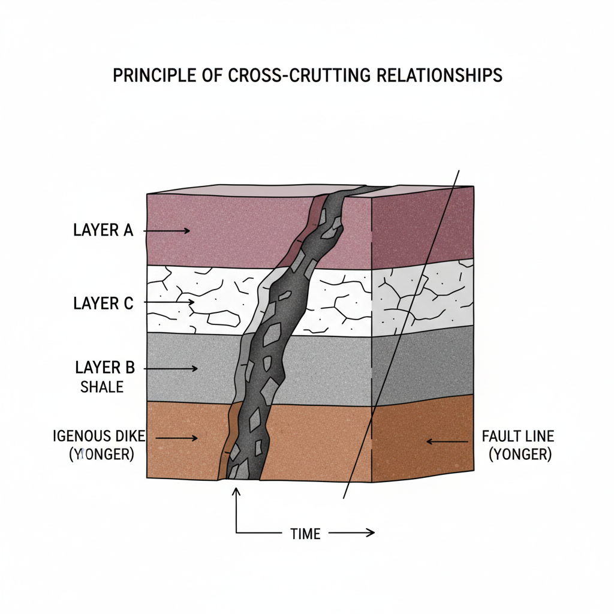
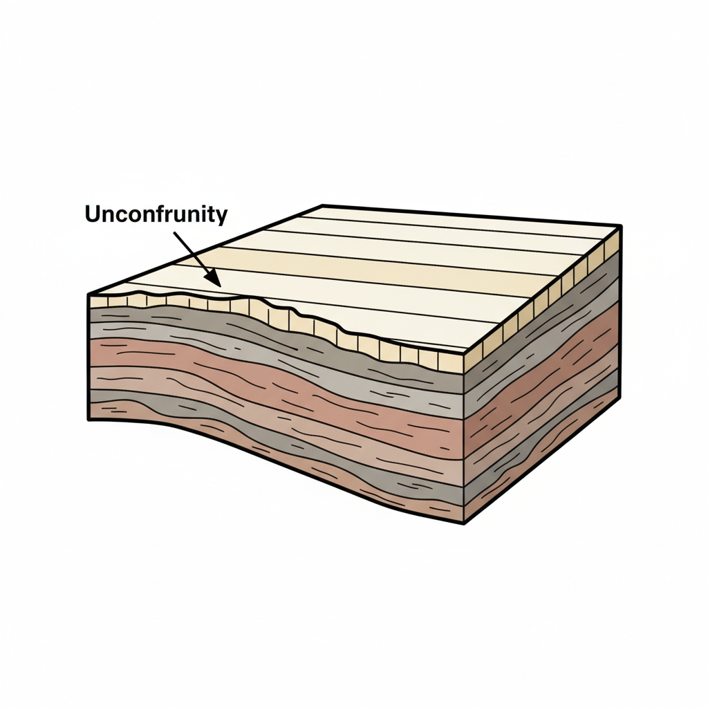

# Geologic Dating
### Regents Earth Science

- **Relative Dating**: Determining the order of past events without determining their absolute age.
- **Absolute Dating**: Determining the numerical age of rocks and fossils.

---

<!--
TODO: Add specific examples or practice questions from the "Relative Dating" PDF.
Since the text extraction was limited, please review the original PDF and add any specific diagrams or questions here.
-->

# Part 2: Absolute Dating

---

## Absolute Dating Basics

- Absolute dating determines the numerical age of rocks and fossils.
- Common methods: radiometric dating (e.g., radiocarbon, uranium–lead, potassium–argon).
- Used to build a timeline of Earth’s history.

---

## Radioactive Decay Basics

- Unstable **parent** isotopes decay into stable **daughter** isotopes.
- Decay follows an exponential law characterized by **half-life**.
- **Half-life**: time for half of the parent atoms to decay.

---

## Visualizing Half-Life

- As time passes, the amount of parent isotope decreases by half for each half-life.
- The curve never truly reaches zero.

---

## Counting Half-Lives

- **0 Half-Lives**: 100% Parent
- **1 Half-Life**: 50% Parent, 50% Daughter
- **2 Half-Lives**: 25% Parent, 75% Daughter
- **3 Half-Lives**: 12.5% Parent, 87.5% Daughter

---

## Radiocarbon (Carbon-14) Dating

- Carbon-14 is produced in the atmosphere and incorporated into living organisms.
- After death, C-14 decays; no new C-14 is added.
- Effective dating range: up to ~50,000 years.
- Measured via ratio of C-14 to stable C-12/C-13.

---

## Example

### Carbon has a half life of $5.7 \times 10^3$ years

If Carbon-14 goes through 2 half lives...

1) How many years will go by?
    * 5,700 x 2 = 11,400 years
2) What % of the original mass will remain?
    * 25%
3) What % of daughter product will you have?
    * 75%
4) What is the daughter product?
    * Nitrogen-14

---

<iframe width="1100" height="600" src="https://www.youtube.com/embed/phZeE7Att_s?si=WPMtXoAPdP8jUNG_" title="YouTube video player" frameborder="0" allow="accelerometer; autoplay; clipboard-write; encrypted-media; gyroscope; picture-in-picture; web-share" referrerpolicy="strict-origin-when-cross-origin" allowfullscreen></iframe>

---

---

## Assumptions and Calibration

- Closed system: no gain/loss of C after death.
- Known initial C-14/C-12 ratio (requires standards).
- Calibration with tree-ring data and other archives accounts for past atmospheric variation.

---

## Other Radiometric Methods

- **Uranium–Lead**: zircon crystals; ages from millions to billions of years.
- **Potassium–Argon / Argon–Argon**: volcanic rocks; >100,000 years.
- **Rubidium–Strontium, Samarium–Neodymium**: metamorphic/igneous contexts.

---

## Applications

- **Archeology**: dating artifacts and human remains.
- **Paleontology**: constraining fossil ages via volcanic layers.
- **Quaternary geology**: glacial/interglacial timelines.
- **Climate records**: lake sediments, peat, cave deposits.

---

## Limits and Sources of Error

- Contamination (modern carbon, conservation materials).
- Reservoir effects (marine vs terrestrial carbon).
- Measurement precision, sample preservation.
- Beyond method range → large uncertainty.

---

# Part 2: Relative Dating

---

## Relative vs. Absolute Dating

- **Relative Dating**
  - "This rock is older than that rock."
  - Uses laws of stratigraphy.
  - No specific numbers.

- **Absolute Dating**
  - "This rock is 1.2 million years old."
  - Uses radiometric dating.
  - Specific numbers.

---

## Principles of Relative Dating

1. **Law of Superposition**
2. **Principle of Original Horizontality**
3. **Principle of Cross-Cutting Relationships**
4. **Inclusions**
5. **Unconformities**

---

## Law of Superposition

- In an undeformed sequence of sedimentary rocks, each layer is **older** than the one above it and **younger** than the one below it.
- *Bottom = Oldest*
- *Top = Youngest*

---

## Principle of Original Horizontality

- Layers of sediment are generally deposited in a **horizontal** position.
- If rock layers are flat, it means they have not been disturbed.
- If they are folded or tilted, the disturbance happened **after** deposition.

---

## Principle of Cross-Cutting Relationships

- An igneous intrusion or a fault that cuts through rock layers is **younger** than the rocks it cuts.
- The "cutter" is younger than the "cuttee".

---

## Inclusions

- Pieces of one rock unit that are contained within another.
- The rock containing the inclusion is **younger** than the inclusion itself.
- The inclusion had to exist *before* it could get stuck in the new rock.

---

## Unconformities

- A break in the geologic record created when rock layers are eroded or when sediment is not deposited for a long period of time.
- Represents a "gap" in time.
- **Angular Unconformity**: Tilted or folded sedimentary rocks are overlain by younger, more flat-lying strata.

---

## Index Fossils

- Fossils used to define and identify geologic periods.
- **Characteristics of a good index fossil:**
    1. Widespread geographically (found everywhere).
    2. Existed for a short period of time (short geologic range).
    3. Abundant (easy to find).
    4. Easy to identify.

---

---

## Quiz

2) The half-life of carbon-14 is approximately:
- A) 573 years
- B) 5,730 years
- C) 57,300 years
- D) 730 years  
<!-- **Answer: B** -->

---

## Quiz

3) A sample has one-quarter of its original C-14 remaining. About how old is it?
- A) 2,865 years
- B) 5,730 years
- C) 11,460 years
- D) 17,190 years  
<!-- **Answer: C** -->

---

## Quiz

4) Which statement about half-life is correct?
- A) It varies with temperature.
- B) It is the time for all parent atoms to decay.
- C) It is constant for a given isotope.
- D) It increases as more atoms decay.  
<!-- **Answer: C** -->

---

## Quiz

5) Why is calibration needed for radiocarbon dates?
- A) To account for changes in atmospheric C-14 over time
- B) To convert BP to CE only
- C) To adjust for sample mass
- D) To remove contamination automatically  
<!-- **Answer: A** -->

---

## Exit Ticket

- Define half-life in your own words.
- Explain one limitation of radiocarbon dating.
- Identify one context where uranium–lead is preferred.

---

# References

- USGS and NOAA materials on radiometric dating.
- Standard Earth Science Regents references.
- Course notes and lab activities.

---

# Next: Lab Prep

- Plan: measure simulated decay and fit an exponential model.
- Materials: counters, graphing tools, sample scenarios.
- Safety: handling and data integrity (no actual radioisotopes).
