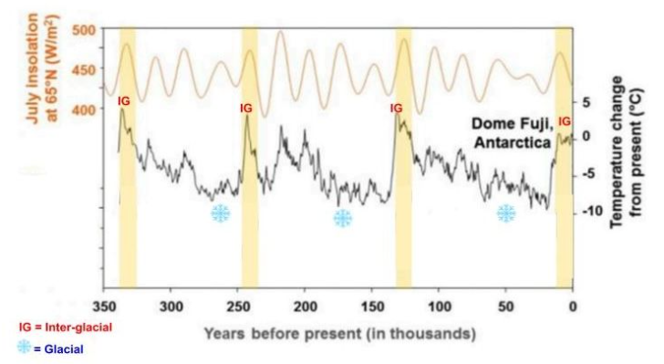
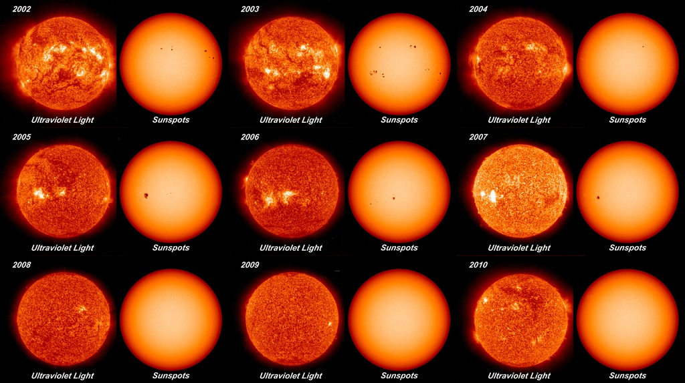

<!-- _class: title-slide -->

# 🌍 Earth-Sun Dynamics
## Unit 4: Climate Change — Earth and Space Science
### How do we know that natural cycles aren't causing climate change today?

---

<!-- _class: phase-title -->

# ENGAGE
## How has the amount of radiation reaching Earth varied in the past?

---

# The Big Questions

- How do we know that climate change isn't happening because of **natural cycles**?
- How has the amount of **radiation (sunlight)** reaching Earth varied in the past?
- Does the amount of radiation the Sun produces **vary over time**?
- Did natural factors contribute to **temperature changes** during Earth's past?
- Do they contribute to **global warming today**?

---

# How Do Scientists Know About the Past?

Scientists reconstruct Earth's climate history using **proxy data**:

- **Ice cores** — Trapped air bubbles reveal atmospheric composition; oxygen isotopes indicate temperature
- **Tree rings** — Width and density reflect growing conditions
- **Ocean sediments** — Fossils and chemistry record ocean temperatures

These records extend **800,000+ years** into the past.

Scientists also use **mathematical models** to calculate how much solar energy (insolation) reached Earth at different times and latitudes.

---

# Why 65°N Latitude?

- **Ice sheets** form and grow at **high latitudes**
- Scientists discovered a strong correlation between **summer insolation at 65°N** and the timing of **glacial-interglacial cycles**
- Summer matters because it determines whether **ice melts faster than it accumulates**

> **🔑 Key Idea:** If summer insolation at 65°N is high enough, more ice melts in summer than forms in winter → ice sheets **shrink**. If summer insolation is low, ice sheets **grow**.

---

# Glacial and Interglacial Periods

**Glacial periods** (Ice Ages)
- Cooler global temperatures
- Large ice sheets cover high latitudes
- Lower sea levels
- Last ~90,000 years each

**Interglacial periods**
- Warmer global temperatures
- Reduced ice sheet coverage
- Higher sea levels
- Last ~10,000–15,000 years each

The cycle repeats approximately every **~100,000 years**.

*We are currently in an interglacial period (the Holocene).*

---

# Insolation and Temperature Over 350,000 Years

*Refer to the graph in your packet.*

What to look for:
- **Temperature line** — cycles between glacial and interglacial periods
- **July insolation at 65°N** — rises and falls in a cyclical pattern
- The two patterns appear to **rise and fall together**

---

# Correlation vs. Causation

**Correlation** — Two variables appear to be related; when one changes, the other tends to change in a predictable way.

**Causation** — One variable directly *causes* the other to change. There is a **mechanism** that explains *why* and *how*.

We observe a **correlation** between insolation at 65°N and glacial-interglacial cycles.

### The question we need to answer:
> Is there a **causal mechanism** that explains this relationship? What evidence do we need?

---

<!-- _class: phase-title -->

# EXPLORE
## How does Earth's position affect the amount of radiation reaching Earth's surface?

---

# Three Orbital Factors

As Earth orbits the Sun, three things change over tens to hundreds of thousands of years:

| Factor | What Changes | Cycle Length |
|--------|-------------|-------------|
| **Precession** | The *direction* Earth's axis points | ~26,000 years |
| **Obliquity** | The *degree* of Earth's axial tilt | ~41,000 years |
| **Eccentricity** | The *shape* of Earth's orbit | ~100,000 years |

These are called **Milankovitch Cycles**, named after Serbian scientist **Milutin Milanković** who calculated their effects on Earth's climate.

---

<video height = "600" controls src="149_axial_precession.m4v" title="Title"></video>

---

# Orbital Factor 1: Precession
### *The direction of Earth's tilt with respect to the Sun*

**Cycle length: ~26,000 years**

- Earth's axis **wobbles** like a spinning top
- This changes **which hemisphere** faces the Sun when Earth is closest (perihelion) vs. farthest (aphelion)

**Configuration A:**
NH tilted toward Sun at **perihelion** (closer)
→ More intense NH summers

**Configuration B:**
NH tilted toward Sun at **aphelion** (farther)
→ Less intense NH summers

---

# Precession: Key Takeaways

### Does precession change the total radiation reaching Earth?
**No.** The total annual energy Earth receives stays roughly the same.

### Does it change radiation at 65°N?
**Yes!** Precession **redistributes** energy between hemispheres and seasons.

- When NH is tilted toward the Sun at perihelion → **more** intense summer radiation at 65°N
- When NH is tilted toward the Sun at aphelion → **less** intense summer radiation at 65°N

Precession changes **when** each hemisphere gets the most intense sunlight — not **how much** total energy Earth receives.

---

<video height = "600" controls src="146_obliquity_with_border.m4v" title="Title"></video>

---

# Orbital Factor 2: Obliquity
### *The degree of Earth's axial tilt*

**Cycle length: ~41,000 years**

Earth's tilt varies between **22.1°** and **24.5°**
*(Currently ~23.4° and decreasing)*

**Less tilt (22.1°)**
- Milder seasons
- Less direct sunlight at high latitudes
- Less extreme difference between summer and winter

**More tilt (24.5°)**
- More extreme seasons
- More direct sunlight at high latitudes in summer
- Greater difference between summer and winter

---

# Obliquity: Key Takeaways

### Does obliquity change the total radiation reaching Earth?
**No.** The total annual energy stays roughly the same.

### Does it change radiation at 65°N?
**Yes!** Greater tilt means sunlight hits 65°N at a **more direct angle** during summer.

- **More tilt** → more direct summer radiation at 65°N → **warmer** high-latitude summers
- **Less tilt** → less direct summer radiation at 65°N → **cooler** high-latitude summers

Obliquity changes the **angle** at which sunlight strikes high latitudes, which changes how **concentrated** the energy is.

---

<video height = "600" controls src="143_eccentricity_with_border.m4v" title="Title"></video>

---

# Orbital Factor 3: Eccentricity
### *The shape of Earth's orbit*

**Cycle length: ~100,000 years**

Earth's orbit changes from nearly **circular** to more **elliptical** and back.

**Low eccentricity** (nearly circular)
- Small difference between perihelion and aphelion distances
- Seasons less affected by orbital distance

**High eccentricity** (more elliptical)
- Larger difference between closest and farthest approach
- Orbital distance has a bigger effect on seasonal intensity

*Current eccentricity is relatively low (~0.017).*

---

# Eccentricity: Key Takeaways

### Does eccentricity change the total radiation reaching Earth?
**Yes, slightly.** Higher eccentricity increases total annual radiation by a small amount.

### Does it change radiation at 65°N?
**Yes.** Higher eccentricity means a bigger difference between perihelion and aphelion seasons.

Eccentricity **amplifies** the effects of precession. When eccentricity is high, the difference between being close to or far from the Sun matters more — so precession has a bigger impact on seasonal intensity.

---

# Summary: Three Factors Working Together

| Factor | Changes... | Timescale | Effect on 65°N |
|--------|-----------|-----------|----------------|
| **Precession** | Direction of tilt | ~26 kyr | Redistributes seasonal energy between hemispheres |
| **Obliquity** | Degree of tilt | ~41 kyr | Changes angle/concentration of sunlight at high latitudes |
| **Eccentricity** | Orbit shape | ~100 kyr | Amplifies seasonal differences; slightly changes total energy |

> No single factor alone explains glacial-interglacial cycles. It is the **combined effect** of all three that drives the pattern.

---

<!-- _class: phase-title -->

# EXPLAIN — Part 1
## Did changes in Earth's position cause glacial-interglacial cycles?

---

# Applying Our Models to Real Data

We will now use what we learned about the three orbital factors to analyze **specific time periods** in the glacial-interglacial record:

| Time Period | Climate Transition |
|------------|-------------------|
| **144 kya → 130 kya** | Glacial → Interglacial |
| **130 kya → 113 kya** | Interglacial → Glacial |
| **25 kya → 9 kya** | Glacial → Interglacial |

For each period, we will examine how each orbital factor changed, predict the effect on 65°N summer insolation, and compare to the actual data.

---

# Features of a Good Explanatory Model

Models are used to represent a system under study. Explanatory models should:

1. **Represent** real-world objects or ideas
2. **Illustrate and/or predict** relationships between components of a system
3. Use **scientific vocabulary** and labels
4. Provide a **scientific mechanism** for what you are claiming
5. Be based on **real data**

### Your task:
Analyze the orbital factor data → Predict the effect on 65°N insolation and ice sheets → Compare predictions to the actual glacial-interglacial graph

---

# Period 1: 144 kya → 130 kya

| Factor | 144 kya | 130 kya | Change |
|--------|---------|---------|--------|
| **Eccentricity** | min 145.6 / max 153.6 Mkm | min 143.8 / max 155.4 Mkm | ↑ Higher (more elliptical) |
| **Tilt** | 22.6° | 24.25° | ↑ Increased |
| **Precession** | NH toward Sun when closer (−) | NH toward Sun when closer (−) | No major change |

### What should happen?
- **Tilt increased** → more direct radiation at 65°N in summer
- **Eccentricity increased** → amplifies seasonal differences
- Both factors **increase** summer insolation at 65°N

---

# 144 kya → 130 kya: Prediction & Check

### Prediction:
- Summer insolation at 65°N should **increase**
- Ice sheets should **shrink** (melting > accumulation)
- Expect a transition from **glacial → interglacial**

### Does the data match?
✅ **Yes!** The July insolation graph shows increasing insolation, and the temperature record shows the transition from glacial to interglacial conditions during this period.

*This is the onset of the Eemian interglacial — the last warm period before our current one.*

---

# Period 2: 130 kya → 113 kya

| Factor | 130 kya | 113 kya | Change |
|--------|---------|---------|--------|
| **Eccentricity** | min 143.8 / max 155.4 Mkm | min 143.6 / max 155.6 Mkm | Remained high |
| **Tilt** | 24.25° | 22.25° | ↓ Decreased |
| **Precession** | NH toward Sun when closer (−) | NH away from Sun when closer (+) | **Shifted** |

### What should happen?
- **Tilt decreased** → less direct radiation at 65°N in summer
- **Precession shifted** → NH summer now at aphelion (farther from Sun)
- **Eccentricity still high** → amplifies the precession shift
- All factors **decrease** summer insolation at 65°N

---

# 130 kya → 113 kya: Prediction & Check

### Prediction:
- Summer insolation at 65°N should **decrease**
- Ice sheets should **grow** (accumulation > melting)
- Expect a transition from **interglacial → glacial**

### Does the data match?
✅ **Yes!** The July insolation graph shows decreasing insolation, and the temperature record shows the transition back to glacial conditions.

*This is the end of the Eemian interglacial and the beginning of the last ice age.*

---

# Period 3: 25 kya → 9 kya

| Factor | 25 kya | 9 kya | Change |
|--------|--------|-------|--------|
| **Eccentricity** | min 147.36 / max 151.84 Mkm | min 146.61 / max 152.59 Mkm | Slightly ↑ (still low) |
| **Tilt** | 22.3° | 24.25° | ↑ Increased significantly |
| **Precession** | NH away from Sun when closer (+) | NH away from Sun when closer (+) | No major change |

### What should happen?
- **Tilt increased significantly** (22.3° → 24.25°) → much more direct radiation at 65°N
- This is the **dominant factor** — tilt drives the warming
- Eccentricity is low, so precession effects are muted

---

# 25 kya → 9 kya: Prediction & Check

### Prediction:
- Summer insolation at 65°N should **increase** (driven by tilt)
- Ice sheets should **shrink**
- Expect a transition from **glacial → interglacial**

### Does the data match?
✅ **Yes!** This corresponds to the end of the last ice age and the transition into our current interglacial period (the **Holocene**).

The Laurentide ice sheet that once covered much of North America melted during this period, raising sea levels by ~120 meters.

---

# Summary: Orbital Factors and Glacial Cycles

The three Milankovitch cycles — **eccentricity** (~100 kyr), **obliquity** (~41 kyr), and **precession** (~26 kyr) — primarily change the **distribution** of solar energy across latitudes and seasons.

When their effects combine to **increase** summer insolation at 65°N → ice sheets melt → **interglacial**

When they combine to **decrease** summer insolation at 65°N → ice sheets grow → **glacial**

The ~100,000-year glacial cycle matches eccentricity's timescale, but it is the **combined effect of all three** that drives the cycle.

---

<!-- _class: phase-title -->

# EXPLAIN — Part 2
## Testing Our Explanation with a Computational Model

---

# The Vostok Ice Core

- A collaborative ice-drilling project (Russia & U.S., 1998)
- Drilled at **Vostok Station** in East Antarctica
- Reached a depth of **3,623 meters**
- Trapped air in ice reveals changes in atmospheric composition
- Provides a **400,000-year** temperature record

### Key Vocabulary

| Term | Definition |
|------|-----------|
| **Perihelion** | Point in orbit where Earth is **closest** to the Sun |
| **Aphelion** | Point in orbit where Earth is **farthest** from the Sun |

---

# Current Earth-Sun Configuration

For today's orbital configuration:

- **Summer solstice** (NH summer) occurs near **aphelion** — Earth is **farther** from the Sun
- **Winter solstice** (NH winter) occurs near **perihelion** — Earth is **closer** to the Sun
- Earth's axis tilts **toward** the Sun during aphelion
- Earth's axis tilts **away from** the Sun during perihelion

> This means Northern Hemisphere summers are currently **less intense** than they could be if summer occurred at perihelion. Precession is currently in an **unfavorable** configuration for strong NH summers.

---

# Tilt and Orbit in New York

How do tilt and orbit determine solar radiation in New York (~41°N)?

**Summer (NH tilted toward Sun):**
- Sunlight strikes at a **more direct angle**
- Days are **longer** (more hours of sunlight)
- More energy delivered per square meter

**Winter (NH tilted away from Sun):**
- Sunlight strikes at a **lower, more oblique angle**
- Days are **shorter** (fewer hours of sunlight)
- Less energy delivered per square meter

Currently Earth is closest to the Sun in **January** (winter), which slightly *moderates* NH seasonal extremes.

---

# Testing Each Factor Against Vostok Data

Using the computational model, we overlay each orbital factor against the Vostok temperature record:

| Factor Alone | Correlates with Temperature? |
|-------------|----------------------------|
| **Eccentricity only** | ❌ No — peaks/valleys don't align well with temperature |
| **Precession only** | ❌ No — ~26 kyr cycle is too short to match ~100 kyr glacial cycle |
| **Tilt only** | ✅ Partially — better match than either alone, but not perfect |
| **All three combined** | ✅✅ **Best match** — most closely tracks temperature over 400,000 years |

---

# Key Finding: Combined Factors

When all three Milankovitch cycles are combined, the resulting pattern **most closely matches** the Vostok temperature record over 400,000 years.

**No single factor alone** can explain glacial-interglacial cycles. It is the **interaction of all three** that produces the pattern.

### But it's not perfect...
There are areas where the orbital factor line and temperature **don't match perfectly**. This tells us that **other factors** also influence temperature:
- Greenhouse gas feedbacks (CO₂, CH₄)
- Ice-albedo feedbacks
- Ocean circulation changes

*These will be investigated in upcoming 5E sequences.*

---

# From Correlation to Causation

We can now say we have established a **causal link**:

1. **Mechanism:** Physical models showed *how* each orbital factor changes radiation at 65°N
2. **Correlation:** Computational model showed the combined orbital factors *track* with temperature data
3. **Prediction:** We successfully predicted glacial/interglacial transitions for three specific time periods using orbital data

> **Correlation** — We see the patterns match.
> **Causation** — We understand the *mechanism* (changing radiation distribution → ice sheet response) that explains *why* they match.

---

<!-- _class: phase-title -->

# ELABORATE
## How well does activity from the Sun correlate with glacial-interglacial cycles?

---

# Sunspots and Solar Radiation

**Sunspots** are dark regions on the Sun's surface associated with increased **ultraviolet radiation** output.

- More sunspots → **more** UV radiation emitted
- Fewer sunspots → **less** UV radiation emitted

The number of sunspots changes in a regular cycle:

**Solar Cycle** — Regular changes in sunspot number and solar radiation output (~11-year cycle)

**Solar Maximum** — Peak sunspot activity → most radiation

**Solar Minimum** — Lowest sunspot activity → least radiation

---

---

# Solar Radiation and Temperature

### Does solar radiation affect Earth's temperature?

**Yes** — more radiation from the Sun means more energy input to Earth's climate system.

### Are sunspot activity and temperature always correlated?

**No!** Looking at the 10,000-year record:
- Sometimes both rise together
- Sometimes solar activity **increases** while temperature **decreases**
- Sometimes temperature changes without a matching solar change

### Why the mismatch?
Other factors also influence temperature: orbital cycles, volcanic eruptions, ocean circulation, greenhouse gases, ice-albedo feedbacks.

---

# The Timescale Problem

| Cycle | Length |
|-------|--------|
| **Solar cycles** | ~11 years |
| **Glacial-interglacial cycles** | ~100,000 years |

The timescales are off by a factor of **~10,000**.

**Solar cycles cannot explain glacial-interglacial cycles.**

The ~11-year solar cycle is far too short and the variation in radiation output is too small (~0.1%) to drive the massive, long-term glacial-interglacial transitions.

Milankovitch cycles (orbital factors) remain the best explanation for glacial-interglacial cycles.

---

# Solar Output: What It Can and Can't Do

### What solar cycles CAN do:
- Cause small, **short-term** temperature fluctuations
- Contribute to decade-scale climate variability
- Influence upper atmosphere chemistry

### What solar cycles CANNOT do:
- Drive glacial-interglacial cycles (wrong timescale)
- Explain current rapid warming (output has been flat/declining)
- Override long-term orbital forcing

---

<!-- _class: phase-title -->

# EVALUATE
## How do we know that orbital factors are not causing climate change today?

---

# The Rate of Current Warming

Looking at the historical temperature record:

| Warming Event | Time to Rise ~1.25°C |
|--------------|---------------------|
| **Current climate change** | ~100–150 years |
| Next fastest natural event | ~1,000–2,000 years |
| Post-glacial warming (20 kya) | ~5,000–10,000 years |

Current warming is **50–100× faster** than any natural warming event in the geological record.

Natural cycles simply cannot produce warming this rapid.

---

# Where Are Orbital Factors Now?

### Comparing 9,000 years ago to today:

| Factor | 9 kya | Today | Trend |
|--------|-------|-------|-------|
| **Tilt** | 24.25° | 23.4° | ↓ Decreasing |
| **Precession** | NH toward Sun when closer (−) | NH away from Sun when closer (+) | Shifted unfavorably |
| **Eccentricity** | 146.61 / 152.59 Mkm | 147.06 / 152.14 Mkm | Low, nearly circular |

### What do orbital factors predict?
- Tilt is **decreasing** → less direct summer radiation at 65°N
- Precession is **unfavorable** → NH summer at aphelion (farther)
- Both factors should be **reducing** summer insolation at 65°N

---

# The Critical Contradiction

### Orbital factors predict Earth should be COOLING.
### But temperatures are RAPIDLY RISING.

This is one of the strongest pieces of evidence that **current climate change is NOT caused by natural orbital cycles**.

Based on Milankovitch cycles alone, Earth should be slowly moving toward the next **glacial period**. Instead, we observe the **fastest warming in the geological record**.

Something else must be driving the warming.

---

# What About the Sun?

Looking at Total Solar Irradiance vs. Global Temperature since ~1880:

- Solar output has been **relatively flat** or **slightly declining** since the 1960s
- Global temperatures have **increased sharply** over the same period
- The two lines have **diverged completely** since ~1980

If the Sun were driving current warming, temperatures should follow solar output. **They don't.**

Solar variation is **eliminated** as a cause of recent climate change.

---

# Putting It All Together

### Why scientists are sure natural cycles are NOT causing current climate change:

**1. Orbital factors predict cooling, not warming**
- Tilt is decreasing, precession is unfavorable for NH summers
- Earth should be slowly heading toward a glacial period

**2. Solar output is flat or declining**
- No increase in solar radiation to explain rising temperatures
- Solar cycles (~11 yr) operate on the wrong timescale

**3. The rate of warming is unprecedented**
- Current warming is 50–100× faster than any natural cycle
- Natural processes simply cannot produce this rate of change

---

# So... What IS Causing Current Climate Change?

Natural cycles **cannot** explain the current warming.

The evidence points to factors we will investigate next:

- 🏭 **Greenhouse gas emissions** from human activity
- 🌡️ Changes in **atmospheric composition** (CO₂, CH₄, N₂O)
- 🔄 **Feedback mechanisms** that amplify warming

> These are the questions we'll tackle in our next investigation.

---

<!-- _class: title-slide -->

# Key Vocabulary Review

---

# Vocabulary Reference

| Term | Definition |
|------|-----------|
| **Milankovitch Cycles** | Three orbital variations that affect Earth's climate over thousands of years |
| **Precession** | Wobble of Earth's axis; changes which hemisphere faces Sun at perihelion (~26 kyr) |
| **Obliquity** | Change in the degree of Earth's axial tilt between 22.1°–24.5° (~41 kyr) |
| **Eccentricity** | Change in the shape of Earth's orbit from circular to elliptical (~100 kyr) |
| **Perihelion** | Point where Earth is closest to the Sun |
| **Aphelion** | Point where Earth is farthest from the Sun |

---

# Vocabulary Reference (continued)

| Term | Definition |
|------|-----------|
| **Insolation** | Amount of solar radiation reaching a surface (e.g., at 65°N) |
| **Glacial period** | Cold period with expanded ice sheets (ice age) |
| **Interglacial period** | Warm period with reduced ice sheets (like today's Holocene) |
| **Correlation** | Two variables appear related — they change together |
| **Causation** | One variable directly causes the other through a mechanism |
| **Solar cycle** | ~11-year cycle of sunspot activity and solar radiation output |
| **Sunspots** | Dark spots on the Sun linked to changes in UV radiation output |
