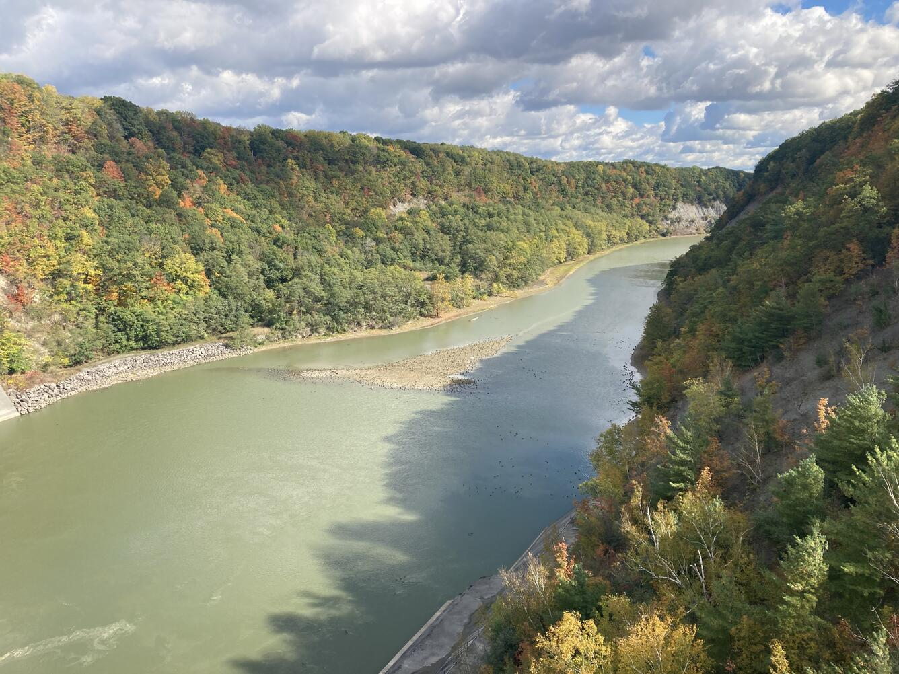
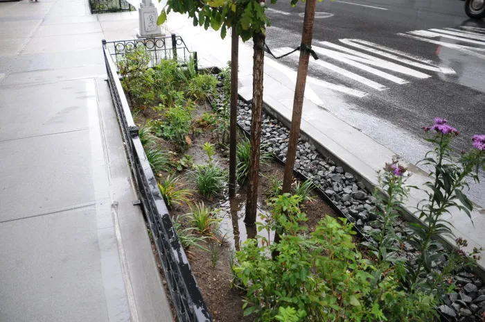
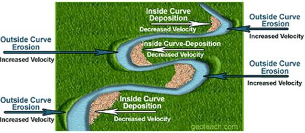
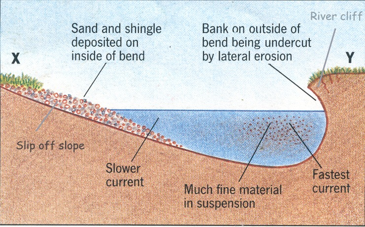

<!-- _class: title-slide -->

# 🌊 The Ripple Effect

## Earth Science — Investigation Prep

### How does water shape the surface of New York State?

<!--
UNIT OVERVIEW: This deck prepares students for the NYSED "Ripple Effect" investigation (HS-ESS2-5). It is the prep day BEFORE planning/conducting. Total time: 80 minutes.
PE: HS-ESS2-5 — plan & conduct an investigation of water's properties and effects on Earth materials and surface processes.
GOAL TODAY: Build vocabulary, experimental-design skill (IV/DV/controls), prediction writing, data-table structure, CER, and a preview of the three investigations + rubric.
DO NOT START THE LAB TODAY — this is readiness.
-->

---

# Today's Mission

We are **getting ready** to run a real investigation about water.

By the end of class you will be able to:

- Tell an **independent** variable from a **dependent** one
- Write a **prediction** scientists would accept
- Use the words: *erosion, deposition, permeability, porosity, infiltration, runoff, weathering*
- Build a **data table** that earns full credit
- Recognize what a strong **claim** looks like

You will not touch any materials today. Today is about **thinking like an investigator** so next class goes smoothly.

<!--
TEACHER MOVE: Set the frame clearly — "prep day." Lower anxiety, raise focus on skills.
TIMING: ~2 min. Part of the 0–8 hook block.
TRANSITION: Move to the two photos.
-->

---

# Two Places, One Force

**The Genesee River**
Carves banks, carries sediment, builds new land downstream near Rochester.

**A NYC Rain Garden**
Soaks up stormwater, slows runoff, sends clean water into the ground.

 

> **Turn & Talk:** Both are shaped by *water*. How can the same substance do two such different jobs?

<!--
TEACHER MOVE: Project alongside the Genesee photo (Student Directions p.3) and rain-garden photo (p.6). 60-sec turn-and-talk, harvest 3–4 ideas on the board.
EXPECTED STUDENT RESPONSES: "Water moves stuff," "water soaks in," "speed matters," "the ground is different."
KEY POINT TO SURFACE: Water's PROPERTIES (it flows, dissolves, soaks in, freezes/expands) are what make it powerful.
TIMING: ~6 min. Completes the 0–8 hook block.
TRANSITION: "Let's get the words we need to talk about this precisely."
-->

---

<!-- _class: phase-title -->

# Part 1 — The Words That Drive the Lab

## Vocabulary you'll use all week

<!--
PHASE GOAL: Direct-teach 8 core terms in 4 paired clusters.
GROUPING: Whole class, students logging in notebooks.
TIMING: ~12 min (8–20 min block).
MATERIALS: Notebooks. Optional vocab word-bank card for support students.
-->

---

# Erosion & Deposition

**Erosion** — water *removes* and carries away sediment/rock (a **destructive** process).

**Deposition** — water *drops off* sediment in a new place (a **constructive** process).

**Misconception alert:** These are **not** opposites that happen separately. On a river bend, erosion (cut bank) and deposition (point bar) happen **at the same time**.

<!--
TEACHER MOVE: Use a river-bend sketch on the board. Fast water on the outside = erosion; slow water on the inside = deposition.
CONNECTION: This is exactly Q2 in Session 2 — students must describe BOTH processes.
TIMING: ~3 min.
-->

---

<video width="520" height="340" controls>
  <source src="sedimentationV5.mp4" type="video/mp4">
</video>

 

---

# Permeability & Porosity

**Porosity** — *how much* empty space is between particles (the room available for water).

**Permeability** — *how easily* water can move **through** the connected spaces.

Big particles (gravel) → high porosity **and** high permeability → water drains fast.
Tiny, tightly-packed particles → water moves slowly.

These are **not** the same word! Porosity = *how much space*. Permeability = *how connected the spaces are*.

<!--
TEACHER MOVE: Hand-gesture: porosity is the size of the gaps; permeability is whether the gaps connect into a path. Clay can be porous but NOT very permeable.
CONNECTION: Rain Garden (Option B) and Q4a/4b/4c hinge on these.
COMMON MISCONCEPTION: Students fuse the two terms. Separate them explicitly.
TIMING: ~3 min.
-->

---

# Infiltration, Runoff & Retention

**Infiltration** — water soaking **down into** the ground.

**Runoff** — water flowing **across** the surface (didn't soak in).

**Retention** — water **held/stored** within the material.

> **Why it matters:** A good rain garden **maximizes infiltration and retention** and **minimizes runoff** — keeping stormwater out of the sewer system.

<!--
TEACHER MOVE: Tie to NYC green infrastructure framing from the directions. More infiltration + retention = less sewer overflow = cleaner waterways.
CONNECTION: Option B's dependent variables are usually infiltration rate, runoff amount, or retention.
TIMING: ~3 min.
-->

---

# Weathering: Two Flavors

### Mechanical (Physical)
Rock is **broken apart** physically — no change in composition.
*Example:* water freezes in a crack, expands, splits the rock.

### Chemical
Rock is **dissolved or changed** at the mineral level.
*Example:* acidic water dissolves limestone → caves, sinkholes.

In **Investigation C**, vinegar (acid rain) on chalk (limestone) models **chemical** weathering. Watch for bubbling — that's the reaction.

<!--
TEACHER MOVE: Connect to NY landscapes — frost wedging in the Adirondacks (mechanical), cave/sinkhole formation in the Allegheny Plateau (chemical).
CONNECTION: Q16 asks students to PREDICT the weathering type + give observational evidence (bubbling, cloudiness, mass loss).
COMMON MISCONCEPTION: Bubbling means "boiling" — clarify it's a chemical reaction releasing gas.
TIMING: ~3 min.
TRANSITION: "Now the real skill — how scientists design a fair test."
-->

---

<!-- _class: phase-title -->

# Part 2 — Designing a Fair Test

## Independent vs. dependent variables, and controls

<!--
PHASE GOAL: The most heavily-weighted rubric dimension (SEP Planning & Carrying Out Investigations) lives here. Spend real time.
TIMING: ~15 min (20–35 min block).
-->

---

# The Three Kinds of Variables

**Independent Variable (IV)** — what **YOU change** on purpose.

**Dependent Variable (DV)** — what you **measure** to see the effect.

**Controlled Variables** — everything you keep the **same** so the test is fair.

> **Memory hook:** *I change the **I**ndependent. The result **D**epends on it (**D**ependent).*

<!--
TEACHER MOVE: Write the memory hook large. This is THE skill of the lab.
COMMON MISCONCEPTION: Students label what they MEASURE as the IV. Hammer: "Did you choose to set it, or did you measure the outcome?"
TIMING: ~3 min.
-->

---

# Worked Example — Stream Table

> If I raise one end of the stream table higher (steeper slope), the sediment travels farther.

**IV:** slope (height of the table)
**DV:** distance sediment / figurine moves
**Controls:** same amount of water, same sediment type, same pour rate

**Why 3 trials?**
One run could be a fluke. Three trials + an **average** make the data trustworthy.

<!--
TEACHER MOVE: Walk through this slowly. Name each variable and WHY it's that category.
KEY POINT: The "control all variables except one" rule (from the procedure) is what makes it a fair test.
TIMING: ~3 min.
-->

---

# Your Turn — Variable Sort

For **each** scenario, whiteboard the **IV**, **DV**, and one **control**:

1. Pour more water on the same sand pile.
2. Compare gravel vs. fine sand in a rain-garden bottle.
3. Cover the slope with a washcloth (plants) vs. bare sand.
4. Soak chalk in vinegar vs. tap water.

Be ready to defend **why** each variable goes where it does.

<!--
TEACHER MOVE: Groups of 2–3, ~5 min to work, then review each aloud. Circulate and check.
ANSWER KEY:
1. IV=volume of water; DV=sediment/distance moved; control=slope, sediment type.
2. IV=sediment type/permeability; DV=infiltration rate/runoff/retention; control=amount of sediment, water volume.
3. IV=surface cover (permeability); DV=distance/amount eroded; control=slope, water amount.
4. IV=type of liquid; DV=change in chalk mass; control=time (5 min), chalk size, liquid volume.
CONFERRING QUESTIONS: "Did you set that or measure it?" "What would ruin this as a fair test?"
TIMING: ~8 min total. Completes 20–35 block.
TRANSITION: "Once you know your variables, you write a prediction."
-->

---

<!-- _class: phase-title -->

# Part 3 — Predictions & Data Tables

## Writing what the rubric rewards

<!--
PHASE GOAL: Strong prediction structure + the required data-table format (a frequent point-loser).
TIMING: ~13 min (35–48 min block).
-->

---

# What Makes a Prediction "Proficient"?

### ❌ Weak
"The chalk will get smaller."

*No variables, no reasoning.*

### ✅ Strong
"**If** the chalk sits in vinegar (acid), **then** it will lose more mass than in water, **because** acid chemically dissolves limestone."

**Formula:** *If [I change IV], then [DV will change this way], because [reason].*

<!--
TEACHER MOVE: Model the upgrade live — take the weak one and add IV/DV/reason.
RUBRIC NOTE: "Excelling" = reasonable prediction of how DV changes when IV is manipulated. "Developing/Emerging" = illogical or missing reasoning.
DIFFERENTIATION: Support students get the sentence frame printed on a card.
TIMING: ~5 min.
-->

---

# The Data Table That Earns Full Credit

| (Title goes here — name your DV & IV) | Trial 1 | Trial 2 | Trial 3 | **Average** | Observations |
|---|---|---|---|---|---|
| **IV value A** | | | | | |
| **IV value B** | | | | | |

Every full-credit table needs: a **title**, the **IV and DV** labeled with **units**, **three trials**, an **average**, and an **observations** column.

<!--
TEACHER MOVE: Students sketch this empty frame in their notebooks now, so it's muscle memory next class.
RUBRIC NOTE: Q7 explicitly requires title, variables, 3 trials, averaged data, observations. Missing the average is the #1 deduction.
COMMON MISCONCEPTION: Recording data but never averaging it → drops from Proficient to Developing.
TIMING: ~5 min.
-->

---

# Quick Check

In the chalk-weathering table, what are the **units**?

Mass is measured in **grams (g)**. Change = Final − Initial. If the chalk lost mass, the change is a **negative** number — and you must write it that way.

<!--
TEACHER MOVE: Quick cold-call. Emphasize the negative-value rule (rubric explicitly checks correct positive/negative values).
TIMING: ~3 min.
TRANSITION: "Here are the three investigations you'll choose from."
-->

---

<!-- _class: phase-title -->

# Part 4 — Your Three Investigations

## Preview the options

<!--
PHASE GOAL: Tour Option A, Option B, Investigation C so students can request a preference and start thinking about variables.
TIMING: ~14 min (48–62 min block).
-->

---

# Option A — Stream Table 🏞️

**Models:** a river like the **Genesee** — erosion & deposition.

**You might change (IV):**
- slope
- amount of water
- sediment type
- surface cover (bare / washcloth / acetate)

**You'd measure (DV):**
- distance sediment or figurines move
- amount of sediment moved

> **Answers focus questions:** How is Earth's surface changed by erosion & deposition?

<!--
TEACHER MOVE: Show the stream-table setup diagram (Directions p.5). Point out the ring stand, pour bottle, collection bucket.
KEY POINT: This option = erosion/deposition + spatial/temporal scale + properties of water.
TIMING: ~4 min.
-->

---

# Option B — Rain Garden 🌧️

**Models:** NYC **green infrastructure** — permeability, infiltration, runoff, retention.

**You might change (IV):**
- type of sediment/material
- layering of materials

**You'd measure (DV):**
- infiltration rate
- amount of runoff
- water retained

> **Answers focus questions:** Which materials make the most effective rain garden?

<!--
TEACHER MOVE: Show the bottle setup diagram (Directions p.8). Note the straw/cap and the cup that catches water.
KEY POINT: Effective design = controlled infiltration + high retention + low runoff into sewers.
TIMING: ~4 min.
-->

---

# Investigation C — Weathering 🧪

**Everyone does this one.** Models chemical weathering of NY limestone.

**Setup:**
- Chalk = limestone
- Tap water = normal rain
- Vinegar = acid rain
- Mass before & after 5 min

**IV:** type of liquid
**DV:** change in chalk mass (g)
**Controls:** time, chalk size, liquid amount

Goggles required. Use tweezers for chalk. Never taste anything.

<!--
TEACHER MOVE: Show the cave/sinkhole block diagram (Directions p.11). Chalk reacting with acid = how caves form in the Allegheny Plateau.
SAFETY: Restate goggles + tweezers + chalk-allergy accommodation (partner collects data).
CONNECTION: Q6 and Q16/17 all come from this investigation.
TIMING: ~4 min.
TRANSITION: "Now — how will your answers be judged?"
-->

---

<!-- _class: phase-title -->

# Part 5 — Claims & the Big Ideas

## CER, feedbacks, and scale

<!--
PHASE GOAL: Teach CER (scored throughout) and PREVIEW the harder Session-2 concepts. Preview only — not mastery today.
TIMING: ~12 min (62–74 min block).
-->

---

# Claim · Evidence · Reasoning

**Claim** — your answer to the question.

**Evidence** — the **numerical data** that backs it up.

**Reasoning** — the science that connects evidence to claim.

> **Example:** *Claim:* Vinegar weathers chalk more. *Evidence:* chalk lost 0.4 g in vinegar vs. 0.0 g in water. *Reasoning:* acid chemically dissolves the calcite in limestone.

A claim with **no numbers** drops you down the rubric. Always cite your data.

<!--
TEACHER MOVE: This structure is scored in Q12, Q28, and all of Packet 2. Make "cite your data" the mantra.
TIMING: ~4 min.
-->

---

# Feedbacks: Systems That Respond

A **feedback** is when a change in one part of a system causes further change — either **amplifying** it or **stabilizing** it.

**Example for Session 2:** A rain garden adds plants → plants absorb water → **less runoff** during storms. The change (more vegetation) feeds back to change the urban water system.

<!--
TEACHER MOVE: Preview only. Q5 asks students to name a water-cycle process change AND a feedback in the geosphere.
CONNECTION: HS-ESS2-2. Keep light today; revisit at Session 2.
TIMING: ~3 min.
-->

---

# Spatial & Temporal Scale

**Spatial** = *how much area / how big.*

Genesee River: shapes land along its whole ~250 km length.
Allegheny caves: form in small, localized spots.

**Temporal** = *how fast / how long.*

River flooding: changes land quickly.
Cave dissolution: takes a very long time.

<!--
TEACHER MOVE: Preview for Q8. Surface water acts fast over wide areas; groundwater dissolution is slow and localized.
CONNECTION: HS-ESS2-1.
TIMING: ~3 min.
-->

---

# Bonus Brain-Stretch: Water & Melting Rock

Water doesn't only shape Earth's **surface**. Deep underground, water **lowers the melting point** of mantle rock.

**Session 2, Q9:** Two rocks at the same depth & pressure — one **wet**, one **dry**. The **wet** rock melts at a **lower** temperature, so it can be **liquid** while the dry rock is still **solid**.

Counter-intuitive but key: adding water **lowers** the melting point — it does not raise it.

<!--
TEACHER MOVE: Preview only for advanced readiness. Wet mantle rock (Box D) = liquid; dry (Box E) = solid at the same conditions.
DIFFERENTIATION: Extension students can attempt the graph reasoning now.
CONNECTION: DCI HS-ESS2.C — water lowers viscosities and melting points of rocks.
TIMING: ~2 min.
TRANSITION: "Let's see exactly how you'll be graded."
-->

---

# How You'll Be Scored

| Level | What it means |
|-------|---------------|
| **Excelling** | Exceeds the expectation — precise, complete, extra detail |
| **Proficient** | Meets it — correct and complete |
| **Developing** | Partially there — some pieces missing or off |
| **Emerging** | Minimal or incorrect |

The biggest scoring category is **Planning & Carrying Out Investigations** — so nail your **variables, prediction, procedure, and data table**.

<!--
TEACHER MOVE: Show the actual rubric language. Reassure: there's a path to credit even if not perfect, but completeness matters.
TIMING: ~3 min. Part of 74–80 block.
-->

---

# Exit Ticket 🎟️

On your own slip:

1. **Scenario:** "We test how grain size affects how fast water drains through sediment."
   - What is the **IV**?
   - What is the **DV**?

2. Define **two** of today's vocab words in your own words.

This tells me you're ready to plan your investigation next class.

<!--
TEACHER MOVE: ~4 min to write, collect on the way out. Also collect Student Directions packets.
ANSWER: IV = grain/particle size (permeability); DV = drainage/infiltration rate.
ASSESSMENT: Correct IV/DV = on track for the dominant rubric dimension. Use misses to form support pairs next class.
TIMING: ~5 min. Completes the lesson at 80 min.
-->

---

# Vocabulary Reference

**Erosion** — water removes & carries sediment (destructive).
**Deposition** — water drops sediment in a new place (constructive).
**Porosity** — how much empty space is between particles.
**Permeability** — how easily water moves through connected spaces.
**Infiltration** — water soaking into the ground.

<!--
Study reference. No live teaching needed.
-->

---

# Vocabulary Reference (cont.)

**Runoff** — water flowing across the surface.
**Retention** — water held/stored within material.
**Mechanical weathering** — rock physically broken apart.
**Chemical weathering** — rock dissolved/changed at the mineral level.
**Feedback** — a change that causes further change (amplifying or stabilizing).
**Spatial scale** — how much area is affected. **Temporal scale** — how fast/long.

<!--
Study reference. End of deck.
-->