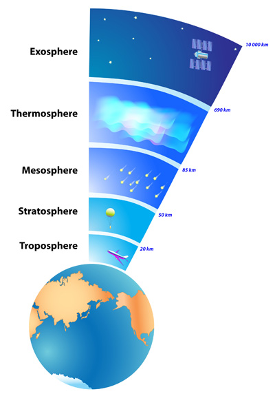
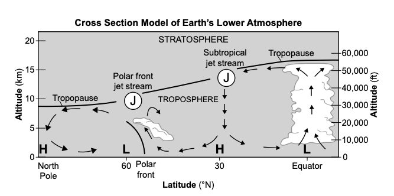
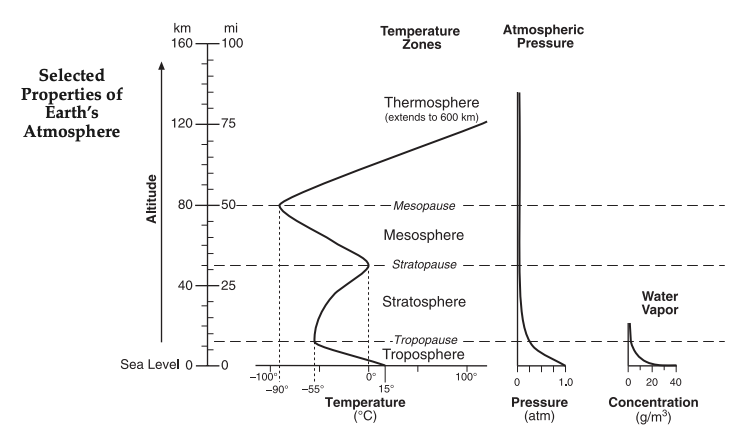

<!-- _class: title-slide -->
<!-- _paginate: false -->

# Weather

## Regents Earth Science — Two-Week Unit

### Will there be more frequent and more intense severe storms in the future?

<!--
Welcome to the unit. The driving question intentionally previews where we'll land on Day 10.
Connect to the previous unit on Climate Change — this unit is the consequence of that one.
Total time: 10 class periods. 9 labs.
NYSSLS anchors: HS-ESS2-5 (water's properties), HS-ESS2-8 (air mass movements & weather changes), HS-ESS3-5 (climate change forecasts & impacts), HS-ESS2-4 (energy flow & climate).
2024 ESRT pages we will live in: 18 (Weather Map Symbols), 19 (Planetary Wind Belts + Lower Atmosphere Cross Section).
-->

---

# Unit Roadmap

| Topic | Days | Lab | NYSSLS Anchor |
|-------|------|-----|---------------|
| **Earth's Atmosphere** | 1–2 | Atmospheric Layers | HS-ESS2-8 |
| **Energy & Phase Change** | 2–3 | Phase Change of Water | HS-ESS2-5 |
| **Atmospheric Moisture** | 3–4 | Sling Psychrometer | HS-ESS2-5 |
| **Cloud Formation** | 5–6 | Cloud Base Altitude | HS-ESS2-5 |
| **Weather Instruments** | 6 | Station Models | HS-ESS2-8 |
| **Mapping Weather** | 7–8 | Isotherms / Isobars; Fronts | HS-ESS2-8 |
| **Severe Storms** | 9–10 | Hurricane Katrina; Killer Typhoon | HS-ESS3-5 |

<!--
Show the full path. Tell students: "Each topic builds on the last. By Day 10 we'll answer the driving question with evidence we've gathered ourselves."
Note the NYSSLS PE column — these are the Performance Expectations the new (June 2025+) Regents exam is built around.
Per the Educator Guide blueprint: Weather & Climate is 11–20% of the exam; Earth's Systems (where HS-ESS2-5 lives) is 20–31%; Human Sustainability (HS-ESS3-5) is 20–31%.
-->

---

<!-- _class: phase-title -->

# Day 1

## Weather Basics &
## Earth's Atmosphere

<!--
PHASE GOAL: Students can describe the structure of Earth's atmosphere — composition, layers — and explain where weather energy comes from and why systems move W→E across the US.
GROUPING: Whole class for instruction; pairs for ESRT exercises.
TIMING: ~30 min lecture, then 10 min ESRT scavenger.
NYSSLS: HS-ESS2-8 (movement and interactions of air masses).
-->

---

# Where Does Weather Come From?

**Energy source for all weather:** the **Sun**.
Unequal heating of Earth's surface drives every weather pattern.

In the United States, weather systems generally move from **west to east**.

**Why?** We sit in the **prevailing westerlies** — a planetary wind belt between 30° and 60° N latitude. *(ESRT page 19.)*

**Weather** — the state of the atmosphere at a certain place and time.
**Climate** — the long-term average of weather in a region.

<!--
TEACHER MOVE: Anchor everything to the Sun. When the curriculum gets complicated, return here.
EXPECTED RESPONSES: Some students will say "the jet stream" — yes, but the jet stream is itself driven by unequal solar heating + Earth's rotation. Don't punish the answer; build on it.
COMMON MISCONCEPTION: "Weather happens because of clouds." Reverse: clouds happen because of weather (because of energy flow + moisture).
TRANSITION: We're going to look at the atmosphere itself first, then build up to systems.
-->

---

# What is the atmosphere?

The **atmosphere** is the layer of gases held to Earth by gravity.

It's *very* thin compared to Earth itself — if Earth were a basketball, the atmosphere would be about as thick as a sheet of paper.

**Composition of dry air (by volume):**
- Nitrogen (N₂) — 78%
- Oxygen (O₂) — 21%
- Argon, CO₂, others — 1%

Plus a *highly variable* amount of **water vapor** (0–4%).

<!--
TEACHER MOVE: Stress the variability of water vapor — that variability is what drives most weather.
EXPECTED RESPONSES: Students may guess "mostly oxygen" — push back: nitrogen dominates.
COMMON MISCONCEPTION: "We breathe oxygen." We breathe AIR; our bodies use the oxygen.
TRANSITION: "If gravity is pulling air molecules toward Earth, where would you expect most of the air to be?" → leads to layers.
-->

---

# Five Layers — Bottom to Top

1. **Troposphere** (0–12 km)
   *Where weather happens.* ~80% of air mass.
2. **Stratosphere** (12–50 km)
   *Ozone layer.* T rises with altitude.
3. **Mesosphere** (50–80 km)
   *Coldest layer.* Meteors burn up here.
4. **Thermosphere** (80–600 km)
   *Auroras.* Few molecules but very hot.
5. **Exosphere** (600+ km)
   *Fades to space.*

The boundaries are called **pauses**:
- tropo**pause**
- strato**pause**
- meso**pause**

**ESRT pg 19** shows the **Cross Section Model of Earth's Lower Atmosphere** — troposphere + stratosphere with the **tropopause**, **polar front jet stream**, and **subtropical jet stream**.

> **Mnemonic:** *The Soup Mom Threw out Expired* — Tropo, Strato, Meso, Thermo, Exo.

<!--
TEACHER MOVE: Walk through the temperature direction in each layer. Pause at the stratosphere — temperature INCREASES with altitude there because ozone absorbs UV. This is the only layer where this happens (besides the thermosphere).
EXPECTED RESPONSES: "Why does the stratosphere get warmer going up?" — because ozone absorbs UV.
COMMON MISCONCEPTION: "It gets colder forever as you go up." Actually it zigzags — the stratosphere and thermosphere both warm with altitude.
ESRT NOTE: The 2024 ESRT no longer has the standalone "Properties of the Atmosphere vs Altitude" graph. The cross-section on pg 19 is what students reference now.
DIFFERENTIATION: The mnemonic lands well for students who struggle to memorize order.
-->

---

<!--- _class: center --->

---

<!--- _class: center --->

---

---

<!-- _class: phase-title -->

# Atmospheric Moisture

<!--
PHASE GOAL: Students use the sling psychrometer (lab) to determine dew point and relative humidity from wet-bulb depression, and explain the relationship between temperature, dew point, and saturation.
NYSSLS: HS-ESS2-5 (water properties affecting weather).
IMPORTANT: 2024 ESRT does NOT include the dewpoint/RH tables that used to be on pg 12. Students learn the relationship through lab data, not table lookup.
-->

---

# Humidity Vocabulary

**Humidity** — the amount of water vapor in the air.

**Saturation** — the air is holding the maximum amount of water vapor possible at that temperature.

**Relative humidity (RH)** — the actual amount of water vapor *as a percentage* of the maximum the air could hold at that temperature.

**Dew point** — the temperature to which air must be cooled (at constant pressure) to reach saturation.

**Warmer air can hold more water vapor.** That single fact drives most of weather.

<!--
TEACHER MOVE: Demonstrate "saturation" with a sponge analogy. A bigger sponge (warm air) holds more water (water vapor) before dripping (precipitation).
EXPECTED RESPONSE: Some students confuse RH with absolute humidity. RH = ratio. Absolute humidity = mass per volume.
KEY POINT: Air at 100% RH is *saturated*; cooling it further forces condensation.
-->

---

# The Sling Psychrometer

Two thermometers side-by-side:
- **Dry bulb** — measures actual air temperature.
- **Wet bulb** — wrapped in a wet wick; cools as water evaporates from the wick.

Spinning the device forces evaporation. The drier the air, the more evaporation, the lower the wet bulb reading.

**Wet-bulb depression** = $T_{dry} - T_{wet}$

A *large* depression → *dry* air (low RH).
A *small* depression → *humid* air (high RH).
A *zero* depression → *saturated* air (100% RH, dew point reached).

<!--
TEACHER MOVE: Demonstrate spinning the psychrometer. Show what happens when you breathe on the wet bulb (wet-bulb temperature rises — humid).
SAFETY: Students must check their swing space before whirling these around.
ESRT NOTE: The 2024 ESRT removed the dewpoint/RH lookup tables. Students determine RH conceptually from depression size (or use a provided table in lab — but it's not on the reference tables anymore).
TRANSITION: "If air is saturated and cools further, what happens?" → leads to clouds.
-->

---

# Three Key Relationships

**1. Temperature vs RH (at constant moisture)**
As temperature ↑ , RH ↓. **Inverse** relationship — warmer air can hold more, so a fixed amount of moisture becomes a smaller percentage of capacity.

**2. Dew point vs Moisture content**
As dew point ↑, moisture content ↑. **Direct** relationship — dew point is a direct measure of how much water vapor is actually in the air.

**3. Air temperature − Dew point**
As (T_air − T_dewpoint) → 0, probability of precipitation ↑.
When they're equal, air is saturated.

<!--
TEACHER MOVE: This slide is dense. Go one relationship at a time, with an example for each. RH inverse: a 60°F room with 50% RH cooled to 50°F has higher RH even though the moisture didn't change. Dew point direct: a desert at noon might have dew point of 0°F; the Gulf Coast at noon has dew point of 75°F.
EXPECTED CHALLENGE: Students conflate "moisture content" with "humidity %." Dew point is the better metric for actual moisture.
-->

---

<!-- _class: phase-title -->

# Day 5 — 6

## Cloud Formation

<!--
PHASE GOAL: Students explain why clouds form (rising air cools adiabatically until reaching dew point) and use the lapse-rate idea to estimate cloud base altitude.
NOTE: 2024 ESRT no longer has the cloud base altitude graph. Concept still tested; lookup is not.
-->

---

# Three Ingredients for Cloud Formation

1. **Water vapor** — there must be moisture in the air.
2. **Condensation nuclei** — tiny particles (dust, pollen, salt, soot) for water to condense onto.
3. **Cooling** — usually because air is rising.

When all three are present, water vapor condenses into tiny droplets — a cloud.

**Clouds form most readily when air is rising, cool, and contains nuclei** — and when the temperature reaches the **dew point**.

<!--
TEACHER MOVE: Some students think clouds form spontaneously when humidity reaches 100%. They actually need a SURFACE — that's the role of condensation nuclei.
INTERESTING NOTE: That's why cloud seeding (silver iodide) works — adding nuclei.
NATURAL PROCESS NOTE: Precipitation is the natural process that cleans nuclei out of the atmosphere.
-->

---

# Why Does Rising Air Cool?

When an air parcel rises, the surrounding pressure drops. The parcel **expands**.

Expansion does work on the surrounding air → the parcel **loses internal energy** → its temperature **drops**.

This is called **adiabatic cooling** (no heat is exchanged with the surroundings; energy converts internally).

**Adiabatic Lapse Rates:**
- **Dry adiabatic rate:** ~10 °C per km (dry-bulb T drops as air rises)
- **Dew-point lapse rate:** ~2 °C per km (dew point drops more slowly)

Because both fall but at different rates, they **converge** — and where they meet, **clouds form**.

<!--
TEACHER MOVE: Use a bicycle pump analogy — when you compress air the pump gets hot; when you let it expand it cools.
KEY POINT: The dew point falls more slowly than the dry-bulb temperature, so they CONVERGE as the parcel rises. Where they meet → cloud base.
COMMON MISCONCEPTION: "The atmosphere gets cooler, so the air rising into it cools by mixing." Wrong — adiabatic = no heat exchange.
-->

---

# Estimating Cloud Base Altitude

The 2024 ESRT no longer provides a cloud base graph. We estimate cloud base from the gap between surface temperature and surface dew point:

$$h_{\text{cloud base}} \approx \frac{T_{\text{surface}} - T_{\text{dewpoint, surface}}}{8 \text{ °C/km}}$$

(8 °C/km = 10 − 2; the rate at which the gap closes per km of lift.)

> **Q:** Surface T = 30 °C, dew point = 14 °C. At what altitude do clouds form?

$$h \approx \frac{30 - 14}{8} = 2 \text{ km}$$

**The closer surface T and dew point are**, the **lower** the cloud base — and the more likely precipitation is at the surface.

<!--
TEACHER MOVE: Walk through the example. Note that this technique is a teaching tool — the 2024 exam won't ask students to compute this from a graph because the graph is gone. But the underlying relationship (lower temp-dewpoint gap → lower clouds → more precip likelihood) is squarely on HS-ESS2-8.
DIFFERENTIATION: Strong students can do the algebra; struggling students just need the qualitative relationship.
-->

---

<!-- _class: phase-title -->

# Day 6 — 7

## Weather Instruments &
## Station Models

<!--
PHASE GOAL: Students identify weather instruments and decode the standard station model (ESRT pg 18 in 2024 edition).
NYSSLS: HS-ESS2-8 — using tools to collect weather data.
-->

---

# Weather Instruments

| Instrument | Measures | Units |
|------------|----------|-------|
| **Thermometer** | Air temperature | °C or °F |
| **Barometer** | Air pressure | mb or in Hg |
| **Anemometer** | Wind speed | knots or mph |
| **Wind vane** | Wind direction | compass direction |
| **Hygrometer / Psychrometer** | Humidity | % RH |
| **Rain gauge** | Precipitation | mm or in |

**Wind direction is named for where the wind is COMING FROM.**
A "north wind" blows *from* the north, *toward* the south.

<!--
TEACHER MOVE: This is a high-yield Regents memorization point. Use the mnemonic: "name the wind by where it came from."
COMMON MISCONCEPTION: Students often reverse this. Drill it.
EXPECTED STUDENT RESPONSE: "Why is it named that way?" — historically, sailors needed to know what was coming at them.
-->

---

# Decoding a Station Model — ESRT Pg 18

A station model is a compact way to plot many weather variables at one location. **The full key is on ESRT page 18** in the 2024 edition.

**Standard layout:**
- **Center circle** — sky cover (% filled)
- **Upper-left** — temperature (°F)
- **Lower-left** — dew point (°F)
- **Upper-right** — pressure (mb, coded — see next slide)
- **Lower-right** — present weather symbol
- **Wind barb** from circle — direction wind is coming from; flags show speed

**Wind barb decoding:**
- Half flag = 5 knots
- Full flag = 10 knots
- Triangle ("pennant") = 50 knots

A barb pointing *north* with two flags = north wind at 20 knots. 

<!--
TEACHER MOVE: Project ESRT page 18 from the 2024 edition. Walk through each variable on a sample station.
CONFERRING QUESTION: "Where is the wind coming from? Where is it going?"
TEMPERATURE UNITS: The ESRT station model shows temperature in °F — Regents tradition; not a typo.
-->

---

# The Pressure Code — Read It Right

**The pressure on a station model is given as 3 digits with no decimal.**

To decode:
1. If it starts with **5–9** → put **"9"** in front, decimal before last digit. So `978` → **997.8 mb**.
2. If it starts with **0–4** → put **"10"** in front, decimal before last digit. So `089` → **1008.9 mb**.

**ESRT pg 18 examples (2024 edition):**
- `410` → 1041.0 mb
- `103` → 1010.3 mb
- `987` → 998.7 mb
- `872` → 987.2 mb

<!--
TEACHER MOVE: This is the trickiest single rule on ESRT pg 18. Drill it. Have students decode 5 in a row on whiteboards: 234, 891, 002, 045, 762.
ANSWERS: 1023.4, 989.1, 1000.2, 1004.5, 976.2
COMMON MISTAKE: Students forget the decimal before the last digit. Always 3 digits → 4-digit number with decimal.
WHY: Atmospheric pressure varies between roughly 950 and 1050 mb. The leading "9" or "10" is implied to save space.
-->

---

# Pressure & Wind — Core Relationships

**Wind blows from HIGH pressure to LOW pressure.**

**As air pressure increases, density increases.** Higher pressure means more molecules packed into the same volume.

**Pressure gradient drives wind speed** — the steeper the pressure gradient (closer isobars on a map), the stronger the wind.

**The wind/wave relationship:**
The stronger the wind, the higher the waves.
Wind transfers energy to water surface — the connection between atmosphere and ocean.

<!--
TEACHER MOVE: Two anchor relationships — pressure → density, and gradient → wind speed. Both come up on Regents exams in different guises.
EXPECTED CONFUSION: "Why does air flow from high to low? Why not the other way?" — Pressure is force per area. High-pressure air is being pushed; it flows toward where there's less resistance (lower pressure).
TRANSITION: We'll see this play out in air masses (high vs low pressure systems) next.
-->

---

<!-- _class: phase-title -->

# Day 7 — 8

## Air Masses, Pressure Systems &
## Weather Fronts

<!--
PHASE GOAL: Students identify the major air masses affecting NYS, predict weather changes associated with each front type, and explain weather using H/L systems and planetary wind belts.
NYSSLS: HS-ESS2-8 (air mass interactions → weather changes). This is the central PE of the unit.
-->

---

# Air Masses

An **air mass** is a large body of air with relatively uniform temperature and humidity, taking on the properties of its **source region**.

**Naming convention:** *moisture letter* + *temperature letter*

| Code | Name | Origin | Properties |
|------|------|--------|-----------|
| **mT** | maritime Tropical | Gulf of Mexico, tropical Atlantic | warm, humid |
| **cT** | continental Tropical | desert SW US, Mexico | hot, dry |
| **mP** | maritime Polar | N Pacific, N Atlantic | cool, humid |
| **cP** | continental Polar | Canada | cold, dry |
| **cA** | continental Arctic | Arctic | very cold, dry |

<!--
TEACHER MOVE: For NYS specifically, mT brings hot humid summers; cP brings cold winters; mP brings nor'easters.
EXPECTED RESPONSE: "What about hurricanes?" — they're tropical cyclones, not air masses. We'll get there.
-->

---

# High and Low Pressure Systems

| | **Low Pressure (L)** | **High Pressure (H)** |
|---|---|---|
| **Air temperature** | warm | cool |
| **Air motion** | rising | sinking |
| **Clouds?** | clouds, often precipitation | clear skies |
| **NH wind rotation** | counterclockwise | clockwise |
| **NH wind direction** | toward center (converging) | away from center (diverging) |
| **Weather** | stormy | fair |

**Mnemonic:** *Lows = lousy weather. Highs = happy weather.*

<!--
TEACHER MOVE: This 6-row table replaces the older paragraph format from the prior slide version. Pull it up alongside the H/L symbols from ESRT pg 18.
KEY POINT: The Coriolis effect (Earth's rotation) deflects converging/diverging air, producing the spiral rotation patterns. In the Southern Hemisphere everything reverses.
COMMON MISCONCEPTION: "Air goes UP into a low because it's lighter." No — air rises in a low because it's CONVERGING from all sides and has nowhere else to go.
-->

---

# Weather Fronts — The Boundaries

A **front** is the boundary between two air masses of different properties.

Four major front types:

**Cold front** — Cold air pushes into warm air. Steep boundary. Brief, intense storms. Cooler weather follows.

**Warm front** — Warm air slides over cold air. Gentle slope. Long period of light precipitation. Warmer weather follows.

**Stationary front** — Boundary not moving. Persistent overcast and drizzle.

**Occluded front** — A faster cold front catches a warm front, lifting the warm air completely off the ground.

<!--
TEACHER MOVE: Use ESRT pg 18 to show the symbols. Cold front = blue triangles pointing in direction of motion. Warm front = red half-circles. Stationary = both, on opposite sides. Occluded = purple, alternating.
KEY POINT: At every front, the warm air is FORCED UP. Lifting → adiabatic cooling → cloud formation. Fronts make weather.
-->

---

# Front Symbols — Identify A through E

**On ESRT page 18, four front symbols appear.** On a weather map, you must identify each by its symbol AND its direction of motion (where applicable).

**Cold front** — blue line + filled triangles
*Triangles point in direction of motion.*

**Warm front** — red line + filled semicircles
*Semicircles point in direction of motion.*

**Stationary front** — alternating triangles (blue) and semicircles (red), pointing **OPPOSITE** directions

**Occluded front** — purple line, alternating triangles & semicircles pointing the **SAME** direction

**Regents-style task:** Given a map with fronts labeled A, B, C, D, E — identify each front type, the direction of motion, and which air mass is on each side.

<!--
TEACHER MOVE: Walk through the front symbol identification practice in guided notes. Students should be able to look at a labeled map and decode 5 fronts in under 2 minutes.
DIFFERENTIATION: Color-coding the symbols by front type helps visual learners.
HS-ESS2-8 LINK: This is core to "communicate information about air mass movements and weather changes."
-->

---

# What Happens When a Cold Front Passes?

| Variable | Before | During | After |
|----------|--------|--------|-------|
| Temperature | warm | drops sharply | cool |
| Pressure | falling | minimum | rising |
| Wind direction | from S/SW | shifts | from NW |
| Clouds | cumulus → cumulonimbus | thunderstorms | clearing |
| Precipitation | none, then heavy | heavy, brief | ends |

**Always:** the *cold* air ends up on the ground; the *warm* air is forced up.
The warm air rising is what produces the weather.

<!--
TEACHER MOVE: Explicitly walk through the relationship between PRESSURE and front passage — pressure reaches a minimum AT the front, then rises sharply.
CONFERRING QUESTION: "Why does the wind shift direction as the front passes?" — air flows in toward the low-pressure center, then around.
-->

---

# Local Winds — Sea Breeze vs Land Breeze

**Sea breeze (daytime):**
- Land heats faster than water
- Warm air over land rises (low pressure)
- Cool air from sea flows toward land
- **Wind blows from sea → land**

**Land breeze (nighttime):**
- Land cools faster than water
- Warm air over water rises (low pressure)
- Cool air from land flows toward sea
- **Wind blows from land → sea**

**Same principle, opposite direction:** local winds always blow from **cooler (higher pressure)** toward **warmer (lower pressure)** surfaces.

<!--
TEACHER MOVE: Diagram on the board with sun-warmed land vs ocean. Use arrows to show convection cells.
WHY IT MATTERS: This is the simplest example of pressure-driven wind — and it's identical to the mechanism that drives the planetary wind belts at much larger scale.
GUIDED NOTES TIE-IN: Students label the daytime/nighttime diagrams in their packet.
-->

---

# Planetary Wind Belts — ESRT Pg 19

**ESRT page 19** shows the **Model of Generalized Planetary Wind Belts in the Troposphere** — three convection cells per hemisphere (Hadley, Ferrel, Polar) and the wind belts they produce.

| Latitude | Prevailing Wind | Vertical Motion |
|---|---|---|
| 0° (equator) | calm (ITCZ) | rising (L pressure) |
| 0°–30° N | NE trades | — |
| 30° N | calm (horse latitudes) | sinking (H pressure) |
| 30°–60° N | **westerlies** ← *we live here* | — |
| 60° N | calm (polar front) | rising (L pressure) |
| 60°–90° N | polar easterlies | — |
| 90° N (pole) | calm | sinking (H pressure) |

<!--
TEACHER MOVE: This is core HS-ESS2-8 content. ESRT pg 19 is the new home for what used to be on pg 14.
QUICK PRACTICE: Have students name the prevailing wind at 45°N (westerlies), 45°S (westerlies, S hemisphere mirror), 20°N (NE trades), 75°N (polar easterlies).
RISING/SINKING: Air RISES at the equator and at 60° (low pressure). Air SINKS at 30° and at the poles (high pressure).
WHY WE LIVE WHERE WE LIVE: Continental US sits in the westerlies → weather moves W→E. Back to slide 3.
-->

---

# Mapping Weather — Isolines

**Isotherm** — line of equal temperature.
**Isobar** — line of equal pressure (in mb).

**Rules for drawing isolines:**
1. Same value → same line. Lines never cross.
2. Lines must close (form loops) or run off the map edge.
3. Adjacent lines differ by the contour interval.
4. Values BETWEEN lines fall between the line values.
5. Spacing matters: **closer lines = steeper gradient**.

<!--
TEACHER MOVE: Draw a small example on the board with 5 station readings. Show how to interpolate.
COMMON ERRORS: Students bend isolines through stations rather than between them; students cross isolines.
DIFFERENTIATION: Provide a partially-completed map with two contours already drawn for struggling students.
-->

---

# Calculating Gradient

**Not on the 2024 ESRT** — the equations table is gone. But the concept is still core to HS-ESS2-8.

$$\text{Gradient} = \frac{\text{change in field value}}{\text{distance}}$$

> **Q:** Two cities are 200 km apart. Temperatures are 10 °C and 22 °C. Find the temperature gradient.

**Step 1.** $\Delta T = 22 - 10 = 12$ °C
**Step 2.** $\text{Gradient} = \dfrac{12 \text{ °C}}{200 \text{ km}} = 0.06$ °C/km

**Always include units in the answer.** °C/km for temperature gradient; mb/km for pressure gradient.

A *steep* gradient (closer lines) means **stronger winds** and **more dramatic weather**. This connects directly to severe storm formation.

<!--
TEACHER MOVE: Pressure gradient is a common Regents question. Same formula — just plug in pressures.
KEY POINT: A steep gradient = stronger winds = closer to severe weather. This is the conceptual hand-off to the severe storms unit.
EXAM NOTE: The 2024 ESRT removed the equations table from pg 1. Students need to recall this formula from memory now.
-->

---

<!-- _class: phase-title -->

# Day 9 — 10

## Severe Storms &
## Climate Connection

<!--
PHASE GOAL: Students apply unit content to severe storms and construct an evidence-based argument about climate change impacts.
NYSSLS: HS-ESS3-5 — "make valid and reliable scientific claims" about climate change and "associated future impacts to Earth systems." Also pulls HS-ESS2-4 (energy flow & climate).
This is where everything we've learned converges.
-->

---

# Tropical Cyclones — Same Storm, Different Names

**Hurricane** — Atlantic, eastern Pacific
**Typhoon** — western Pacific
**Cyclone** — Indian Ocean, S Pacific

All three are the **same kind of storm**.

**Required conditions:**
- Sea surface T ≥ 26.5 °C (about 80 °F)
- Warm water to a depth of ~50 m
- Low vertical wind shear
- Sufficient distance from the equator (~5°+) for Coriolis

The energy source: **latent heat released when water vapor condenses** in the storm's eyewall.
This is the same $Q = m \cdot H_v$ we calculated on Day 2.

<!--
TEACHER MOVE: Make the explicit connection back to Day 2 — phase change drives the storm. Each gram of water vapor condensing releases 2260 J. Multiply by trillions of grams happening simultaneously.
KEY POINT: Hurricanes weaken over land because they lose their energy source — warm ocean water.
HURRICANES ARE INTENSE LOW PRESSURE SYSTEMS. Show the connection back to L systems (rising air, converging, counterclockwise rotation).
-->

---

# Anatomy of a Hurricane

**Three main parts:**

- **Eye** — calm center, ~30–60 km across, nearly clear sky, low pressure.
- **Eyewall** — ring of strongest winds and heaviest rain, surrounding the eye.
- **Rain bands** — spiraling arms of precipitation extending hundreds of km outward.

> **Storm surge:** wind-driven rise in seawater level. Often the deadliest aspect of a hurricane — it can flood coastal areas tens of kilometers inland.

**Hurricanes cover a much larger geographic area than tornadoes**, even though tornadoes have higher peak wind speeds.

<!--
TEACHER MOVE: Show a satellite image and identify each part. Watch the Killer Typhoon clip if time permits.
EXPECTED RESPONSE: "Why is the eye calm?" — air is sinking in the eye (clearing), while it's rising in the eyewall.
HURRICANE vs TORNADO: Different scales. Hurricanes ~500 km across; tornadoes ~1 km. Both deadly for different reasons.
-->

---

# Saffir-Simpson Hurricane Scale

| Category | Wind Speed (mph) | Damage |
|----------|------------------|--------|
| **Tropical Depression** | < 39 | Forming |
| **Tropical Storm** | 39–73 | Named storm |
| **Cat 1** | 74–95 | Some damage |
| **Cat 2** | 96–110 | Extensive |
| **Cat 3** | 111–129 | Devastating |
| **Cat 4** | 130–156 | Catastrophic |
| **Cat 5** | 157+ | Total destruction |

The scale is based **only on wind speed** — it does not account for storm surge, rainfall, or storm size. A Cat 1 with massive surge can be deadlier than a Cat 4 that misses populated areas.

<!--
TEACHER MOVE: This is a Regents-friendly table. Drill it briefly.
KEY POINT: When categorizing in the lab, students will use ONLY wind speed — even if the storm has dropped pressure or had storm surge.
-->

---

# Other NYS Severe Weather

**Nor'easter** — extratropical cyclone forming off the East Coast.
- mP and cP air collide
- Heavy snow, strong winds
- Common in winter

**Blizzard** — winter storm with:
- Sustained winds ≥ 35 mph
- Visibility < ¼ mile (snow)
- Lasting ≥ 3 hours

**Tornado** — violently rotating column of air.
- Forms in supercell thunderstorms
- Strong wind shear required
- Rated on EF scale (0–5)
- Most common in spring/summer

<!--
TEACHER MOVE: Connect nor'easters to mP air — they bring NYS its biggest snowstorms (e.g., Blizzard of '96, '78).
EXPECTED QUESTION: "Are tornadoes worse than hurricanes?" — different scales. A tornado is more locally intense; a hurricane is much larger.
-->

---

# Climate Change & Severe Storms

**Three connections from this unit (HS-ESS3-5, HS-ESS2-4):**

1. **Warmer oceans** → more available latent heat → potentially stronger storms.
2. **Warmer atmosphere** → holds more water vapor (recall: warm air holds more moisture) → heavier rainfall.
3. **Higher sea level** → smaller storms produce larger surges.

What's *less certain*: whether the **frequency** of storms will change. The strongest evidence is for increased **intensity** of the storms that do form.

<!--
TEACHER MOVE: Reinforce that the science here is nuanced. The IPCC says high confidence in increased intensity, lower confidence in increased frequency.
NYSSLS LINK: HS-ESS3-5 explicitly asks students to "make an evidence-based forecast of the current rate of global or regional climate change and associated future impacts to Earth systems." This slide IS that PE.
This frames the unit-end CER prompt: argue for intensity OR frequency OR both, using evidence from the unit.
-->

---

# Connecting It All — Day 10 Synthesis

> **Driving question:** *Will there be more frequent and more intense severe storms in the future?*

Use evidence from this unit:

1. **Sea surface temperatures are rising.** (From Climate Change unit.)
2. **Warmer water releases more latent heat when it evaporates.** (Day 2.)
3. **Warmer air holds more water vapor.** (Day 3.)
4. **Hurricanes are powered by latent heat from warm seawater.** (Day 9.)

**Claim:** Storms are likely to become more *intense* (stronger winds, heavier rain, higher surge) — even if the *number* of storms doesn't change much.

**Evidence-Reasoning chain:** ↑ SST → ↑ latent heat available → ↑ energy in eyewall convection → ↑ wind speeds. ↑ atmospheric moisture → ↑ precipitation per storm.

<!--
TEACHER MOVE: This is THE central conceptual move of the unit. Have students write their own CER paragraph using this scaffolding.
NYSSLS ALIGNMENT: This synthesis is the unit summative for HS-ESS3-5. The CER is the assessment-of-record.
ASSESSMENT: This claim, with this evidence chain, is the unit summative.
TRANSITION TO NEXT UNIT: "If we're confident storms will get more intense, what should engineers and planners do about it?" — sets up HS-ESS3-4 (designing technological solutions).
-->

---

# Vocabulary Master List (1 of 2)

atmosphere · troposphere · stratosphere · mesosphere · thermosphere · exosphere
tropopause · stratopause · mesopause
phase change · endothermic · exothermic · heat of fusion · heat of vaporization · latent heat
humidity · relative humidity · dew point · saturation
wet-bulb depression · sling psychrometer
condensation nuclei · adiabatic · lapse rate · cloud base

<!--
Display this slide for student reference. Keep up during exit ticket / quick reviews.
-->

---

# Vocabulary Master List (2 of 2)

station model · isotherm · isobar · gradient
air mass · cP · mP · cT · mT · cA
front · cold front · warm front · stationary front · occluded front
high-pressure system · low-pressure system
convergence · divergence
sea breeze · land breeze · prevailing westerlies · trade winds · polar easterlies
Hadley cell · Ferrel cell · Polar cell
tropical cyclone · hurricane · typhoon
eye · eyewall · rain band · storm surge
Saffir-Simpson scale
nor'easter · blizzard · tornado · supercell
climate · climate change · sea surface temperature

<!--
End of vocabulary. Total: ~60 terms. Students should master all of these for the unit assessment.
-->

---

<!-- _class: title-slide -->
<!-- _paginate: false -->

# Unit Wrap-Up

## Weather

### *"The atmosphere is a heat engine. We've spent two weeks learning how it runs — and what happens when we turn up the dial."*

<!--
Final slide. Brief reflection. Preview of the unit assessment (the CER from slide before Vocab).
-->
