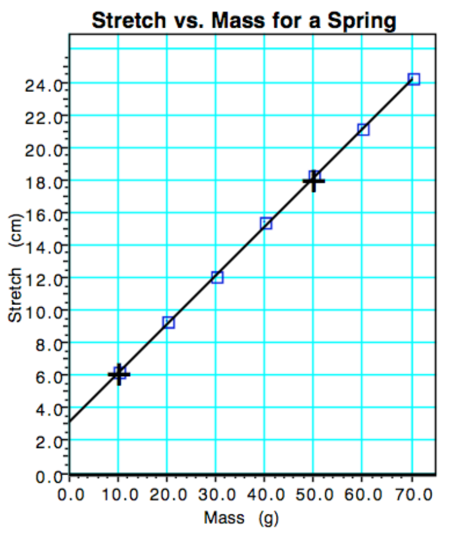

# Experimental Methods <!--fit--->

## Regents Physics 

#### Mr. Porter

---

# Designing a Controlled Experiment

* Scientists aim to determine how one variable affects another
* Requires a controlled experiment setup
* Only one variable is manipulated (independent variable)
* Its effect on a second variable is measured (dependent variable)
* All other variables are held constant (controlled variables)

---

# Example: Pendulum Experiment

* Goal: Test how changing mass affects pendulum period
* Independent variable: Mass of pendulum
* Dependent variable: Period of pendulum
* Controlled variables: Length of string, amplitude

---

# Characteristics of Good Data Recording

1) Data table constructed before data collection
3) Table laid out neatly with a straightedge
4) Independent variable in leftmost column
5) Descriptive title for data table
6) Each column labeled with variable name
7) Units of measurement included
9) Calculations explained with sample calculations
10) Constant values described and recorded

---

# Mr. Porter Rule of Thumb 👍

### 8 x 10 Rule

* Collect at least 8 data points
    - Allows us to see a trend
* Your largest IV data point should be 10 times the smallest, or as close as possible
    - Allows us to see a trend over a wide range of data

---

# Graphing Data

* Scatter graphs are common in physics
* Used for conceptual understanding and mathematical formulation
* Each relationship investigated should have an appropriate graph

---

<!--- footer:   --->

### Elements of Good Graphs

- Descriptive title (DV vs. IV)
- Graph should fill allotted space
- Proper scaling (start at zero, uniform and linear)
- Labeled axes with quantities and units
- Data points plotted correctly with point protectors

---

### Elements of Good Graphs (cont.)

- Line of best fit showing overall trend
- No connecting of successive data points
- For linear graphs, mark two points for slope calculation
- No other work in graph space
- Linearization of non-linear graphs when necessary

---

# Graphical Analysis and Linear Mathematical Models

* For linear graphs, use slope-intercept form: $y = mx + b$
* Determine slope and y-intercept from graph
* Substitute constants and variables from experiment
* Develop final mathematical model

---

### Example: Spring Stretch Experiment

1. Graph equation: $y = mx + b$
2. From graph: slope (m) = 0.30 cm/g; y-intercept = 3.2 cm
3. Substitute: S = [0.30 (cm/g)]m + 3.2 cm
4. Final model: Stretch = 0.30 cm/g · mass + 3.2 cm

---

# Interpreting Mathematical Models

- Each value has physical significance
- Slope: Stretch of spring is 0.3 cm *for each* additional gram of mass. 
- Y-intercept: initial stretch (3.2 cm)
- Can predict behavior for any mass value

---

# Evaluating Real Data

- Decide if graph should go through origin
- Consider experimental limitations
- Use physical reasoning when possible
- Assume physical significance if unclear

---

# Graphical Methods Summary

| Graph Shape | Written Relationship | Linearization | Algebraic Representation |
|-------------|----------------------|---------------|--------------------------|
| Horizontal line | No relationship | None | $y = b$ |
| Straight line through origin | Direct proportion | None | $y = mx$ |
| Straight line not through origin | Linear relationship | None | $y = mx + b$ |

---

# Graphical Methods Summary (cont.)

| Graph Shape | Written Relationship | Linearization | Algebraic Representation |
|-------------|----------------------|---------------|--------------------------|
| Decreasing curve | Inverse proportion | Graph $y$ vs $1/x$ | $y = m(1/x) + b$ |
| Increasing parabola | $y$ proportional to $x^2$ | Graph $y$ vs $x^2$ | $y = mx^2 + b$ |
| Increasing curve | $y^2$ proportional to $x$ | Graph $y^2$ vs $x$ | $y^2 = mx + b$ |

---

