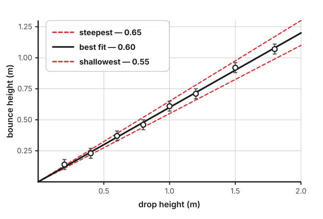

<!-- _class: title -->

# How Sure Are You?

**Uncertainty, Slopes, and Predictions**

---

## Five Drops, Five Answers

You drop your ball from **1.00 m**, five times, and read the bounce:

| Trial | 1 | 2 | 3 | 4 | 5 |
|---|---|---|---|---|---|
| Bounce (m) | 0.58 | 0.63 | 0.60 | 0.65 | 0.59 |

Same ball. Same height. Same person reading.

> So which one is **the** answer?

---

## None of Them. All of Them.

The honest answer is not a single number — it's a **center** and a **spread**.

**Center:** the mean &rarr; $\dfrac{0.58+0.63+0.60+0.65+0.59}{5} = 0.610$ m

**Spread:** half the range &rarr; $\dfrac{0.65 - 0.58}{2} = 0.035 \approx 0.04$ m

$$h_{\text{bounce}} = 0.61 \pm 0.04 \text{ m}$$

---

<!-- _class: impact -->

## Scatter Is Not a Mistake

Your five readings disagreeing is **not** sloppy work.

It is *the measurement telling you how precisely it can be made.*

Report the spread. **Never** hide it by writing down one "good" trial.

---

## So Why Graph It At All?

You could stop here: $\dfrac{0.61}{1.00} = 0.61$ and call it done.

Don't. A single ratio has three problems:

- It rests on **two** measurements — you took **forty**
- It **assumes** the line goes through the origin. It can't check
- One misread apex moves it a lot. One bad point barely tilts a line

> The graph is how you spend all your data at once.

---

## Drawing the Best-Fit Line

- Plot **mean** bounce height vs. drop height
- **Do not connect the dots** — you're not tracing, you're modeling
- One straight line, roughly as many points **above** as **below**
- Extend it across the full range

---

## Finding the Slope

Pick two points that sit **on your line** — *not* two of your data points.

$$\text{slope} = \frac{\Delta h_{\text{bounce}}}{\Delta h_{\text{drop}}} = \frac{1.08 - 0.12}{1.80 - 0.20} = \frac{0.96}{1.60} = 0.60$$

**Units?** Meters over meters. They cancel — the slope is a **pure number**.

> Reading slope off two data points throws away the whole point of fitting a line.

---

## But How Sure Is *That*?

You drew one line. Your data would have tolerated others.

---

## Steepest and Shallowest

Draw the **steepest** line your data still supports, and the **shallowest**.

| Line | Slope |
|---|---|
| Steepest | 0.65 |
| Best fit | **0.60** |
| Shallowest | 0.55 |

$$\delta(\text{slope}) = \frac{0.65 - 0.55}{2} = 0.05$$

---

<!-- _class: equation -->

## Your Model

$$h_{\text{bounce}} = (0.60 \pm 0.05)\, h_{\text{drop}}$$

That is the whole lab in one line: an **equation**, built from **your** data, carrying **your** precision.

> Write it in physics symbols. Never $y = mx$.

---

<!-- _class: challenge -->

## Now Make It Earn Its Keep

An equation that only describes data you already have proves nothing.

**Predict** a bounce you have *not* measured.

Pick a drop height inside your range that you skipped — say **1.40 m**.

---

## A Prediction Is a Range

Run your **best** slope, then both **edges**:

| Using slope | Predicted bounce |
|---|---|
| 0.55 (shallowest) | $0.55 \times 1.40 = 0.77$ m |
| **0.60 (best fit)** | $0.60 \times 1.40 = \mathbf{0.84}$ **m** |
| 0.65 (steepest) | $0.65 \times 1.40 = 0.91$ m |

$$h_{\text{bounce}} = 0.84 \text{ m} \qquad (\text{anywhere from } 0.77 \text{ to } 0.91 \text{ m})$$

---

<!-- _class: rules -->

## Then Test It

Write the prediction **before** you drop the ball. Then run five trials.

- **Lands inside your range** &rarr; your model works, *and* your uncertainty was honest
- **Lands just outside** &rarr; you were probably too confident — your range was too narrow
- **Lands far outside** &rarr; something is wrong with the model, not the arithmetic

> A prediction written *after* the measurement tests nothing at all.

---

## Two Kinds of Error

**Random** — scatter, different every time
- Misjudging the apex, slight release differences
- More trials and averaging **shrink** it

**Systematic** — same direction every time
- Measuring drop to the ball's bottom but bounce to its top
- Averaging **does nothing**. A thousand trials stay wrong

> Only one of these is fixed by working harder. The other is fixed by thinking harder.

---

## In Your Notebook

- Mean **and** spread at each height
- A graph with a **best-fit line**, plus your steepest and shallowest*
- Slope $\pm$ uncertainty
- Your model equation in physics symbols
- Prediction and range, written **before** the test drop
- Measured result, and whether it landed inside
