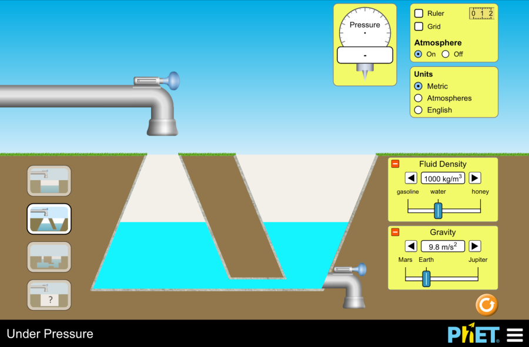

# Fluids <!--fit--->

## AP Phyics 1

---

| Quantity | Definition | Unit | Measuring Device | Equation |
|:--------:|:----------:|:----:|:----------------:|:--------:|
| Mass | Amount of matter | kg | Balance | N/A |
| Volume | Space occupied | m³ | Graduated Cylinder | $V = l \times w \times h$ |
| Density | Matter per space | kg/m³ | Calculated or Hydrometer | $\rho = m/V$ |
| Weight | Force of Gravity | Newtons | Spring Scale | $F_g = mg$ |

---

# What is a Fluid?

## A **fluid** is a substance that:

- Has no fixed shape
- Takes the shape of its container
- Can flow

Includes both liquids and gases

---

# States of Matter - What are fluids?

| States of Matter | Mass | Volume | Density | Shape |
|:----------------:|:----:|:------:|:-------:|:-----:|
| Solid | Constant | Constant | Constant | Constant |
| Liquid | Constant | 'Constant' | 'Constant' | **Variable** |
| Gas | Constant | **Variable** | **Variable** | **Variable** |

---
  
# Fields of Study in Fluids

## Fluid Statics 
- Study of fluids at rest

## Fluid Dynamics
- Study of fluids in motion

---

# Fluid Statics

* Study of fluids at rest
* Determining the **density** of objects and fluids
* Factors that affect the pressure exerted by a fluid at rest
* Archimedes' Principle: Buoyancy and the Buoyant Force

---

# Density 

## Density: The ratio of mass to volume

$$\rho = \frac{m}{V}$$

- Units: kg/m³, g/cm³, g/mL
- Intensive property (doesn't depend on amount)
- Key characteristic of materials

---

# Density

## Equation
$\boxed{\rho = m/V}$

## Units
AP Physics: kg/m³
Chemistry: g/mL or g/cm³

## Common Values
- Air: 1.2 kg/m³
- Water: 1,000 kg/m³
- Salt Water: 1,030 kg/m³
- Honey: 1,420 kg/m³ 
- Iron: 7,870 kg/m³

---

## Floating vs. Sinking
Objects float when:

- Density of object < Density of fluid

Objects sink when:

- Density of object > Density of fluid

---

# Ideal Fluids 

For the AP exam, we consider ideal fluids:

- **Incompressible**: Volume doesn't change under pressure
- **No viscosity**: Flows without resistance

Real fluids like water are close to ideal in many situations.

---

# Density Determination Lab
## Data for different amounts of the same unknown material

| Mass (kg) | Volume (×10⁻⁴ m³) |
|:---------:|:-----------------:|
| 1.2 | 1.7 |
| 2.0 | 2.9 |
| 3.3 | 4.7 |
| 4.1 | 5.8 |
| 5.4 | 7.7 |

How can you graph the data to determine the density of the material?

 
 
 
 

---

# Density Comparison Ranking Task

| Object | Mass(kg) | Volume(m³) |
|:------:|:--------:|:----------:|
| A | 7.2 | 0.0019 |
| B | 5.5 | 0.0026 |
| C | 2.3 | 0.00034 |
| D | 6.1 | 0.0077 |

Rank the densities of each object from the largest to the smallest.

---

# Density Comparison Ranking Task - Solution

| Object | Mass(kg) | Volume(m³) | Density (kg/m³) | Rank |
|:------:|:--------:|:----------:|:--------------:|:----:|
| A | 7.2 | 0.0019 | 3,789 | 2 |
| B | 5.5 | 0.0026 | 2,115 | 3 |
| C | 2.3 | 0.00034 | 6,765 | 1 |
| D | 6.1 | 0.0077 | 792 | 4 |

---

# AP Workbook Unit 8.A & 8.B <!--fit--->

---

---

# Quick Review: Density

- **Density**: Mass per unit volume: $\rho = \frac{m}{V}$
- Determines whether objects float or sink
- Units: kg/m³, g/cm³, g/mL

**Connection to pressure**: The weight of fluid above a point creates pressure at that point.

---

# Defining Pressure 

**Pressure**: Force perpendicular to a surface divided by the area over which the force is applied

_"Force per area"_

$$P = \frac{F_\perp}{A}$$

- Units: Pascals (Pa) = N/m²
- 1 atmosphere ≈ 100,000 Pa = $1 \times 10^5$ N/m² (rounded from 101.3 kPa)
- Pressure is a **scalar** quantity 
- To find force from pressure: $F_\perp = P \times A$

---

# Weight of Car Determination Lab

## Using Tire Pressure & Area Data

| Tire | P (PSI) | A (in²) |
|:----:|:-------:|:-------:|
| Driver Front | 43 | 24 |
| Passenger Front | 44 | 24 |
| Driver Rear | 44 | 34 |
| Passenger Rear | 45 | 34 |

  How can you analyze the data to determine the weight of the car?

---

# Weight of Car Determination Lab

## Using Tire Pressure & Area Data

| Tire | P (PSI) | A (in²) | Force (lbs) |
|:----:|:-------:|:-------:|:------:|
| Driver Front | 43 | 24 | 1032 |
| Passenger Front | 44 | 24 | 1056 |
| Driver Rear | 44 | 34 | 1496 |
| Passenger Rear | 45 | 34 | 1530|
| | | TOTAL | 5114 |

  
  1. $F = PA$ 
  2. Calculate for each Tire
  3. Sum forces!

  Note: These are not in metric units

---

Does a student apply a larger pressure to the ground when they are wearing running shoes or soccer cleats and why?

  
A

  
When they are wearing running shoes because the bottom area of running shoes is larger.

  
  
B

  
When they are wearing running shoes because the bottom area of running shoes is smaller.

  
  
C

  
When they are wearing soccer cleats because the bottom area of soccer cleats is larger.

  
  
D

  
When they are wearing soccer cleats because the bottom area of soccer cleats is smaller.

---

## Answer: D _When they are wearing soccer cleats because the bottom area of soccer cleats is smaller._

Remember: Pressure = Force ÷ Area

- The force (student's weight) is constant
- Soccer cleats have small studs/spikes that concentrate force onto a much smaller area
- Running shoes have a larger, flat contact surface with the ground
- Smaller contact area = Higher pressure

This is why cleats provide better traction on grass fields!

---

# Pressure vs. Depth Lab <!--fit--->

## Pivot

---

# Pressure in Incompressible Fluids

Fluids analyzed in AP Physics 1 are incompressible. Therefore, the more pressure exerted over the surface of the incompressible fluid, the greater force is exerted over the entire surface. 

However, the pressure **at a specific depth** depends only on:
- The depth below the surface
- The density of the fluid
- Gravitational field strength

Not on the shape or width of the container!

---

# Pressure vs. Depth 

For a fluid at rest, pressure increases linearly with depth:

$$\boxed{P_{gauge} = \rho gh}$$

Where:
- $\rho$ = fluid density (kg/m³)
- $g$ = gravitational field strength (on earth = 9.8 m/s²)
- $h$ = depth below surface (m)

---

# Absolute vs. Gauge Pressure 

**Absolute Pressure**: Total pressure at a point
* $\boxed{P = P_0 + \rho gh}$
* $P_0$ is reference pressure (often atmospheric)

**Gauge Pressure**: Difference between absolute and reference pressure
* $P_{gauge} = \rho gh$ 

Most pressure gauges measure gauge pressure

**Remember**: When solving problems, be clear about whether you're using absolute or gauge pressure!

---

# Understanding Absolute vs. Gauge Pressure

## Definitions

**Absolute Pressure**: The total pressure at a point, measured relative to a perfect vacuum (zero pressure). It includes the pressure due to the fluid and any atmospheric pressure.

Formula: $P_{absolute} = P_0 + \rho gh$
- $P_0$ is the reference pressure (usually atmospheric pressure)
- $\rho$ is the fluid density
- $g$ is gravitational acceleration
- $h$ is depth below the surface

---

# Understanding Absolute vs. Gauge Pressure

## Definitions

**Gauge Pressure**: The pressure measured relative to the local atmospheric pressure. It only includes the additional pressure caused by the fluid itself.

Formula: $P_{gauge} = \rho gh$

---

## Key Differences

1) **Reference Point**:
   - Absolute pressure: Measured from zero pressure (perfect vacuum)
   - Gauge pressure: Measured from atmospheric pressure
2) **Mathematical Relationship**:
   - $P_{absolute} = P_{gauge} + P_{atmospheric}$
   - $P_{gauge} = P_{absolute} - P_{atmospheric}$
3) **Value Comparison**:
   - Absolute pressure is always positive
   - Gauge pressure can be positive, zero, or negative

---

## When to Use Absolute Pressure

1. **Thermodynamic Calculations**: When working with gas laws (PV = nRT), absolute pressure must be used.
2. **Scientific Research**: Any fundamental calculations requiring complete pressure values.
3. **Aviation and Weather Applications**: When atmospheric pressure variations are significant.
4. **Vacuum Systems**: When dealing with pressures below atmospheric pressure.
5. **Problem Setup**: When the reference point is explicitly stated as a perfect vacuum.

---

## When to Use Gauge Pressure

1. **Most Fluid Mechanics Problems**: For calculating forces on submerged objects or pressure differences in fluids.
2. **Hydraulic Systems**: When working with enclosed fluids where only the pressure difference matters.
3. **Tire Pressure**: When measuring pressure above the atmospheric level.
4. **Blood Pressure**: Measured relative to atmospheric pressure.
5. **Most Pressure Sensors and Gauges**: These typically measure gauge pressure.
6. **AP Physics 1 Problems**: Most exam questions dealing with depth-related pressure use gauge pressure.

---

## Examples to Illustrate the Distinction

**Example 1: Swimming Pool**
- A swimmer is 2m below the surface of a swimming pool
- Water density = 1000 kg/m³
- Gauge pressure: $P_{gauge} = \rho gh = 1000 \times 9.8 \times 2 = 19,600$ Pa
- Absolute pressure: $P_{absolute} = P_{gauge} + P_{atm} = 19,600 + 101,325 = 120,925$ Pa

---

## Examples to Illustrate the Distinction

**Example 2: Pressure at Different Altitudes**
- At sea level, gauge pressure = 0 Pa (by definition)
- Absolute pressure ≈ 101,325 Pa (standard atmospheric pressure)
- At high altitudes, gauge pressure is still 0 Pa at the air-ground interface
- But absolute pressure is lower (e.g., ~70,000 Pa at 3000m elevation)

---

# Pascal's Principle

Pascal's principle states that pressure applied to an enclosed fluid is transmitted undiminished to every point in the fluid and to the walls of the container.

Mathematical representation:
- If pressure changes by ΔP at one point, it changes by ΔP at all points

This principle makes hydraulic systems possible!

---

# Hydraulic Systems: Applications of Pascal's Principle

The relationship between forces in a hydraulic system:
$\frac{F_1}{A_1} = \frac{F_2}{A_2}$

This means:
- $F_2 = F_1 \times \frac{A_2}{A_1}$
- Small force on small piston can create large force on large piston
- **Mechanical advantage** = $\frac{A_2}{A_1}$

**Key insight**: The work done is conserved (force × distance)

---

# Hydraulic Systems: Work Conservation

Conservation of energy implies that work input equals work output:

$F_1 \times d_1 = F_2 \times d_2$

Where $d_1$ and $d_2$ are distances moved by the pistons

Combined with Pascal's principle:
$\frac{d_1}{d_2} = \frac{A_2}{A_1}$

**Trade-off**: The small piston must move a greater distance to move the large piston a small distance

---

# Practice Problems: Hydraulic Systems

## Example: Hydraulic Car Lift
A hydraulic system is used to lift a 2000-kg vehicle in an auto garage.
- The vehicle sits on a piston of area 0.5 m²
- Force is applied to a piston of area 0.03 m²
- What is the minimum force needed to lift the vehicle?

---

# Solution: Hydraulic Car Lift

**Step 1**: Find the weight of vehicle
$F_2 = mg = 2000 \text{ kg} \times 9.8 \text{ m/s}^2 = 19,600 \text{ N}$

**Step 2**: Apply Pascal's principle
$\frac{F_1}{A_1} = \frac{F_2}{A_2}$

**Step 3**: Solve for the required force
$F_1 = F_2 \times \frac{A_1}{A_2} = 19,600 \text{ N} \times \frac{0.03 \text{ m}^2}{0.5 \text{ m}^2} = 1,176 \text{ N}$

A relatively small force can lift a very heavy vehicle!

---

# Thought Experiment: Container Shapes

Consider three differently shaped containers with the same height, all connected at the bottom:

- Do they contain the same amount of water? No
- Is the pressure the same at the bottom of each container? Yes
- Why? Pressure depends only on depth, density, and gravity

This helps explain why a small amount of water can create huge forces in hydraulic systems!

---

<!-- 
TEACHER NOTES: 
Welcome to Lesson 3 on Buoyancy and Archimedes' Principle. This lesson builds on students' understanding of pressure in fluids and connects it to the concept of buoyant forces. The lesson is structured to move from conceptual understanding to mathematical application.

Key objectives:
- Explain the origin of buoyant forces from pressure differences
- Apply Archimedes' principle to calculate buoyant forces
- Analyze floating, sinking, and neutral buoyancy conditions
- Use free-body diagrams to solve buoyancy problems

Assessment strategy: Use the practice problems and exit ticket to assess student understanding. Look for students who struggle with the density-volume-mass relationships, as these are fundamental to buoyancy problems.
-->

# Buoyancy & Archimedes' Principle

---

<!-- 
TEACHER NOTES:
This slide serves as a quick review of the previous lesson on pressure. The key is to make the connection between pressure differences and buoyant forces. Make sure students understand that buoyancy is a direct consequence of pressure increasing with depth.

Ask students: "Why does pressure increase with depth?" (Because of the weight of fluid above)
Follow up with: "If pressure increases with depth, what happens to the forces on the top and bottom of a submerged object?" (The force on the bottom will be greater than on the top)
-->

# Quick Review: Pressure in Fluids

- Pressure is force per unit area: $P = \frac{F_\perp}{A}$
- Pressure in a fluid increases with depth: $P_{gauge} = \rho gh$
- Pascal's principle: Pressure applied to an enclosed fluid is transmitted undiminished
- Hydraulic systems use pressure to multiply forces

**Connection to today's topic**: Pressure differences in a fluid create buoyant forces!

---

<!-- 
TEACHER NOTES:
This slide introduces the puzzle of buoyancy with familiar examples. Use this to generate curiosity and activate prior knowledge. Students often have intuitive notions about why objects float or sink, but may not be able to explain it scientifically.

Consider asking students to predict what factors determine whether an object floats or sinks. Common misconceptions include:
- Believing that "heavy" objects sink and "light" objects float (rather than understanding it's about density)
- Thinking that the shape of an object determines whether it floats (somewhat true but more complex)
- Confusing mass and density

Take time to address these misconceptions throughout the lesson.
-->

# The Puzzle of Buoyancy

Why do some objects float while others sink?
- A large steel ship floats, but a small steel nail sinks
- A helium balloon rises in air
- Your body feels lighter in water

What determines whether an object floats or sinks in a fluid?

---

<!-- 
TEACHER NOTES:
This slide introduces the formal definition of buoyant force (Learning Objective 8.3.B.1). Make sure students understand that buoyant force is not a new type of force - it's really just the net effect of pressure forces acting on an object.

Emphasize that buoyancy exists in both liquids and gases. Students often only think of buoyancy in liquids, but concepts like hot air balloons rely on buoyancy in air.

Key point: The buoyant force depends on the fluid, not the object itself.
-->

# What is Buoyancy?

**Buoyant force**: The net upward force exerted on an object by a fluid

- Acts opposite to gravity
- Caused by pressure differences in the fluid
- Exists in both liquids and gases
- Depends on the fluid, not the object
- Follows Archimedes' principle

---

<!-- 
TEACHER NOTES:
This slide explains the origin of buoyant force (Learning Objective 8.3.B.2). It's important for students to understand that buoyancy arises from pressure differences, not some mysterious "floating force."

You might use a simple diagram on the board showing pressure arrows on all sides of a submerged rectangle - larger arrows at the bottom, smaller at the top, and equal on the sides.

Ask: "Why do horizontal pressure forces cancel out?" (Because at any given depth, pressure is the same in all directions)
-->

# The Origin of Buoyant Force 

The buoyant force results from the collective forces exerted on the object by the particles making up the fluid.

Pressure increases with depth, so:
- Greater pressure on bottom surface than top surface
- Horizontal pressure forces cancel out
- Net upward force results from the pressure difference

---

<!-- 
TEACHER NOTES:
This slide introduces Archimedes' principle (Learning Objective 8.3.B.3), which is the central concept of the lesson. Make sure students understand what "displaced fluid" means - it's the volume of fluid that would occupy the same space as the submerged part of the object.

Point out that while the verbal statement seems simple, it's very powerful for calculations. Make sure students can translate between the verbal and mathematical forms.

Common challenge: Students confuse the density of the object with the density of the fluid in the formula. Emphasize that ρ_fluid is used to calculate buoyant force.
-->

# Archimedes' Principle 

**Archimedes' principle**: The buoyant force exerted on an object by a fluid is equal to the weight of the fluid displaced by the object.

Mathematically:
$F_B = \rho_{fluid} \cdot V_{displaced} \cdot g$

Where:
- $F_B$ is the buoyant force
- $\rho_{fluid}$ is the density of the fluid
- $V_{displaced}$ is the volume of fluid displaced
- $g$ is gravitational acceleration (9.8 m/s²)

---

<!-- 
TEACHER NOTES:
This derivation slide helps students understand why Archimedes' principle works. It's not just a formula to memorize, but a consequence of how pressure varies with depth.

This derivation assumes a rectangular object for simplicity. If students are ready for more challenge, ask how the derivation would change for irregularly shaped objects (the principle still holds).

The key insight is that the buoyant force equals the weight of displaced fluid because the net force from pressure differences is proportional to the volume of the object and the density of the fluid.
-->

# Deriving Archimedes' Principle

Consider a rectangular object submerged in a fluid:

1) Pressure at top: $P_{top} = \rho g h_{top}$
2) Pressure at bottom: $P_{bottom} = \rho g h_{bottom}$
3) Force on top: $F_{top} = P_{top} \cdot A$ (downward)
4) Force on bottom: $F_{bottom} = P_{bottom} \cdot A$ (upward)
5) Net force: $F_{net} = F_{bottom} - F_{top} = \rho g (h_{bottom} - h_{top}) \cdot A$
6) Volume displaced: $V_{displaced} = (h_{bottom} - h_{top}) \cdot A$
7) Therefore: $F_{net} = \rho g V_{displaced} = F_B$

---

<!-- 
TEACHER NOTES:
This example calculation shows students how to apply Archimedes' principle. Make sure they can follow each step of the calculation and understand the units.

Common challenges:
- Unit conversions (cm³ to m³)
- Keeping track of which density to use (fluid vs. object)

You may want to work through this example step-by-step, asking students what to do at each stage. This builds confidence for the practice problems.

Emphasize: For a fully submerged object, the volume displaced equals the volume of the object.
-->

# Buoyant Force Calculations

**Example**: A 500 cm³ solid metal block is submerged in water (density = 1.0 g/cm³).

What is the buoyant force on the block?

$F_B = \rho_{fluid} \cdot V_{displaced} \cdot g$
$F_B = 1.0 \text{ g/cm}^3 \cdot 500 \text{ cm}^3 \cdot 9.8 \text{ m/s}^2$
$F_B = 500 \text{ g} \cdot 9.8 \text{ m/s}^2$
$F_B = 0.5 \text{ kg} \cdot 9.8 \text{ m/s}^2$
$F_B = 4.9 \text{ N}$

The buoyant force is 4.9 N, equivalent to the weight of 500 cm³ of water.

---

<!-- 
TEACHER NOTES:
This slide outlines the three possible scenarios for buoyancy. Make sure students understand the conditions for each scenario and the relationship between density and buoyancy outcomes.

You might use a visual demonstration by comparing:
- A piece of foam floating (density < water)
- A neutrally buoyant object (can use a carefully adjusted balloon and weights)
- A piece of metal sinking (density > water)

Emphasize that comparing the density of the object to the density of the fluid is the key to predicting behavior.
-->

# Three Buoyancy Scenarios

1. **Floating**: Object partially submerged, buoyant force equals weight
   - $F_B = W_{object}$
   - $\rho_{object} < \rho_{fluid}$

2. **Neutral Buoyancy**: Object fully submerged, buoyant force equals weight
   - $F_B = W_{object}$
   - $\rho_{object} = \rho_{fluid}$

3. **Sinking**: Object fully submerged, buoyant force less than weight
   - $F_B < W_{object}$
   - $\rho_{object} > \rho_{fluid}$

---

<!-- 
TEACHER NOTES:
This slide explores the case of floating objects in more detail. The key insight here is that a floating object displaces an amount of fluid equal to its own weight, not its volume.

The fraction of volume submerged is a particularly useful concept for AP Physics problems. Make sure students understand where this formula comes from:
- For floating objects, buoyant force equals weight (F_B = W)
- Buoyant force equals weight of displaced fluid (F_B = ρ_fluid × V_submerged × g)
- Object weight equals (ρ_object × V_total × g)
- Setting these equal and solving for V_submerged/V_total gives the ratio formula

This has practical applications: it's why ice cubes float with about 90% of their volume submerged.
-->

# Floating Objects: Partial Submersion

For a floating object, only part of its volume is submerged.

For a floating object in equilibrium:
$F_B = W_{object}$
$\rho_{fluid} \cdot V_{submerged} \cdot g = \rho_{object} \cdot V_{total} \cdot g$

Simplifying:
$\frac{V_{submerged}}{V_{total}} = \frac{\rho_{object}}{\rho_{fluid}}$

This ratio is the **fraction of volume submerged**

---

<!-- 
TEACHER NOTES:
This slide connects buoyancy to Newton's laws (Learning Objectives 8.3.A.1-2). Students need to understand that buoyancy problems can be analyzed using the same force and motion principles they've been using all year.

The free-body diagram for a submerged object is critical. Have students practice drawing these diagrams for different scenarios.

The acceleration equation is more complex and might be challenging for some students. Focus on the conceptual understanding first: if fluid density > object density, the object accelerates upward, and vice versa.
-->

# Free-Body Diagrams for Buoyancy

Newton's laws apply to fluid motion! Let's analyze the forces:

**For a submerged object**:
- Weight down: $W = mg = \rho_{object} V_{object} g$
- Buoyancy up: $F_B = \rho_{fluid} V_{object} g$
- Net force: $F_{net} = F_B - W$ (if positive, object rises)

**Acceleration**:
$a = \frac{F_{net}}{m} = \frac{(\rho_{fluid} - \rho_{object})V_{object}g}{\rho_{object}V_{object}}$
$a = g\left(\frac{\rho_{fluid}}{\rho_{object}} - 1\right)$

---

<!-- 
TEACHER NOTES:
This practice problem addresses a fully submerged object. It's a good starting point as it applies Archimedes' principle directly.

Have students work on this problem individually or in pairs before discussing the solution. Watch for students who have difficulty:
- Converting units correctly
- Determining whether the object will rise or sink
- Drawing the free-body diagram with the correct force magnitudes

Common error: Some students may forget to calculate the weight of the block to compare with the buoyant force.
-->

# Practice Problem 1: Fully Submerged Object

A 2.0 kg block with volume 800 cm³ is held fully submerged in water.

1. What is the buoyant force on the block?
2. If released, will the block rise, sink, or remain in place?
3. Draw a free-body diagram showing all forces.

---

<!-- 
TEACHER NOTES:
This slide shows the detailed solution to Practice Problem 1. Walk through each step carefully, emphasizing:
- The use of Archimedes' principle to calculate buoyant force
- The comparison between weight and buoyant force to determine motion
- The free-body diagram showing both forces with their calculated values

Ask students: "What is the density of the block?" (They can calculate: 2.0 kg ÷ 800×10⁻⁶ m³ = 2500 kg/m³)
Follow-up: "How does this density compare to water, and how does that relate to whether it sinks or floats?" (Density > water, so it sinks)
-->

# Solution: Practice Problem 1

1. **Buoyant force calculation**:
   $F_B = \rho_{water} \cdot V_{block} \cdot g$
   $F_B = 1000 \text{ kg/m}^3 \cdot 800 \times 10^{-6} \text{ m}^3 \cdot 9.8 \text{ m/s}^2$
   $F_B = 7.84 \text{ N}$

2. **Block's weight**:
   $W = mg = 2.0 \text{ kg} \cdot 9.8 \text{ m/s}^2 = 19.6 \text{ N}$
   
   Since $W > F_B$, the block will sink when released.

3. **Free-body diagram**: Shows weight downward (19.6 N) and buoyant force upward (7.84 N)

---

<!-- 
TEACHER NOTES:
This practice problem addresses floating objects and the fraction submerged calculation. It's more complex than the first problem as it requires understanding of the relationship between densities and floating.

The saltwater extension question challenges students to apply the concept to a new situation. It reinforces the idea that buoyancy depends on the fluid's density, not just the object's properties.

Have students work on this in small groups (2-3 students) to encourage discussion.
-->

# Practice Problem 2: Floating Object

A block of wood with density 800 kg/m³ floats in water.

1. What fraction of the block's volume is submerged?
2. If the block has a volume of 0.05 m³, what is the buoyant force on it?
3. How would the submerged fraction change if placed in saltwater (density 1025 kg/m³)?

---

<!-- 
TEACHER NOTES:
This slide shows the solution to Practice Problem 2. Key points to emphasize:
- Using the density ratio to calculate fraction submerged
- For a floating object in equilibrium, buoyant force equals weight
- How changing the fluid density affects the fraction submerged

The third part shows the practical application - this is why it's easier to float in saltwater than in freshwater.

Ask: "Why does the block float higher (less volume submerged) in saltwater?" (Because saltwater provides more buoyant force per volume submerged due to its higher density)
-->

# Solution: Practice Problem 2

1. **Fraction submerged**:
   $\frac{V_{submerged}}{V_{total}} = \frac{\rho_{wood}}{\rho_{water}} = \frac{800 \text{ kg/m}^3}{1000 \text{ kg/m}^3} = 0.80$ or 80%

2. **Buoyant force**:
   $F_B = W = \rho_{wood} \cdot V_{total} \cdot g$
   $F_B = 800 \text{ kg/m}^3 \cdot 0.05 \text{ m}^3 \cdot 9.8 \text{ m/s}^2 = 392 \text{ N}$

3. **In saltwater**:
   $\frac{V_{submerged}}{V_{total}} = \frac{\rho_{wood}}{\rho_{saltwater}} = \frac{800 \text{ kg/m}^3}{1025 \text{ kg/m}^3} = 0.78$ or 78%
   
   Less of the block would be submerged in saltwater.

---

<!-- 
TEACHER NOTES:
This practice problem addresses using buoyancy to determine an object's density - a common type of application problem. This connects to the experimental setup that would traditionally be done as a lab.

This problem requires working backward from the observed weight difference to determine properties of the object. It's more challenging as students need to:
- Recognize that weight difference = buoyant force
- Use Archimedes' principle to find volume
- Calculate density from mass and volume

This is a good problem for the more advanced students.
-->

# Practice Problem 3: Finding Density

An irregular metal object weighs 3.0 N in air. When fully submerged in water, it weighs only 2.2 N.

1. What is the buoyant force on the object?
2. What is the volume of the object?
3. What is the density of the object?

---

<!-- 
TEACHER NOTES:
This slide shows the solution to Practice Problem 3. This is an important problem type because it demonstrates how Archimedes' principle can be used to find properties of objects that would be difficult to measure directly.

Key points to emphasize:
- The apparent weight loss equals the buoyant force
- Buoyant force depends on the volume of the object and the density of the fluid
- Once we know volume and mass (from weight), we can calculate density

This problem type appears frequently on the AP exam.
-->

# Solution: Practice Problem 3

1. **Buoyant force**:
   $F_B = W_{air} - W_{water} = 3.0 \text{ N} - 2.2 \text{ N} = 0.8 \text{ N}$

2. **Object volume**:
   $F_B = \rho_{water} \cdot V_{object} \cdot g$
   $V_{object} = \frac{F_B}{\rho_{water} \cdot g} = \frac{0.8 \text{ N}}{1000 \text{ kg/m}^3 \cdot 9.8 \text{ m/s}^2} = 8.16 \times 10^{-5} \text{ m}^3 = 81.6 \text{ cm}^3$

3. **Object density**:
   $\rho_{object} = \frac{m}{V} = \frac{W_{air}/g}{V} = \frac{3.0 \text{ N}/9.8 \text{ m/s}^2}{8.16 \times 10^{-5} \text{ m}^3} = 3750 \text{ kg/m}^3$

---

---

<!-- 
TEACHER NOTES:
Welcome to Lesson 4 on Fluid Dynamics! This is where we transition from static fluids to fluids in motion. Today's focus is on mass conservation and the continuity equation.

Key objectives:
- Explain what causes fluids to flow
- Apply conservation of mass to fluid flow
- Use the continuity equation to analyze fluid speed through different cross-sections
- Design theoretical experiments to measure fluid flow rates

This lesson builds on previous concepts of pressure while introducing new principles that will lead to Bernoulli's equation in the next lesson.
-->

# Unit 8: Fluids
## Fluid Dynamics - Mass Conservation

---

<!-- 
TEACHER NOTES:
This slide connects previous lessons to today's topic. Students should understand that pressure differences are what drive fluid flow - this concept will be essential for Bernoulli's equation in the next lesson.

Possible question to pose: "Why does water flow out of a hole in the bottom of a bucket? What force causes this movement?" (Answer: The pressure difference between the water at the hole and the atmospheric pressure outside)
-->

# Quick Review: Static Fluids

In our previous lessons, we covered:
- Density and pressure in fluids
- Pressure increases with depth: $P_{gauge} = \rho gh$
- Pascal's principle for enclosed fluids
- Archimedes' principle and buoyancy

**Today's focus**: What happens when fluids are in motion?

**Connection**: Pressure differences not only cause buoyancy but also drive fluid flow!

---

<!-- 
TEACHER NOTES:
This slide introduces the fundamental concept that drives fluid flow - pressure differences. Emphasize that fluids always flow from high pressure to low pressure regions, similar to how heat flows from high to low temperature.

The everyday examples help make the concept relatable. You might ask students to think of other examples of fluid flow in their daily lives and identify the pressure differences involved.
-->

# What Causes Fluids to Flow? 

**Fundamental principle**: A difference in pressure between two locations causes a fluid to flow.

_Fluid moves from high pressure regions to low pressure regions._

Examples:
- Water flowing from a faucet (high pressure in pipes → low pressure in air)
- Air moving through lungs (low pressure in lungs → air flows in)
- Wind (high pressure weather system → low pressure system)
- Blood circulation (high pressure from heart → lower pressure in vessels)

---

# Conservation of Mass and Fluid Flow Rate

* The mass of a system is **conserved**
* Water is assumed to be **incompressible** (an Ideal Fluid)
* The volume of a liquid system is therefore also conserved
* The volume of a water passing a point per second is constant
* This rate is referred to as the _**Fluid Flow Rate**_ $Q = V/t$
* This rate is measured in $\text{m}^3/\text{s}$

---

<!-- 
TEACHER NOTES:
This slide introduces the key concepts of fluid flow rate. Emphasize that flow rate can be measured in either volume per time or mass per time, and the two are related by density.

The equation V/t = Av is particularly important as it leads to the continuity equation. Make sure students understand what each variable represents.

Common misconception: Students often confuse flow rate with fluid velocity. Clarify that flow rate is the amount of fluid passing a point, while velocity is the speed of the fluid at that point.
-->

### **Fluid Flow Rate**: The amount of fluid passing through a cross-section per unit time

Two ways to measure flow rate:
1. **Volume flow rate**: Volume of fluid per unit time 
   - Units: m³/s
   - Equation: $\frac{V}{t} = Av$

2. **Mass flow rate**: Mass of fluid per unit time
   - Units: kg/s
   - Equation: $\frac{m}{t} = \rho \frac{V}{t} = \rho Av$

Where: $A$ = cross-sectional area, $v$ = fluid velocity

---

<!-- 
TEACHER NOTES:
This slide emphasizes conservation of mass in fluid flow (Learning Objective 8.4.A.1.i). This is a critical concept for understanding the continuity equation.

The pipe example helps visualize the concept. You might draw this on the board, showing fluid entering one end of a pipe and the same amount of fluid exiting the other end.

Question to ask students: "What would happen if more fluid entered a pipe than exited it?" (The pipe would burst from increasing pressure, or the flow would adjust to maintain equal rates)
-->

# Conservation of Mass in Fluid Flow

For a fluid-filled tube open at both ends:

**The rate at which matter enters must equal the rate at which matter exits.**

This is similar to:
- Conservation of charge in electric circuits
- Conservation of cars on a highway

For incompressible fluids, this means the volume flow rate into any region equals the volume flow rate out of that region.

---

## [Phet Simulation - Fluid Flow](https://phet.colorado.edu/sims/cheerpj/fluid-pressure-and-flow/latest/fluid-pressure-and-flow.html?simulation=fluid-pressure-and-flow) <!--fit--->

---

<!-- 
TEACHER NOTES:
This slide introduces the continuity equation (Learning Objective 8.4.A.2), which is one of the key equations students need to know for the AP exam.

The pipe narrowing example is a classic application of the continuity equation. Students often find it counterintuitive that the fluid must move faster in narrower sections - this is a good opportunity to challenge and correct their intuitive understanding.

Common error: Students may forget to include the velocity when calculating flow rate, thinking only about the cross-sectional area.
-->

# The Continuity Equation

For incompressible fluids, the product of cross-sectional area and velocity remains constant:

$$A_1v_1 = A_2v_2$$

**Meaning**: 
- If area decreases, velocity must increase
- If area increases, velocity decreases

This is why water shoots farther from a partially-covered garden hose!

---

<!-- 
TEACHER NOTES:
This slide provides a step-by-step derivation of the continuity equation. This helps students understand where the equation comes from rather than just memorizing it.

Walking through this derivation reinforces the concept of conservation of mass. Point out that this is a straightforward application of the conservation principle, not a new physical law.

Possible question: "Why can we simplify from mass flow rate to volume flow rate for incompressible fluids?" (Because density is constant throughout the fluid)
-->

# Deriving the Continuity Equation

1. Conservation of mass: $\frac{m_1}{t} = \frac{m_2}{t}$
2. Mass flow rate: $\frac{m}{t} = \rho \frac{V}{t}$
3. Volume flow rate: $\frac{V}{t} = Av$
4. For incompressible fluids, $\rho_1 = \rho_2$
5. Therefore: $\rho_1 A_1 v_1 = \rho_2 A_2 v_2$
6. Simplifying: $A_1 v_1 = A_2 v_2$

This equation describes conservation of mass flow rate in incompressible fluids.

---

<!-- 
TEACHER NOTES:
This slide applies the continuity equation to a specific example. Working through concrete examples helps students understand how to use the equation in practice.

This particular example highlights how smaller areas lead to higher velocities - a concept that appears frequently in AP problems.

Watch for unit conversion errors. Students might need a reminder about converting cm² to m² or similar conversions.
-->

# Example: Pipe Narrowing

_Water flows through a pipe with a cross-sectional area of 20 cm² at a speed of 3 m/s._

If the pipe narrows to 5 cm², what is the water speed in the narrow section?

---

# Example: Pipe Narrowing

_Water flows through a pipe with a cross-sectional area of 20 cm² at a speed of 3 m/s._

If the pipe narrows to 5 cm², what is the water speed in the narrow section?

**Solution**:
Using the continuity equation: $A_1v_1 = A_2v_2$

$v_2 = \frac{A_1v_1}{A_2} = \frac{20 \text{ cm}^2 \times 3 \text{ m/s}}{5 \text{ cm}^2} = 12 \text{ m/s}$

The water speeds up by a factor of 4 (the same factor by which the area decreases).

---

<!-- 
TEACHER NOTES:
This slide presents a conceptual application of the continuity equation to blood flow. This is a great way to show the real-world relevance of these principles.

The medical implications help students connect physics to other fields and increases engagement. If you have students interested in medical careers, this example can be particularly motivating.

Discussion question: "Why might blood vessels narrow in certain conditions, and what would this do to blood pressure?" (Narrowing increases velocity and can increase pressure, which relates to hypertension)
-->

# Application: Blood Flow

The human circulatory system demonstrates the continuity equation:

1. The aorta has a cross-sectional area of about 3-5 cm²
2. This branches into many small arteries, arterioles, and capillaries
3. Each capillary is tiny (~8 μm diameter) but there are billions of them
4. Total cross-sectional area of all capillaries is ~2000-3000 cm²

**Effect on blood flow**:
- Velocity in aorta: ~30-40 cm/s
- Velocity in capillaries: ~0.05-0.1 cm/s (500 times slower!)

The slower velocity in capillaries allows time for nutrient and gas exchange.

---

# Practice Problem 1: River Narrowing

A river with width 50 m and average depth 3 m flows at a speed of 2 m/s. The river narrows to a width of 25 m with the same depth.

1. What is the cross-sectional area at each location?
2. What is the water speed in the narrow section?
3. If the river widens to 100 m and depth 2 m, what is the speed there?

---

<!-- 
TEACHER NOTES:
This slide presents the solution to the first practice problem. Walk through the solution step by step, emphasizing the application of the continuity equation.

Point out that the strategy is the same regardless of the specific scenario - find the areas, then use A₁v₁ = A₂v₂ to solve for the unknown.

Ask students: "What would happen to the river depth if the width narrowed but the velocity stayed the same?" (The depth would have to increase to maintain the same cross-sectional area)
-->

### Solution: Practice Problem 1

1. **Cross-sectional areas**:
   - Location 1: $A_1 = 50 \text{ m} \times 3 \text{ m} = 150 \text{ m}^2$
   - Location 2: $A_2 = 25 \text{ m} \times 3 \text{ m} = 75 \text{ m}^2$
   - Location 3: $A_3 = 100 \text{ m} \times 2 \text{ m} = 200 \text{ m}^2$

2. **Speed in narrow section**:
   $A_1v_1 = A_2v_2$
   $v_2 = \frac{A_1v_1}{A_2} = \frac{150 \text{ m}^2 \times 2 \text{ m/s}}{75 \text{ m}^2} = 4 \text{ m/s}$

3. **Speed in wide section**:
   $A_1v_1 = A_3v_3$
   $v_3 = \frac{A_1v_1}{A_3} = \frac{150 \text{ m}^2 \times 2 \text{ m/s}}{200 \text{ m}^2} = 1.5 \text{ m/s}$

---

<!-- 
TEACHER NOTES:
This more complex practice problem requires students to apply the continuity equation along with the concept of volume flow rate. This helps differentiate between students with basic versus more advanced understanding.

This problem is more challenging because students must calculate the total flow rate first, then use that to find velocity through a different opening. Watch for students who try to directly use the continuity equation without considering the multiple pipe scenario.

Tip: Draw a diagram on the board to help students visualize the problem.
-->

# Practice Problem 2: Multiple Pipes

A water main with cross-sectional area 50 cm² carries water at 6 m/s. The main splits into three identical smaller pipes.

1. What is the volume flow rate in the main pipe?
2. If each smaller pipe has a diameter of 3 cm, what is the water speed in these pipes?

---

<!-- 
TEACHER NOTES:
This slide shows the solution to the second practice problem. This solution involves multiple steps, including calculating flow rate and then using the continuity equation.

Make sure students understand that the total flow rate is conserved - what goes into the main pipe must come out through the three smaller pipes combined.

Common error: Students may forget to divide the total flow rate by 3 when calculating the flow through each individual smaller pipe.
-->

### Solution: Practice Problem 2

1. **Volume flow rate in main pipe**:
   $\frac{V}{t} = A_1v_1 = 50 \text{ cm}^2 \times 6 \text{ m/s} = 50 \times 10^{-4} \text{ m}^2 \times 6 \text{ m/s} = 3 \times 10^{-2} \text{ m}^3/\text{s} = 30 \text{ L/s}$

2. **Cross-sectional area of each smaller pipe**:
   $A_2 = \pi r^2 = \pi \times (1.5 \text{ cm})^2 = \pi \times 2.25 \text{ cm}^2 \approx 7.07 \text{ cm}^2$
   
   **Volume flow rate in each smaller pipe**:
   $\frac{V_2}{t} = \frac{V_1}{3t} = \frac{30 \text{ L/s}}{3} = 10 \text{ L/s}$
   
   **Speed in each smaller pipe**:
   $v_2 = \frac{V_2/t}{A_2} = \frac{10 \text{ L/s}}{7.07 \text{ cm}^2} = \frac{10 \times 10^{-3} \text{ m}^3/\text{s}}{7.07 \times 10^{-4} \text{ m}^2} \approx 14.1 \text{ m/s}$

---

---

<!-- 
TEACHER NOTES:
Welcome to Lesson 5 on Bernoulli's Equation and Conservation of Energy in Fluids. This is one of the most challenging but also most fascinating topics in the fluid mechanics unit.

This lesson builds directly on the previous lesson about continuity. While the previous lesson focused on mass conservation, this one focuses on energy conservation in fluid flow. Together, these principles form the foundation of fluid dynamics.

Key learning objectives:
- Explain how energy differences cause fluid flow (8.4.B.1)
- Apply Bernoulli's equation to fluid flow scenarios (8.4.B.2)
- Make and defend claims about pressure differences using Bernoulli's principle
-->

# Unit 8: Fluids
## Bernoulli's Equation & Energy Conservation

---

<!-- 
TEACHER NOTES:
This review slide connects the previous lesson on the continuity equation to today's topic on energy conservation. The continuity equation establishes the relationship between cross-sectional area and fluid velocity, which is essential for understanding Bernoulli's equation.

Ask students to explain the continuity equation in their own words before proceeding. This quick check ensures they have the prerequisite knowledge for today's lesson.

If students are struggling with the continuity concept, spend a few more minutes reviewing it, as it's fundamental to understanding Bernoulli's principle.
-->

# Review: The Continuity Equation

From our last lesson:
- Fluid flow is caused by pressure differences
- For incompressible fluids, flow rate remains constant
- The continuity equation: $A_1v_1 = A_2v_2$
- In narrower sections, fluid velocity increases

**Today's focus**: How does changing velocity affect pressure and energy in a fluid?

**Connection**: The continuity equation tells us how velocity changes; Bernoulli's equation tells us how pressure changes as a result.

---

<!-- 
TEACHER NOTES:
This slide introduces the fundamental concept of energy differences causing fluid flow (Learning Objective 8.4.B.1). This sets the stage for Bernoulli's equation, which quantifies these energy relationships.

The waterfall example provides a concrete visualization that students can easily grasp. It clearly shows gravitational potential energy being converted to kinetic energy as the water falls.

Key point to emphasize: In fluid systems, energy can take different forms, but the total energy remains constant (assuming no external work or heat transfer).
-->

# Energy Differences Drive Fluid Flow 

A difference in energy between two locations in a fluid system causes fluid to flow.

**Types of energy in fluids**:
- Gravitational potential energy (height)
- Kinetic energy (velocity)
- Pressure energy (compression)

**Example**: Water flowing over a waterfall
- At the top: High gravitational potential energy, low kinetic energy
- At the bottom: Low gravitational potential energy, high kinetic energy
- Total energy is conserved, just converted from one form to another

---

<!-- 
TEACHER NOTES:
This slide introduces Bernoulli's equation (Learning Objective 8.4.B.2), which is the central equation of this lesson. This equation is a direct application of energy conservation to fluid flow.

Make sure students understand what each term in the equation represents. The "energy per unit volume" interpretation helps students grasp the physical meaning of the equation.

Common misconception: Students often think pressure is higher where velocity is higher, when actually the opposite is true. Emphasize that pressure and velocity have an inverse relationship in Bernoulli's equation.
-->

# Bernoulli's Equation 

Bernoulli's equation describes conservation of mechanical energy in fluid flow:

$$P_1 + \rho gh_1 + \frac{1}{2}\rho v_1^2 = P_2 + \rho gh_2 + \frac{1}{2}\rho v_2^2$$

Each term represents a form of energy per unit volume:
- $P$: Pressure energy
- $\rho gh$: Gravitational potential energy
- $\frac{1}{2}\rho v^2$: Kinetic energy

For a fluid flowing from point 1 to point 2, the sum of these energies remains constant.

---

<!-- 
TEACHER NOTES:
This slide helps students understand the conditions under which Bernoulli's equation applies. These limitations are important for students to know when determining whether they can apply the equation to a specific problem.

Emphasize that while real fluids may not perfectly satisfy these conditions, Bernoulli's equation still provides a good approximation in many practical situations.

The simplified versions of Bernoulli's equation for special cases are particularly useful for problem-solving. Make sure students understand when they can use these simplifications.
-->

# Conditions for Bernoulli's Equation

Bernoulli's equation applies when:
- The fluid is incompressible (density is constant)
- The fluid flow is steady (velocity at each point doesn't change with time)
- The fluid flow is non-viscous (no energy loss due to friction)
- The fluid flow is along a streamline

**Special cases**:
- Horizontal flow (same height): $P_1 + \frac{1}{2}\rho v_1^2 = P_2 + \frac{1}{2}\rho v_2^2$
- Static fluid (no flow): $P_1 + \rho gh_1 = P_2 + \rho gh_2$

---

<!-- 
TEACHER NOTES:
This slide demonstrates how Bernoulli's principle explains the relationship between pressure and velocity. This inverse relationship is one of the key insights from Bernoulli's equation.

The pipe constriction example clearly illustrates this relationship. You might draw this example on the board with pressure and velocity vectors to reinforce the concept.

Question to ask students: "Why does pressure decrease when velocity increases?" (Because total energy is conserved, and more energy in the form of kinetic energy means less energy in the form of pressure)
-->

# Bernoulli's Principle

**Bernoulli's Principle**: In a flowing fluid, high velocity corresponds to low pressure, and low velocity corresponds to high pressure.

**Example**: Flow through a constricted pipe
- In the wider section: Lower velocity, higher pressure
- In the narrower section: Higher velocity, lower pressure

This principle explains many phenomena:
- Airplane wing lift
- Atomizers and spray bottles
- Curveballs in baseball
- Venturi meters for measuring flow

---

<!-- 
TEACHER NOTES:
This slide uses the continuity equation together with Bernoulli's equation to derive the relationship between cross-sectional area and pressure. This helps students see how these two important equations work together.

The key insight here is that pressure is higher in wider sections of a pipe and lower in narrower sections, contrary to what many students intuitively expect.

This is a good opportunity to challenge student misconceptions. Ask them to predict where pressure would be higher before showing the mathematical relationship.
-->

# Connecting Continuity and Bernoulli

Using the continuity equation with Bernoulli's equation:

1. From continuity: $v_2 = v_1 \frac{A_1}{A_2}$ (velocity increases when area decreases)

2. For horizontal flow, Bernoulli gives: $P_1 - P_2 = \frac{1}{2}\rho(v_2^2 - v_1^2)$

3. Substituting: $P_1 - P_2 = \frac{1}{2}\rho v_1^2 \left[\left(\frac{A_1}{A_2}\right)^2 - 1\right]$

**Result**: For $A_1 > A_2$ (pipe narrows), $P_1 > P_2$ (pressure decreases)

The pressure difference depends on the square of the area ratio!

---

<!-- 
TEACHER NOTES:
This slide introduces Torricelli's theorem (Learning Objective 8.4.B.3), which is a special case of Bernoulli's equation. This is important for the AP exam, as it's explicitly mentioned in the curriculum.

The derivation shows how Torricelli's theorem follows directly from energy conservation principles. This reinforces the fundamental concept that Bernoulli's equation is an expression of energy conservation.

The connection to the "hole in a container" problem makes this abstract concept more concrete for students. This is a classic problem type that may appear on the exam.
-->

# Torricelli's Theorem (8.4.B.3)

Torricelli's theorem relates the speed of fluid exiting an opening to the difference in height between the opening and the fluid surface.

**Derived equation**: $v = \sqrt{2gh}$

Where:
- $v$ is the exit velocity of the fluid
- $g$ is the acceleration due to gravity
- $h$ is the height difference between the fluid surface and the opening

This is equivalent to the velocity an object would have after falling from height $h$ under gravity!

---

<!-- 
TEACHER NOTES:
This slide shows how to derive Torricelli's theorem from Bernoulli's equation. Walking through this derivation helps students understand the relationship between these equations.

Emphasize that Torricelli's theorem is a special case of Bernoulli's equation, not a separate physical principle. This helps students see the coherence of fluid dynamics concepts.

Point out that the result is identical to the kinematic equation for an object falling from height h, which reinforces the energy conservation principle.
-->

# Deriving Torricelli's Theorem

Apply Bernoulli's equation to a fluid in a tank with a small opening:

1. Point 1: At the fluid surface
   - $P_1 = P_{atm}$ (atmospheric pressure)
   - $v_1 \approx 0$ (surface moves slowly if tank is wide)
   - $h_1 = h$ (height of fluid surface)

2. Point 2: At the opening
   - $P_2 = P_{atm}$ (same atmospheric pressure)
   - $v_2 = ?$ (exit velocity we want to find)
   - $h_2 = 0$ (reference height at opening)

---

3. Bernoulli: $P_1 + \rho gh_1 + \frac{1}{2}\rho v_1^2 = P_2 + \rho gh_2 + \frac{1}{2}\rho v_2^2$

4. Simplify: $\rho gh = \frac{1}{2}\rho v_2^2$

5. Solve: $v_2 = \sqrt{2gh}$

---

# Example Problem: Pressure in a Pipe

Water flows horizontally through a pipe that narrows from a diameter of 8.0 cm to 4.0 cm. The pressure in the wider section is 150 kPa, and the water speed is 2.5 m/s.

What is the pressure in the narrower section?

**Solution approach**:
1. Find the water speed in the narrower section using the continuity equation
2. Apply Bernoulli's equation for horizontal flow to find the pressure difference
3. Calculate the pressure in the narrower section

---

<!-- 
TEACHER NOTES:
This slide shows the detailed solution to the example problem. Walk through each step of the solution process, emphasizing the application of both the continuity equation and Bernoulli's equation.

Point out that we can use the simplified horizontal flow version of Bernoulli's equation since there's no change in height.

Emphasize that the pressure decreases in the narrower section, which aligns with Bernoulli's principle that higher velocity corresponds to lower pressure.
-->

# Solution: Pressure in a Pipe

**Step 1**: Use continuity equation to find $v_2$
- $A_1v_1 = A_2v_2$
- $\pi(4.0 \text{ cm})^2 \times 2.5 \text{ m/s} = \pi(2.0 \text{ cm})^2 \times v_2$
- $v_2 = 2.5 \text{ m/s} \times \frac{(4.0 \text{ cm})^2}{(2.0 \text{ cm})^2} = 10.0 \text{ m/s}$

---

**Step 2**: Apply Bernoulli's equation for horizontal flow
- $P_1 + \frac{1}{2}\rho v_1^2 = P_2 + \frac{1}{2}\rho v_2^2$
- $P_2 = P_1 + \frac{1}{2}\rho(v_1^2 - v_2^2)$
- $P_2 = 150 \text{ kPa} + \frac{1}{2} \times 1000 \text{ kg/m}^3 \times [(2.5 \text{ m/s})^2 - (10.0 \text{ m/s})^2]$
- $P_2 = 150 \text{ kPa} + \frac{1}{2} \times 1000 \text{ kg/m}^3 \times (6.25 - 100) \text{ m}^2/\text{s}^2$
- $P_2 = 150 \text{ kPa} - 46.9 \text{ kPa} = 103.1 \text{ kPa}$

---

<!-- 
TEACHER NOTES:
This worksheet slide provides a structured problem-solving activity for students. Working through multiple problems helps reinforce the application of Bernoulli's equation to different scenarios.

The paired problem-solving approach allows students to help each other and verbalize their problem-solving strategies, which deepens understanding.

Circulate during this activity to address any misconceptions and provide guidance to struggling students.
-->

# Problem-Solving Workshop

With a partner, work through these Bernoulli's equation problems:

**Problem 1**: A horizontal pipe narrows from a radius of 10 cm to 5 cm. If the pressure in the wider section is 200 kPa, and the fluid speed is 3 m/s, what is the pressure in the narrower section?

**Problem 2**: Water flows from the bottom of a tank where it is 12 m deep. What is the speed of the water as it exits the tank?

**Problem 3**: Air flows over an airplane wing. If the air speed above the wing is 120 m/s and below the wing is 100 m/s, what is the pressure difference between the top and bottom of the wing? (Air density = 1.2 kg/m³)

---

<!-- 
TEACHER NOTES:
Welcome to the final lesson of the fluid mechanics unit! This lesson has two main components: an exploration of Torricelli's theorem and its applications, followed by a comprehensive review of the entire unit.

Key objectives:
- Apply Torricelli's theorem to analyze fluid exit velocity problems
- Connect all major fluid mechanics concepts (density, pressure, buoyancy, continuity, Bernoulli)
- Review and synthesize key principles in preparation for assessment
- Practice applying fluid concepts to complex scenarios

Since this is the final lesson, it's a good opportunity to address any lingering questions and reinforce connections between different topics in the unit.
-->

# Unit 8: Fluids
## Torricelli's Theorem & Unit Review

---

<!-- 
TEACHER NOTES:
This review slide connects Bernoulli's equation from the previous lesson to Torricelli's theorem, which is the focus of the first part of today's lesson. This helps establish continuity between lessons.

The review of Bernoulli's equation should be brief but thorough. If students seem confused about any aspects of Bernoulli's equation, address these issues before moving on to Torricelli's theorem.

Ask a few students to explain Bernoulli's principle in their own words to check for understanding before proceeding.
-->

# Review: Bernoulli's Equation

From our last lesson:
- Bernoulli's equation represents conservation of energy in fluid flow:
  $$P_1 + \rho gh_1 + \frac{1}{2}\rho v_1^2 = P_2 + \rho gh_2 + \frac{1}{2}\rho v_2^2$$

- Bernoulli's principle: High velocity corresponds to low pressure
- Each term represents a form of energy per unit volume
- Total energy remains constant in ideal fluid flow

**Today's focus**: Applying Torricelli's theorem, which is derived from Bernoulli's equation

---

<!-- 
TEACHER NOTES:
This slide reminds students of Torricelli's theorem and its derivation from Bernoulli's equation. This is important for establishing that Torricelli's theorem is not a new principle, but rather a specific application of energy conservation.

The derivation steps are included for reference, but you don't need to go through the entire derivation again if it was thoroughly covered in the previous lesson.

Emphasize that Torricelli's theorem has the same form as the kinematic equation for an object falling from height h, which reinforces the connection to energy conservation.
-->

# Torricelli's Theorem Revisited 

**Torricelli's theorem**: The speed of fluid exiting an opening equals the speed an object would have after falling from the fluid surface height.

$$v = \sqrt{2gh}$$

**Derivation from Bernoulli's equation**:
1. Apply Bernoulli's equation between surface and opening
2. At both points, pressure equals atmospheric pressure
3. Surface velocity is approximately zero for a wide container
4. Simplifying leaves: $\rho gh = \frac{1}{2}\rho v^2$
5. Solving for v gives: $v = \sqrt{2gh}$

---

<!-- 
TEACHER NOTES:
This slide demonstrates how to apply Torricelli's theorem to a simple problem. The step-by-step solution serves as a model for how students should approach similar problems.

This example focuses on calculating exit velocity, which is the most straightforward application of Torricelli's theorem. Later examples will incorporate more complex scenarios.

Common error: Students may forget that h is the height difference between the fluid surface and the opening, not the total height of the container. Emphasize this point when explaining the problem.
-->

# Example 1: Exit Velocity

A water tank has a small hole in its side at a height of 2 meters above the ground. The water level in the tank is 5 meters above the ground.

What is the speed of the water as it exits the hole?

**Solution**:
1. Identify the height difference: $h = 5 \text{ m} - 2 \text{ m} = 3 \text{ m}$
2. Apply Torricelli's theorem: $v = \sqrt{2gh}$
3. Calculate: $v = \sqrt{2 \times 9.8 \text{ m/s}^2 \times 3 \text{ m}} = \sqrt{58.8 \text{ m}^2/\text{s}^2} \approx 7.7 \text{ m/s}$

**Key insight**: The exit velocity depends only on the height difference, not on the density of the fluid!

---

<!-- 
TEACHER NOTES:
This slide introduces the application of Torricelli's theorem to the projectile motion of a fluid stream. This combines fluid dynamics with kinematics, creating connections between different areas of physics.

The horizontal range formula is a key result that can be applied to various fluid exit problems. Make sure students understand where this formula comes from (combining Torricelli's theorem with horizontal projectile motion).

You might draw a diagram on the board showing the parabolic trajectory of the water stream to help students visualize the problem.
-->

# Horizontal Range of Fluid Jets

When water exits a horizontal hole, it follows a parabolic trajectory due to gravity.

The horizontal distance (range) the water travels can be found by combining:
1. Horizontal motion: $x = v_x t$ (constant velocity)
2. Vertical motion: $y = v_y t + \frac{1}{2}gt^2$ (accelerated motion)
3. Initial vertical velocity $v_y = 0$ for a horizontal hole
4. Time to reach ground: $t = \sqrt{\frac{2h_{\text{hole}}}{g}}$
5. Exit velocity from Torricelli: $v_x = \sqrt{2g(h_{\text{water}} - h_{\text{hole}})}$

**Resulting range equation**: $R = 2\sqrt{h_{\text{hole}}(h_{\text{water}} - h_{\text{hole}})}$

---

<!-- 
TEACHER NOTES:
This slide applies the range equation derived on the previous slide to a specific problem. This helps students see how the concepts translate to practical situations.

The question about maximum range introduces an optimization problem, which is a higher-level application of the concepts. This challenges students to think more deeply about the relationship between variables.

Ask students: "Why is the maximum range achieved when the hole is at half the water height?" They should recognize this is an optimization problem where the product of two factors (whose sum is constant) is maximized when the factors are equal.
-->

# Example 2: Maximum Range

A water tank is 6 meters tall and filled with water. A small hole is made in the side of the tank at a height of 2 meters above the ground.

1. How far horizontally will the water jet land from the base of the tank?
2. At what height should the hole be placed to achieve maximum horizontal range?

**Solution**:
1. Using the range equation:
   $R = 2\sqrt{h_{\text{hole}}(h_{\text{water}} - h_{\text{hole}})} = 2\sqrt{2 \text{ m} \times (6 \text{ m} - 2 \text{ m})} = 2\sqrt{8 \text{ m}^2} \approx 5.7 \text{ m}$

2. Maximum range occurs when $h_{\text{hole}} = \frac{h_{\text{water}}}{2} = 3 \text{ m}$
   Maximum range = $2\sqrt{3 \text{ m} \times 3 \text{ m}} = 6 \text{ m}$

---

<!-- 
TEACHER NOTES:
This slide introduces the application of Torricelli's theorem to calculate flow rates, which is another practical application of fluid dynamics principles.

The tank emptying problem is a challenging application that requires calculus concepts. Depending on your students' mathematical background, you might focus on the conceptual understanding or go through the complete solution.

Even without the full calculus solution, students should understand that as the tank empties, the exit velocity decreases because the height difference decreases, which in turn decreases the flow rate.
-->

# Flow Rate and Tank Emptying

Using Torricelli's theorem, we can calculate flow rate from a tank:

**Volume flow rate**: $\frac{dV}{dt} = Av = A\sqrt{2gh}$

Where:
- A is the area of the opening
- h is the height of fluid above the opening

**Tank emptying problem**:
- As fluid drains, h decreases
- This leads to decreasing exit velocity
- Emptying time depends on the changing height
- For a cylindrical tank with constant cross-sectional area A_tank:
  $t_{\text{empty}} = \frac{2A_{\text{tank}}}{A_{\text{hole}}}\sqrt{\frac{2h_{\text{initial}}}{g}}$

---

# Key Equations Summary

**Density and Pressure**:
- Density: $\rho = \frac{m}{V}$
- Pressure: $P = \frac{F}{A}$
- Pressure vs. depth: $P_{\text{gauge}} = \rho gh$
- Absolute pressure: $P = P_0 + \rho gh$

**Buoyancy**:
- Buoyant force: $F_B = \rho_{\text{fluid}}Vg$
- Floating condition: $\rho_{\text{object}} < \rho_{\text{fluid}}$

 

**Fluid Flow**:
- Continuity equation: $A_1v_1 = A_2v_2$
- Bernoulli's equation: $P_1 + \rho gh_1 + \frac{1}{2}\rho v_1^2 = P_2 + \rho gh_2 + \frac{1}{2}\rho v_2^2$
- Torricelli's theorem: $v = \sqrt{2gh}$

---

<!-- 
TEACHER NOTES:
This slide outlines common misconceptions that students may have about fluid mechanics. Addressing these directly can help students correct their understanding before assessment.

These misconceptions are based on research on student learning difficulties in fluid mechanics. If you've observed other common misconceptions among your students, you may want to add those to the list.

Consider having students discuss these misconceptions in pairs or small groups, explaining to each other why each statement is incorrect and what the correct understanding should be.
-->

# Common Misconceptions

**Pressure misconceptions**:
- ❌ Pressure acts only downward
- ✓ Pressure acts equally in all directions

**Buoyancy misconceptions**:
- ❌ Objects float because they are "light" or sink because they are "heavy"
- ✓ Objects float or sink based on density comparison with the fluid

---

# Common Misconceptions

**Fluid flow misconceptions**:
- ❌ Fluid pressure is highest where velocity is highest
- ✓ According to Bernoulli's principle, pressure is lowest where velocity is highest

**Torricelli misconceptions**:
- ❌ Exit velocity depends on the fluid density
- ✓ Exit velocity depends only on height difference (for the same gravitational field)

