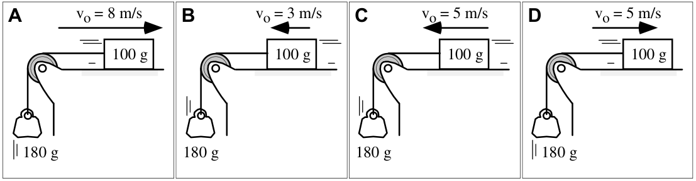

# Accelerating Systems 🔨 <!--fit--->
### Mr. Porter - AP Physics 

---

### Acceleration Systems 

Boxes are pulled by ropes along frictionless surfaces, accelerating toward the left. All of the boxes are identical, and the accelerations of all three systems are the same.

**Rank the tensions in the ropes.** Explain your reasoning

---

# With your table <!--fit--->

# AP Workbook **2.K** <!--fit--->

---

In each case shown below, a box is sliding along a horizontal surface. There is friction between the box and the horizontal surface. The box is tied to a hanging stone by a massless rope running over a massless, frictionless pulley. All these cases are identical except for the different initial velocities of the boxes.

**Rank the magnitudes of the accelerations of the boxes at the instant shown.** Explain your ranking

---

----

#### Solving Modified Atwood Machines - Individual Objects 

#### $m_1$:

$$\Sigma F = ma$$

$$F_T = m_1 a$$

#### $m_2$:

$$\Sigma F = ma$$

$$F_g - F_T = m_2 a$$

$$m_2 g - F_T = m_2a$$

#### Combine

$$m_2g - m_1a = m_2a$$

$$m_2g = (m_1+m2)a$$

---

## System Thinking...

#### $m_1$ and $m_2$ as a system:

$$\Sigma F = m_{sys}a$$

External force is gravity:

$$m_2g = (m_1+m_2)a$$

---

## Friction?

#### $m_1$:

$$\Sigma F = ma$$

$$F_T - F_f = m_1 a$$

$$F_T - \mu m_1 g = m_1a$$

#### $m_2$:

$$\Sigma F = ma$$

$$F_g - F_T = m_2 a$$

$$m_2 g - F_T = m_2a$$

---

## System Thinking...Friction?

#### $m_1$ and $m_2$ as a system:

$$\Sigma F = m_{sys}a$$

External force is gravity and Friction:

$$m_2g - \mu m_1g= (m_1+m_2)a$$

---

# Self Practice 

Consider the two-body situation above. A 100.0-gram hanging mass ($m_2$) is attached to a 325.0-gram mass ($m_1$) at rest on the table. The coefficient of friction between the 325.0-gram mass and the table is 0.215. Determine the acceleration of the system and the tension in the string.

---

# Physics Classroom Practice 

# [https://www.physicsclassroom.com/calcpad/launch/CPF2D14](https://www.physicsclassroom.com/calcpad/launch/CPF2D14)