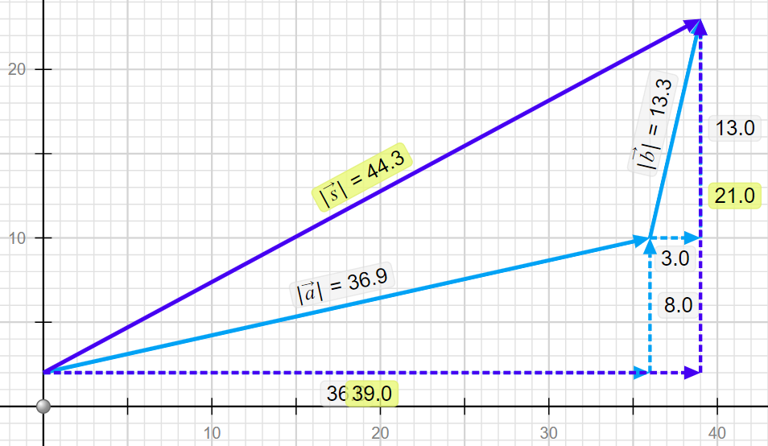

# Dynamics 🔨 <!--fit--->

## A causual model for motion <!--fit--->

### Mr. Porter - AP Physics 2023

---

# 📖 Contents:

1. [Vectors](#vector-quantities)
3. [Mallet Ball](#mallet-ball)
4. [Dueling Fan Carts](#dueling-fan-carts)
5. [Newton's Third Law]
5. [Interactions & Force Names]
6. [Force Diagrams]

---

# Try It...

Mr. Porter and his wife walk from Nighthawks to Troy Savings Bank Music Hall. They walk 6 blocks East and then 2 Blocks South. [1 Block = 100 Meters]

1. Determine the **distance** that they traveled.
2. Determine their  **displacement**.

---

# Vctor Quantities:

### A *<u>vector</u>* is a quantity with both **magnitude** (size) and **direction**.

#### Examples:

  - The child was displaced 9 meters North.
  - The car has a velocity of 10 meters per second East
  - $\vec{F}$, $\vec{p}$, $\vec{a}$, $\vec{v}$, $\Delta \vec{x}$, etc

---

# Scalar Quantities

### A *<u>scalar</u>* is a quantity with just **magnitude**.

#### Examples

  - The child traveled a distance of 12 meters
  - The car is moving 20 miles per hour
  - The frog has mass of 0.5 kg.
  - $m$, $t$, $r$, etc

---

# Representing Vectors 

---

# Representing Vector Components

---
<!--- _footer:   --->

# Vector Components

* Parts of a two-dimensional vector
* The *component* of a vector is the influence of that vector in a given direction.
    * i.e. How far _East_ of a North East displacement did you walk?
* We look at the ***perpendicular components***
    * How much of the vector is in the *x-direction*
    * How much of the vector is in the *y-direction*
* Vector $\vec{A}$ is made up of components $\vec{A}_x$ and $\vec{A}_y$
    * $\vec{A} = \vec{A}_x + \vec{A}_y$

---

# Vector Components Math

- Notice this is a right triangle
    * $\vec{A}^2 = \vec{A}_x^2 + \vec{A}_y^2$
    * Depending on the angle...
        * $A_x = \pm A \cos \theta$
        * $A_y = \pm A \sin \theta$

---

## What are the components of Vector $\vec{A}$?

---

## What are the components of Vector $\vec{A}$ and $\vec{B}$?

---

## Use Trig to Find $\vec{A}_x$ and $\vec{A}_y$

---

<!--- _footer:  --->

## Adding Vectors 

Vectors are added ___"tip to tail"___, that is redraw the vectors so that the tip of one vector is attached to the tail of the second vector. 

$$\vec{s} = \vec{a} + \vec{b}$$

>_The **resultant** vector S is equal to the addition of vectors a and b_

---

# Adding Vectors 

Mr. Porter's brother is on a hike. He walks:

- 2 KM North
- 3 KM East 
- 5 KM Exactly South East 

**Draw a the vector addition diagram** to represent this motion

---

## Adding Vectors 

#### Using Components

You can sum the components of the two vectors to find the components of the **resultant** vector 

* $s_x = a_x + b_x$
* $s_y = a_y + b_y$
* $s = \sqrt{s_x^2 + s_y^2 }$

---

# Practice and Review <!--fit--->

## In Pivot Interactives, using the PHET Simulation

---

# Which objects move with constant speed?

### What do you notice about the conditions where the objects move at a constant speed?

---

---

---

---

---

---

# Mallet Ball <!--fit--->

# 🔨 🎳 🔨 🎳 <!--fit--->

---

# Mallet Ball

### We are going to try and recreate constant velocity motion with objects moving over smooth, hard, level surfaces.

* First with a bowling ball,
* then with with fan carts
* finally by looking at a simulation

---

<!--- _footer:  --->

### Bowling Ball Situations - Using a mallet and a bowling ball:

Each time we use the mallet, let it bounce. (Don’t use the mallet like a bulldozer.)

* Start with a stationary bowling ball. Then, speed up the bowling ball from rest.
* Have someone roll a bowling ball. Then, bring it to a stop.
* Have someone roll a bowling ball. Then, keep it moving at a constant velocity.
* Have someone roll a bowling ball. With one tap, have the bowling ball make a 90 degree turn.

**Your goal: summarize the relation between taps and motion in as few statments as possible**

---

# Lab Safety: 

1. No High Mallets 
2. Be aware of your surroundings 
3. No excessive rolls 
4. No smashing into walls, mats, classmates, etc. 

---

# Lab Instructions:

1. Everyone in your group should _play mallet ball_ at least once. 
2. As a group think about how you will accomplish the mallet ball task. 
3. Attempt to accomplish task. 
4. Record how you successfully accomplished the task
    - Written description
    - Drawing that models the motion and your mallet taps

---

<!--- _footer:  --->

# How do **taps** relate to <!--fit--->
# the **motion** of <!--fit--->
# the bowling ball? <!--fit--->

---

# Does our rule relating motion and taps work for the bowling ball tapping the mallet? Or in other words does the bowling ball tap the mallet? 

---

# What would happen as we make the taps more "constant"?

---

# Describe the "taps" that affect the motion of the fan cart

---

# Dueling Fan Carts 

## What happens when there are forces from both directions?

---

# [Phet Tug of War](https://phet.colorado.edu/sims/html/forces-and-motion-basics/latest/forces-and-motion-basics_all.html)

## CER

On the next slide there is a list of statements. Decide if they the statement is ***true*** or ***false*** and then support that claim with evidence from the simulation and reasoning based on our models of motion and forces. 

---

# [Phet Tug of War](https://phet.colorado.edu/sims/html/forces-and-motion-basics/latest/forces-and-motion-basics_all.html):

1. A person's location on the rope matters.
2. Different combinations of people can produce the same sum of forces.
3. The sum of the forces on the cart is always equal to the addition of the individual forces.
4. It is impossible for the cart to accelerate to the left if there are people pulling it to the right.
5. The side with the bigger person will always win.
6. The side with more people will always win.
7. It is impossible to make the cart decrease in speed.
8. It is impossible to make the cart move at a steady speed.
9. The cart will always move in the direction of the sum of the forces.
10. If the sum of the forces is zero, the cart must be at rest.

---

# ______'s First Law

## When the forces acting on a system are **unbalanced** the system will **accelerate**. 

## When forces acting on a system are **balanced** the system will maintain its **constant velocity**. 

---

# Interaction Stations <!--fit--->

# and Contact Forces <!--fit--->

---

# A **force** is <!--fit--->

# an *interaction* between two objects.  <!--fit--->

---

### Contact Interactions 

1. ***Compression***: when two objects' surfaces are pushed together and the surfaces *deform*
2. ***Stretch***: when two objects pull on each other and are elongated
3. ***Shear***: When surfaces pull on each other as they slide or attempt to slide

---

# Interaction Stations:

### At each station...

1. Observe the objects interacting 
2. Identify the interactions:
    - do you notice compression, stretching, or shear
    - do you notice one or more than one interaction
    - what evidence to you have for that interaction occuring?
3. Report findings 

---

# Force Names <!--fit--->

---

# Gravitational Force $\vec{F}_g$ or $mg$

### Type: Long Range force

### Description 

Attractive force between all objects with mass. 

### Equation 

TBD

---

# Normal Force $\vec{F}_N$ or $N$

### Type: Contact, compression

### Description 
"Perpendicular Force" occurs because atoms are compressed and want to return to their original position. ***Always perpendicular to the surfaces in contact***

### Equation 
None 

---

# Spring Force $\vec{F}_s$

### Type: Contact, stretch or compression

### Description 
Spring is stretched or compressed and wants to return to "natural" length

### Equation 
TBD

---

# Tension Force $\vec{F}_T$ or $T$

### Type: Contact, stretch

### Description 
Atomic Structure is stretched and wants to return to natural length

### Equation 
None

---

# Friction Force $\vec{F}_f$ or $f$

### Type: Contact, shear

### Description 
Irregular surfaces interlock to slow or prevent sliding of two surfaces relative to eachother **Always parallel to the surfaces in contact**

### Equation 
None

---

# Drag Force $\vec{F}_d$

### Type: Contact

### Description 
Fluid/gas Friction, resists objects motion through a fluid/gas

### Equation 
None

---

# Bouyant Force $\vec{F}_B$

### Type: Contact

### Description 
Fluid/Gas Normal Force

### Equation 
None

---

# Electrostatic Force $\vec{F}_e$

### Type: Long Rance

### Description 
Attractice or resistive force because objects have charge

### Equation 
None 

---

# Magnetic Force $\vec{F}_M$

### Type: Long Range

### Description 
Attractive or repulsive force because of moving charge

### Equation 
None 