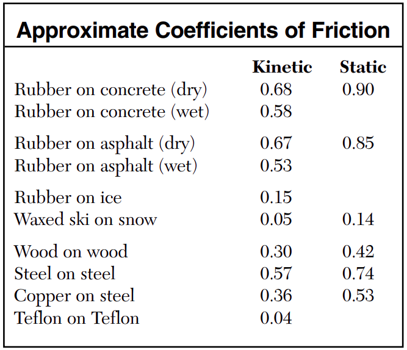

# Dynamics 🔨 <!--fit--->

## A causual model for motion <!--fit--->

### Mr. Porter - AP Physics 2024

---

# 📖 Contents:

1. [Vectors](#vector-quantities)
2. [Mallet Ball](#mallet-ball)
3. [Dueling Fan Carts](#dueling-fan-carts)
4. [Interactions & Force Names](#force-names)
5. [Force Diagrams](#force-diagrams)
5. [Force Interactions](#force-interactions)
6. [Tension Force Problems](#solving-force-problems)
7. [Fan Cart Lab](#fan-cart-lab)

8. [Inclined Planes](#inclined-planes)
9. [Friction](#Friction)

---

# Try It...

Mr. Porter and his wife walk from Nighthawks to Troy Savings Bank Music Hall. They walk 6 blocks East and then 2 Blocks South. [1 Block = 100 Meters]

1. Determine the **distance** that they traveled.
2. Determine their  **displacement**.

---

# Vctor Quantities:

### A *<u>vector</u>* is a quantity with both **magnitude** (size) and **direction**.

#### Examples:

  - The child was displaced 9 meters North.
  - The car has a velocity of 10 meters per second East
  - $\vec{F}$, $\vec{p}$, $\vec{a}$, $\vec{v}$, $\Delta \vec{x}$, etc

---

# Scalar Quantities

### A *<u>scalar</u>* is a quantity with just **magnitude**.

#### Examples

  - The child traveled a distance of 12 meters
  - The car is moving 20 miles per hour
  - The frog has mass of 0.5 kg.
  - $m$, $t$, $r$, etc

---

# Representing Vectors 

---

# Representing Vector Components

---
<!--- _footer:   --->

# Vector Components

* Parts of a two-dimensional vector
* The *component* of a vector is the influence of that vector in a given direction.
    * i.e. How far _East_ of a North East displacement did you walk?
* We look at the ***perpendicular components***
    * How much of the vector is in the *x-direction*
    * How much of the vector is in the *y-direction*
* Vector $\vec{A}$ is made up of components $\vec{A}_x$ and $\vec{A}_y$
    * $\vec{A} = \vec{A}_x + \vec{A}_y$

---

# Vector Components Math

- Notice this is a right triangle
    * $\vec{A}^2 = \vec{A}_x^2 + \vec{A}_y^2$
    * Depending on the angle...
        * $A_x = \pm A \cos \theta$
        * $A_y = \pm A \sin \theta$

---

## What are the components of Vector $\vec{A}$?

---

## What are the components of Vector $\vec{A}$ and $\vec{B}$?

---

## Use Trig to Find $\vec{A}_x$ and $\vec{A}_y$

---

<!--- _footer:  --->

## Adding Vectors 

Vectors are added ___"tip to tail"___, that is redraw the vectors so that the tip of one vector is attached to the tail of the second vector. 

$$\vec{s} = \vec{a} + \vec{b}$$

>_The **resultant** vector S is equal to the addition of vectors a and b_

---

# Adding Vectors 

Mr. Porter's brother is on a hike. He walks:

- 2 KM North
- 3 KM East 
- 5 KM Exactly South East 

**Draw a the vector addition diagram** to represent this motion

---

## Adding Vectors 

#### Using Components

You can sum the components of the two vectors to find the components of the **resultant** vector 

* $s_x = a_x + b_x$
* $s_y = a_y + b_y$
* $s = \sqrt{s_x^2 + s_y^2 }$

---

# Practice and Review <!--fit--->

## In Pivot Interactives, using the PHET Simulation

---

# Which objects move with constant speed?

### What do you notice about the conditions where the objects move at a constant speed?

---

---

---

---

---

---

# Mallet Ball <!--fit--->

# 🔨 🎳 🔨 🎳 <!--fit--->

---

# Mallet Ball

### We are going to try and recreate constant velocity motion with objects moving over smooth, hard, level surfaces.

* First with a bowling ball,
* then with with fan carts
* finally by looking at a simulation

---

<!--- _footer:  --->

### Bowling Ball Situations - Using a mallet and a bowling ball:

Each time we use the mallet, let it bounce. (Don’t use the mallet like a bulldozer.)

* Start with a stationary bowling ball. Then, speed up the bowling ball from rest.
* Have someone roll a bowling ball. Then, bring it to a stop.
* Have someone roll a bowling ball. Then, keep it moving at a constant velocity.
* Have someone roll a bowling ball. With one tap, have the bowling ball make a 90 degree turn.

**Your goal: summarize the relation between taps and motion in as few statments as possible**

---

# Lab Safety: 

1. No High Mallets 
2. Be aware of your surroundings 
3. No excessive rolls 
4. No smashing into walls, mats, classmates, etc. 

---

# Lab Instructions:

1. Everyone in your group should _play mallet ball_ at least once. 
2. As a group think about how you will accomplish the mallet ball task. 
3. Attempt to accomplish task. 
4. Record how you successfully accomplished the task
    - Written description
    - Drawing that models the motion and your mallet taps

---

<!--- _footer:  --->

# How do **taps** relate to <!--fit--->
# the **motion** of <!--fit--->
# the bowling ball? <!--fit--->

---

# Does our rule relating motion and taps work for the bowling ball tapping the mallet? Or in other words does the bowling ball tap the mallet? 

---

# What would happen as we make the taps more "constant"?

---

# Describe the "taps" that affect the motion of the fan cart

---

# Dueling Fan Carts 

## What happens when there are forces from both directions?

---

# [Phet Tug of War](https://phet.colorado.edu/sims/html/forces-and-motion-basics/latest/forces-and-motion-basics_all.html)

## CER

On the next slide there is a list of statements. Decide if they the statement is ***true*** or ***false*** and then support that claim with evidence from the simulation and reasoning based on our models of motion and forces. 

---

# [Phet Tug of War](https://phet.colorado.edu/sims/html/forces-and-motion-basics/latest/forces-and-motion-basics_all.html):

1. A person's location on the rope matters.
2. Different combinations of people can produce the same sum of forces.
3. The sum of the forces on the cart is always equal to the addition of the individual forces.
4. It is impossible for the cart to accelerate to the left if there are people pulling it to the right.
5. The side with the bigger person will always win.
6. The side with more people will always win.
7. It is impossible to make the cart decrease in speed.
8. It is impossible to make the cart move at a steady speed.
9. The cart will always move in the direction of the sum of the forces.
10. If the sum of the forces is zero, the cart must be at rest.

---

# ✏️ Write a Summary <!--fit--->

# How do forces affect the motion of an object?

You can do this in ***2 sentences***

---

# ______'s First Law

## When the forces acting on a system are **unbalanced** the system will **accelerate**. 

## When forces acting on a system are **balanced** the system will maintain its **constant velocity**. 

---

# Interaction Stations <!--fit--->

# and Contact Forces <!--fit--->

---

# A **force** is <!--fit--->

# an *interaction* between two objects.  <!--fit--->

---

### Contact Interactions 

1. ***Compression***: when two objects' surfaces are pushed together and the surfaces *deform*
2. ***Stretch***: when two objects pull on each other and are elongated
3. ***Shear***: When surfaces pull on each other as they slide or attempt to slide

---

# Interaction Diagrams 

1. Put all objects in bubbles 
2. Connect objects' bubbles with a line ***for each*** interaction 
3. Label the interactions with Compression, Shear, or Stretch
    -  (We will eventually use different names)

--- 

# Interaction Stations 

### At each station...**in your notebook**

1. Sketch Situation
2. Identify the interactions:
    - do you notice compression, stretching, or shear?
    - do you notice one or more than one interaction
    - what evidence to you have for that interaction occurring?
3. Draw Interaction Diagram
3. Report findings 

---

# Force Names <!--fit--->

---

# Make a Table 

| Force Name          | Symbol | Type       | Description | Equation |
| ------------------- | ------ | ---------- | ----------- | -------- |
| Gravitational Force | $F_g$  | Long Range | ...         | ...         |
| 9 total Forces  | | | 

---

# Gravitational Force $\vec{F}_g$ or $mg$

### Type: Long Range force

### Description 

Attractive force between all objects with mass. 

### Equation 

TBD

---

# Normal Force $\vec{F}_N$ or $N$

### Type: Contact, compression

### Description 
"Perpendicular Force" occurs because atoms are compressed and want to return to their original position. ***Always perpendicular to the surfaces in contact***

### Equation 
None 

---

# Spring Force $\vec{F}_s$

### Type: Contact, stretch or compression

### Description 
Spring is stretched or compressed and wants to return to "natural" length

### Equation 
TBD

---

# Tension Force $\vec{F}_T$ or $T$

### Type: Contact, stretch

### Description 
Atomic Structure is stretched and wants to return to natural length

### Equation 
None

---

# Friction Force $\vec{F}_f$ or $f$

### Type: Contact, shear

### Description 
Irregular surfaces interlock to slow or prevent sliding of two surfaces relative to eachother **Always parallel to the surfaces in contact**

### Equation 
None

---

# Drag Force $\vec{F}_d$

### Type: Contact

### Description 
Fluid/gas Friction, resists objects motion through a fluid/gas

### Equation 
None

---

# Bouyant Force $\vec{F}_B$

### Type: Contact

### Description 
Fluid/Gas Normal Force

### Equation 
None

---

# Electrostatic Force $\vec{F}_e$

### Type: Long Rance

### Description 
Attractice or resistive force because objects have charge

### Equation 
None 

---

# Magnetic Force $\vec{F}_M$

### Type: Long Range

### Description 
Attractive or repulsive force because of moving charge

### Equation 
None 

---

# Force Diagrams <!--fit--->

# 💭 ↙️ ➡️ ⬇️ ⬆️ 🗯️ <!--fit--->

---

# Free Body Diagrams

---

# Vector Addition Diagrams 

---

# $F_g$ Lab 

## Notes:

* Weight == $F_g$ == Force of Gravity...so $F_g = mg$
* Weight is a **FORCE**, mass is scalar quantity
* $g$ is the gravitational field strength
    * Measured in N/kg 
    * changes based on planet and location on that planet
    * _near the surface of the Earth_ $g = 9.8 \textrm{ N/kg}$

---

<!---footer:  --->

Tim is in a lab on the ground floor of the school. He hangs a small box on a spring. It stretches the spring by 20 centimetres. 

He then carries the spring and box up to a classroom on the top floor of the school, two flights up. Then he repeats the experiment.

1. How much would the spring stretch now?
  a. More than 20 centimetres.
  b. Exactly 20 centimetres again.
  c. Less than 20 centimetres. 

---

<!---footer:  --->

Tim is in a lab on the ground floor of the school. He hangs a small box on a spring. It stretches the spring by 20 centimetres. 

He then carries the spring and box up to a classroom on the top floor of the school, two flights up. Then he repeats the experiment.

2. How would you explain this?
    a. The box is now higher above the ground.
    b. The change in distance from the center of the Earth is too small to have any effect.
    c. The box is now further from the center of the Earth.
    d. The weight of an object is always the same. 

---

<!---footer:  --->

Pam is in a lab on the ground floor of the school. She hangs a small box on a spring. It stretches the spring by 35 centimetres. 

She then takes the spring and box up to the top of a mountain, and repeats the experiment. 

1. How much would the spring stretch now?
  a. More than 35 centimetres.
  b. Exactly 35 centimetres again.
  c. Less than 35 centimetres. 

---

How would you explain this? 

  1. The box is now higher above the ground, so gravity pulls it down harder.
  2. The box is further from the center of the Earth, so the gravity force is less.
  3. The box is further from the center of the Earth, so the gravity force is less, but the change is much too small to see.
  4. The weight of an object is always the same, so the spring stretches by exactly the same amount. 

---

<!---footer:  --->

An astronaut carries out an experiment. Before leaving Earth, he hangs a small box from a spring. It stretches the spring by 25 centimeters. 

He then takes the spring and the box to the Moon, and repeats the experiment. 

How much would the spring stretch on the Moon?

1.  More than 25 centimetres.
1.  Exactly 25 centimetres again.
1.  Less than 25 centimetres.
1.  Zero - no stretch at all. 

---

How would you explain this? 

1. The box is now higher above the ground, so gravity pulls it down harder.
1. The Moon is smaller than the Earth, so gravity is weaker there.
1. There is no gravity on the moon, because it has no atmosphere.
1. The weight of an object is always the same. 

---

# $F_s$ Lab 

## Notes:

* $F_s$ is proportional to stretch or compression ($|x|$)
* The proportionality constant, $k$, is called "the spring constant" (creative)

$$\boxed{|\vec{F}_s| = k |\vec{x}|}$$

* A spring is _Hookean_ if it follows the equation above

---

# Force Interactions <!--fit--->

# 🚙 💥 🚚 <!--fit--->

---

# Newton's Third Law 

## A **force** is an interaction between two objects. The two objects mutually apply this **force** on each other. The force is **always *equal in magntiude and opposite in direction***.

---

# Force Pairs 

* Newton's Third Law describes force pairs 
  * You can identify these pairs with an interaction diagram
  * The line that connects each bubble or object is the force pair. 

---

# AP Practice <!--fit--->

# 🤔 🏋️ 📖 ✍️ 🔨 <!--fit--->

---

# Solving Force Problems <!--fit--->

# Quantitatively <!--fit--->

---

# Try it - Mild 🫑

Two giant holiday ornaments are hanging on Mr. Porter's front porch as show in the diagram to the right. 

1. Draw the FBD for each ornament. 
2. Determine the value of **all** of the forces. 

---

# Medium 🌶️

In another episode of Don't Do This At Home, Jason secures a strong cable to two dead trees in the woods behind his home and attempts to jump-start his tight-rope walking career. His first attempt ends in the rather precarious position shown in the diagram. The rope makes an angle of 10° with the horizontal. Jason has a mass of 70 kg. Determine the tension in the cable.

---

<!--- footer:  --->

## Spicy 🌶️🌶️🌶️

Tarzan, much to his dismay, gets his loincloth stuck on a branch. He’s left hanging with the vine pulling upward at a $40^\circ$ angle and his loincloth pulling him horizontally to the right.

1. Draw FBD for Tarzan
2. Write the equation for the vertical forces on Tarzan ($\Sigma F_y =$) and horizontal forces ($\Sigma F_x =$)
3. Tarzan is 75 kg what is his weight?
4. Determine the tension in the vine and his loincloth. 

---

# Fan Cart Lab

Draw a FBD and vector addition diagram for the fan cart for the following three situations:

1. Fan off, cart at rest 
2. Fan on, held in place by Mr. Porter
3. Fan on, moving on level track 

---

# Fan Cart Lab <!--fit--->

# What variables affect the **acceleration** of the fan cart?  <!--fit--->

---

# Fan Cart 

Design an experiment(s) to find a mathematical relationship between those variables and acceleration 

Consider:

- What will you measure? 
- How will you measure it? 
- What tools can you use to limit uncertainty?
- How can you design your experiment to limit uncertainty?

---

# Before you begin... 

## 🤔 How will you measure the fan force for each of the three settings?

---

# Fan Cart Lab 

## Essential Questions:
1. How is mass related to the acceleration for a *constant Net Force*?
2. How is Net Force related to acceleration for a *constant mass*?

---

# Newton's Second Law <!--fit--->

$$\boxed{\vec{a} = \frac{\Sigma \vec{F}}{m}}$$

---

# Appling Newton's Second Law 

1. Draw Free Body Diagram
1. Split Forces into x & y components 
2. Sum forces in x & y direction ($\Sigma F_x = ... = ma_x$ and $\Sigma F_y = ... = ma_y$)
3. Solve

---

# Elevator Problems <!--fit--->

## Solve on **whiteboard** with your group first & then make notes for your future forgetful self **in your notebook**.

---

# Elevator Problem 

An elevator makes a trip up and then back down in a building, and a $50 \textrm{ kg}$ woman stands in the elevator for the entire trip. The elevator starts out at rest, then accelerates upward at $2 \textrm{ m/s}^2$, travels at a constant velocity of $2 \textrm{ m/s}$, then slows down at $3 \textrm{ m/s}^2$. After staying at rest for a moment, it again speeds up at $3 \textrm{ m/s}^2$, downward this time, travels at a constant velocity of $2 \textrm{ m/s}$, and then slows down at $2 \textrm{ m/s}^2$.

**Draw the _velocity vs. time_ graph for the motion described above.**

---

## Elevator Problem: $v$ ⬆️ $a$ ⬆️

An elevator makes a trip up and then back down in a building, and a $50 \textrm{ kg}$ woman stands in the elevator for the entire trip. The elevator starts out at rest, then accelerates upward at $2 \textrm{ m/s}^2$, travels at a constant velocity of $2 \textrm{ m/s}$, then slows down at $3 \textrm{ m/s}^2$. After staying at rest for a moment, it again speeds up at $3 \textrm{ m/s}^2$, downward this time, travels at a constant velocity of $2 \textrm{ m/s}$, and then slows down at $2 \textrm{ m/s}^2$.

**Consider the moment while the elevator is _speeding up_ at the start of its trip**

1. Construct a free body diagram for the woman.
2. Using N2L to find the force the floor exerts on the woman. 

---

## Elevator Problem: $v$ ⬆️ $a$ 0️⃣

An elevator makes a trip up and then back down in a building, and a $50 \textrm{ kg}$ woman stands in the elevator for the entire trip. The elevator starts out at rest, then accelerates upward at $2 \textrm{ m/s}^2$, travels at a constant velocity of $2 \textrm{ m/s}$, then slows down at $3 \textrm{ m/s}^2$. After staying at rest for a moment, it again speeds up at $3 \textrm{ m/s}^2$, downward this time, travels at a constant velocity of $2 \textrm{ m/s}$, and then slows down at $2 \textrm{ m/s}^2$.

**Consider the moment while the elevator is moving upward at a _constant velocity_.**

1. Construct a free body diagram for the woman.
2. Using N2L to find the force the floor exerts on the woman. 

---

# How would your answer change if the woman was moving downward at a constant velocty?

---

## Elevator Problem: $v$ ⬆️ $a$ ⬇️

An elevator makes a trip up and then back down in a building, and a $50 \textrm{ kg}$ woman stands in the elevator for the entire trip. The elevator starts out at rest, then accelerates upward at $2 \textrm{ m/s}^2$, travels at a constant velocity of $2 \textrm{ m/s}$, then slows down at $3 \textrm{ m/s}^2$. After staying at rest for a moment, it again speeds up at $3 \textrm{ m/s}^2$, downward this time, travels at a constant velocity of $2 \textrm{ m/s}$, and then slows down at $2 \textrm{ m/s}^2$.

**Consider the moment while the elevator is _slowing down_ at the top of its path.**

1. Construct a free body diagram for the woman.
2. Using N2L to find the force the floor exerts on the woman. 

---

## Elevator Problem: $v$ ⬇️ $a$ ⬇️

An elevator makes a trip up and then back down in a building, and a $50 \textrm{ kg}$ woman stands in the elevator for the entire trip. The elevator starts out at rest, then accelerates upward at $2 \textrm{ m/s}^2$, travels at a constant velocity of $2 \textrm{ m/s}$, then slows down at $3 \textrm{ m/s}^2$. After staying at rest for a moment, it again speeds up at $3 \textrm{ m/s}^2$, downward this time, travels at a constant velocity of $2 \textrm{ m/s}$, and then slows down at $2 \textrm{ m/s}^2$.

**Consider the moment while the elevator is _speeding up_ downwards**

1. Construct a free body diagram for the woman.
2. Using N2L to find the force the floor exerts on the woman. 

---

## Elevator Problem: $v$ ⬇️ $a$ ⬆️

An elevator makes a trip up and then back down in a building, and a $50 \textrm{ kg}$ woman stands in the elevator for the entire trip. The elevator starts out at rest, then accelerates upward at $2 \textrm{ m/s}^2$, travels at a constant velocity of $2 \textrm{ m/s}$, then slows down at $3 \textrm{ m/s}^2$. After staying at rest for a moment, it again speeds up at $3 \textrm{ m/s}^2$, downward this time, travels at a constant velocity of $2 \textrm{ m/s}$, and then slows down at $2 \textrm{ m/s}^2$.

**Consider the moment while the elevator is _speeding up_ downwards**

1. Construct a free body diagram for the woman.
2. Using N2L to find the force the floor exerts on the woman. 

---

# Elevator Scale Reading 

A person who weighs **500 N** is standing on a scale in an elevator. The elevator is identical in all cases. The velocity and acceleration of the elevators at the instant shown are given.

1. List the cases where the scale reading is **greater** than 500 N.
2. List the cases where the scale reading is **less** than 500 N.
List the cases where the scale reading is **equal to** than 500 N.

---

# Assuming Friction...

#### Rank the boxes from easiest to acceleration to most difficult to accelerate. Explain your reasoning...

---

#### Boxes are held at rest against rough, vertical walls by forces pushing horizontally on the boxes as shown. 

##### Rank the **magnitude of the normal force** exerted on the walls by the boxes. 

---

#### Boxes are held at rest against rough, vertical walls by forces pushing horizontally on the boxes as shown. 

##### Rank the **magnitude of the normal force** on each box from greatest to least. 

---

#### Ignoring the normal force...which box(es) do you think is the **most** difficult to hold up? Why?

---

#### In both cases below, Grace pulls the same large crate across a floor at a constant speed of $1.48 \textrm{ m/s}$.

##### Is the magnitude of the force exerted by Grace on the rope (i) _greater_ in Case A, (ii) _greater_ in Case B, or (iii) _the same_ in both cases?

##### Explain your reasoning.

---

# Friction

$$ \boxed{F_f \le \mu F_N} $$

### Notes: 

* $\le$ is only for **static friction**
  * Why? Only need friction to **balance** so you don't need the _maximum_ amount of static friction 
* $\mu$ (greek letter mu, pronouced "_mew_") - **coefficient of friction**
  * how likely surface pairs are to interlock
  * _always_ less than 1 

---

# Common $\mu$ Values

** From NYS Regents Physics Reference Tables

**How do Kinetic $\mu$ compare to Static $\mu$ values?**

---

#### Friction Practice 

Consider the free-body diagram for an object accelerating across a surface. The object has a mass of 2.12-kg. There is a forward thrust force of 50.0 N. The coefficient of friction between the object and the surface is 0.365. Determine the …

1. $F_N$ experienced by the object
2. $F_f$ experiened by the object 
3. $F_{net}$ experienced by the object
4. Acceleration experienced by the object

---

## Dexter Eius is running through the cafeteria when he slips on some mashed potatoes and falls to the floor. (Let that be a lesson for Dexter.) Dexter lands in a puddle of milk and skids to a stop with an acceleration of $-4.23 \textrm{ m/s/s}$. Dexter weighs $723.0 \textrm{ N}$. 

## **Determine the coefficient of friction between Dexter and the milky floor**.

---

## Amaya is driving his $1300 \textrm{-kg}$ car home after soccer practice. He is traveling down Lake Avenue with a speed of $15.8 \textrm{ m/s}$. A deer runs onto the road and Amaya skids to a stop in $3.41 \textrm{ s}$. 

## **Determine the coefficient of friction between the car tires and the roadway.**

---

#### Consider the free-body diagram shown at the right. If the applied force is 97.7 N at an angle of 27.4 degrees, the force of gravity is 110 N and the coefficient of friction is 0.369, then **what is the acceleration (in m/s/s) of the object?** 

---

# Inclined Planes

Component of gravity ***perpendicular to incline***

$$F_{g\perp} = mg\cos\theta$$

Component of gravity ***parallel to incline***

$$F_{g\parallel} = mg\sin\theta$$

**if you can't find these with _ease_ using trig, you ***MUST*** memorize those equations

---

Lab partners Anna Litical and Noah Formula placed a 0.25-kg glider on their air track and inclined the track at 10.4° above the horizontal. Use the structure provided at the right to determine the …

1. Force of gravity 
2. Parallel component of gravity
3. Perpendicular component of gravity
4. Normal Force 
5. Net Force
5. Acceleration

---

### Accelerating Systems 

Three blocks are connected by strings and pulled to the right by a force with magnitude $F_0$, as shown in the figure above. All frictional forces are  negligible. The tension in the right and left strings have magnitudes $T_1$ and $T_2$, respectively. Taking the positive direction to be toward the right, which of the following is a correct equation of motion for the block of mass?

***If the acceleration is $a_{sys}$ derive an expression for $F_0$, $T_1$, and $T_2$ in terms of $a_{sys}$, $m_1$, $m_2$, $m_3$ and any universal constants.***

---

### Acceleration Systems 

Boxes are pulled by ropes along frictionless surfaces, accelerating toward the left. All of the boxes are identical, and the accelerations of all three systems are the same.

**Rank the tensions in the ropes.** Explain your reasoning

---

#### Accelerating Systems 

In both cases a spaceship is pulling two cargo pods, one empty and one full. At the instant shown, the speed of the pods and spaceships is 300 m/s, but they have different accelerations as shown. All masses are given in terms of M, the mass of an empty pod.

**Will the tension at point *S* in the tow rod be (i) *greater in Case A*, (ii) *greater in Case B*, or (iii) *the same in both cases?*** Find the tension in each rope to help.

---

# With your table <!--fit--->

# AP Workbook **2.K** <!--fit--->

---

In each case shown below, a box is sliding along a horizontal surface. There is friction between the box and the horizontal surface. The box is tied to a hanging stone by a massless rope running over a massless, frictionless pulley. All these cases are identical except for the different initial velocities of the boxes.

**Rank the magnitudes of the accelerations of the boxes at the instant shown.** Explain your ranking

---

----
