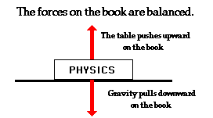

# **Forces** & Newton's Laws <!--fit--->

## 2024-25 Regents Physics

### A casual model for **motion**

---

<!---_class: default--->

# What is a **Force**?
- An interaction between two objects
- Forces are the cause for differing motion

---

# Motion is a result of **all forces** acting on an object. 

---

# Pivot - Balanced vs. **Unbalanced** Forces <!--fit--->

## How does motion differ when forces are balances vs. unbalanced?

---

# Newton's First Law

graph TD
    A[Forces are Balanced] --> B[Objects at Rest v = 0 m/s]
    A --> C[Objects in Motion v ≠ 0 m/s]
    B --> D[a = 0 m/s²]
    C --> E[a = 0 m/s²] 
    D --> F[Stay at Rest]
    E --> G[Stay in Motion same speed and direction]

---
# Balanced Forces

- Net force = 0
- Object either:
  - Stays at rest
  - Continues at constant speed

---
# Unbalanced Forces

- Net force ≠ 0  
- Object:
  - Speeds up
  - Slows down
  - Changes direction

---
# Newton's First Law (Inertia)

* ## **Inertia** is an object's resistance to _changes_ in its state of motion

* ## The amount of inertia is based solely on its **mass**

---
# Mass and Inertia
- Mass = amount of matter
- More mass = more inertia
- Example:
  - Harder to start/stop heavy cart
  - Easier to start/stop light cart
---

# 📝 Worksheet: Inertia & Mass <!--fit--->

## Complete Independently

---

# Pre-Conceptions 

Students typically have many pre-conceived notions regarding concepts in Physics. It has always proven useful to bring these ideas to the forefront of your mind and to make an effort to evaluate their correctness. The following statements pertain in one way or another to common notions regarding central concepts of this unit. Identify each statement as being either true (T) or false (F).

1. Fill out on sheet and then click answers into Google Form (linked in daily slides) and [here](https://forms.gle/rrFSUb9QNnRGdoni8).

---

# Mini Experiment: **Mass vs. Weight**

## Objective: 

#### **_Determine the mathematical relationship between mass and weight using a spring scale._**

### Notes:

- Don't forget a diagram of your setup 
- Include units in your measurements
- Will need graph and equation for line of best fit

---

# Gravity $F_g$ 

## Notes:

* Weight == $F_g$ == Force of Gravity...so $F_g = mg$
* Weight is a **FORCE**, mass is scalar quantity
* $g$ is the gravitational field strength
    * Measured in N/kg 
    * changes based on planet and location on that planet
    * _near the surface of the Earth_ $g = 9.8 \textrm{ N/kg}$

---

# Reminder Mass vs. **Weight**

## Mass:

- related to how much *stuff* there is
- the **same** regardless of location in universe
- measured in *kilograms* (kg)

 

## Weight: 

- How much Earth is pulling on that *stuff*
- depends on the gravitational field strength ($g$)
- measured in *Newtons* (N)

---

The diagram to the right shows a 3 kg mass attached to spring scales on Earth, Mars, and Earth's Moon. Use the information in the diagram to calculate the gravitational field strength ($g$) for each Celestial Body.

Reminder:

$$\boxed{g = \frac{F_g}{m}}$$

---

## Balanced Forces

### Book at Rest

- Forces are equal in magnitude and opposite in direction, they balanced each other

 

## Unbalanced Forces

### Book Sliding across table

- Sometime in the prior history of the book, it may have been given a shove and set in motion from a rest position.
- Friction now accelerates (slows) the book down

---

## Balanced Forces

### Book at Rest

- ***Constant velocity***
- $a = 0$ (**not** necessarily v = 0)

 

## Unbalanced Forces

### Book Sliding across table

- ***Acceleration*** 
- $\ a \ne 0$

---

# A **force** is a push or pull upon an object resulting from the object's **interaction** with another object. 

Whenever there is an interaction between two objects, there is a force upon each of the objects. When the interaction ceases, the two objects no longer experience the force. **Forces only exist as a result of an interaction.**

---

# Force Categories 

## Contact Forces

- Objects are physically in contact with each other
- Examples: _tension, friction, normal force, air resistance, applied forces_

 

## Action at a distance 

- Interaction when objects are not in contact with each other. 
- Examples: _gravitational, electrical , magnetic_

---

# What is a **Newton**?

* The unit of force
* 1 N is the amount of net force required to accelerate a 1 kg mass 1 m/s/s. 

$$\boxed{1\textrm{ Newton} = 1\textrm{ kg} \cdot 1 \textrm{ m/s}^2}$$

---

# Force is a **vector** 

- it has magnitude and direction 

 
---

# Types of Forces

| Force & Symbol | Description | 
|---|---------| 
| Gravity $F_g$ | The force of gravity is the force with which the earth, moon, or other massively large object attracts another object towards itself. By definition, this is the weight of the object. All objects upon earth experience a force of gravity that is directed "downward" towards the center of the earth. | 
| Applied Force $F_app$ | An applied force is a force that is applied to an object by a person or another object. If a person is pushing a desk across the room, then there is an applied force acting upon the object. The applied force is the force exerted on the desk by the person. | 

---

| Force & Symbol | Description | 
|---|---------| 
| Normal $F_N$ | The normal force is the support force exerted upon an object that is in contact with another stable object. For example, if a book is resting upon a surface, then the surface is exerting an upward force upon the book in order to support the weight of the book. On occasions, a normal force is exerted horizontally between two objects that are in contact with each other. For instance, if a person leans against a wall, the wall pushes horizontally on the person. | 
|Tension $F_T$ | The tension force is the force that is transmitted through a string, rope, cable or wire when it is pulled tight by forces acting from opposite ends. The tension force is directed along the length of the wire and pulls equally on the objects on the opposite ends of the wire. | 

---

| Force & Symbol | Description | 
|---|---------| 
| Friction $F_f$ | The friction force is the force exerted by a surface as an object moves across it or makes an effort to move across it. There are at least two types of friction force - sliding and static friction. Though it is not always the case, the friction force often opposes the motion of an object.  Friction results from the two surfaces being pressed together closely, causing intermolecular attractive forces between molecules of different surfaces. As such, friction depends upon the nature of the two surfaces and upon the degree to which they are pressed together. | 

---

| Force & Symbol | Description | 
|---|---------| 
| Spring $F_f$ | The spring force is the force exerted by a compressed or stretched spring upon any object that is attached to it. An object that compresses or stretches a spring is always acted upon by a force that restores the object to its rest or equilibrium position.  | 
| Air Resistance (Drag) $F_D$| The air resistance is a special type of frictional force that acts upon objects as they travel through the air. The force of air resistance is often observed to oppose the motion of an object. This force will frequently be neglected due to its negligible magnitude (and due to the fact that it is mathematically difficult to predict its value). | 