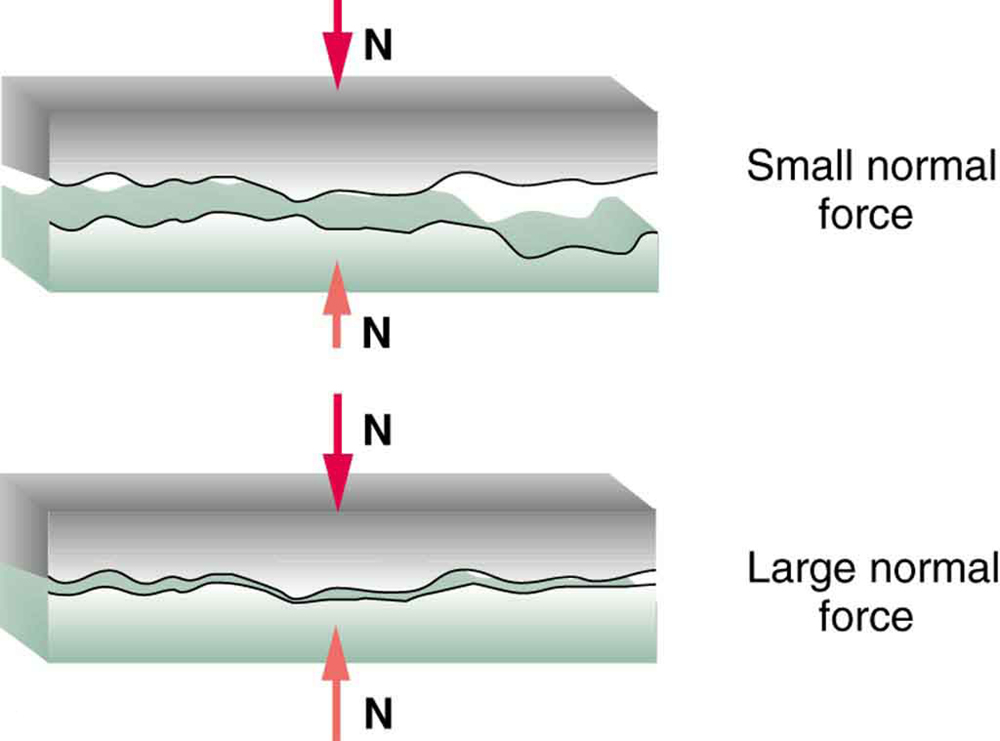
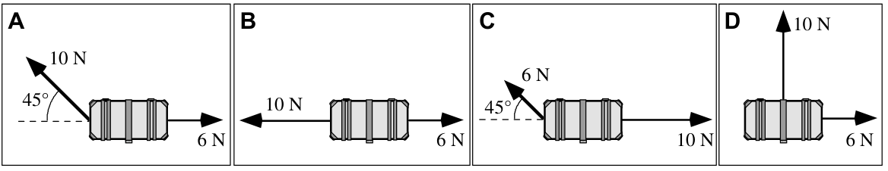

# **Forces** & Newton's Laws 

## 2025-26 Regents Physics

### A casual model for **motion**

---

# Which objects move with constant speed?

### What do you notice about the conditions where the objects move at a constant speed?

---

---

---

---

---

---

# Mallet Ball 

 

# 🔨 🎳 🔨 🎳 

---

# Mallet Ball

### We are going to try and recreate uniform motion (constant acceleration) where $a=0$ and $a\ne 0$ with objects moving over smooth, hard, level surfaces.

* First with a bowling ball,
* then  by looking at a simulation

---

### Bowling Ball Situations - Using a mallet and a bowling ball:

Each time we use the mallet, let it bounce. (Don’t use the mallet like a bulldozer.)

* Start with a stationary bowling ball. Then, speed up the bowling ball from rest.
* Have someone roll a bowling ball. Then, bring it to a stop.
* Have someone roll a bowling ball. Then, keep it moving at a CV.
* Have someone roll a bowling ball. With one tap, have the bowling ball make a 90 degree turn.
* Keep a bowling ball moving in a circle at constant speed.

**Your goal: summarize the relation between taps and motion in as few statments as possible**

---

# Lab Safety: 

1. No High Mallets 
2. Be aware of your surroundings 
3. No excessive rolls 
4. No smashing into walls, mats, classmates, etc. 

---

# Lab Instructions:

1) Everyone in your group should _play mallet ball_ at least once. 
2) As a group think about how you will accomplish the mallet ball task. 
3) Attempt to accomplish task. 
4) Record how you successfully accomplished the task
    * Written description
    * Drawing that models the motion and your mallet taps
5) Finally, write a general descriptive model that explains how mallet taps relate to the motion of the bowling ball

---

<!-- _align: center -->

# How do **taps** relate to the **motion** of the bowling ball?

---

# Does our rule relating motion and taps work for the bowling ball tapping the mallet? Or in other words does the bowling ball tap the mallet? 

---

# What would happen as we make the taps more "constant"?

---

# What is a **Force**?
- An interaction between two objects
- Forces are the cause for differing motion

---

# Motion is a result of **all forces** acting on an object. 

---

# Pivot - Balanced vs. **Unbalanced** Forces

## How does motion differ when forces are balances vs. unbalanced?

---

# Newton's First Law

graph TD
    A[Forces are Balanced] --> B[Objects at Rest v = 0 m/s]
    A --> C[Objects in Motion v ≠ 0 m/s]
    B --> D[a = 0 m/s²]
    C --> E[a = 0 m/s²] 
    D --> F[Stay at Rest]
    E --> G[Stay in Motion same speed and direction]

---
# Balanced Forces

- Net force = 0
- Object either:
  - Stays at rest
  - Continues at constant speed

---
# Unbalanced Forces

- Net force ≠ 0  
- Object:
  - Speeds up
  - Slows down
  - Changes direction

---
# Newton's First Law (Inertia)

* ## **Inertia** is an object's resistance to _changes_ in its state of motion

* ## The amount of inertia is based solely on its **mass**

---
# Mass and Inertia
- Mass = amount of matter
- More mass = more inertia
- Example:
  - Harder to start/stop heavy cart
  - Easier to start/stop light cart
---

# 📝 Worksheet: 

## Inertia & Mass

---

# Pre-Conceptions 

Students typically have many pre-conceived notions regarding concepts in Physics. It has always proven useful to bring these ideas to the forefront of your mind and to make an effort to evaluate their correctness. The following statements pertain in one way or another to common notions regarding central concepts of this unit. Identify each statement as being either true (T) or false (F).

---

# ⚖️ Lab: **Mass vs. Weight**

## Objective: 

#### **_Determine the mathematical relationship between mass and weight using a spring scale._**

### Notes:

- Don't forget a diagram of your setup 
- Include units in your measurements
- Will need graph and equation for line of best fit

---

# 🌎 Gravity $F_g$ 

## Notes:

* Weight == $F_g$ == Force of Gravity...so $F_g = mg$
* Weight is a **FORCE**, mass is scalar quantity
* $g$ is the gravitational field strength
    * Measured in N/kg 
    * changes based on planet and location on that planet
    * _near the surface of the Earth_ $g = 9.8 \textrm{ N/kg}$

---

# ⚖️ Reminder Mass vs. **Weight**

## Mass:

- related to how much *stuff* there is
- the **same** regardless of location in universe
- measured in *kilograms* (kg)

 

## Weight: 

- How much Earth is pulling on that *stuff*
- depends on the gravitational field strength ($g$)
- measured in *Newtons* (N)

---

The diagram to the right shows a 3 kg mass attached to spring scales on Earth, Mars, and Earth's Moon. Use the information in the diagram to calculate the gravitational field strength ($g$) for each Celestial Body.

Reminder:

$$\boxed{g = \frac{F_g}{m}}$$

---

## ⚖️ Balanced Forces

### Book at Rest

- Forces are equal in magnitude and opposite in direction, they balanced each other

 

## :triangular_ruler: Unbalanced Forces

### Book Sliding across table

- Sometime in the prior history of the book, it may have been given a shove and set in motion from a rest position.
- Friction now accelerates (slows) the book down

---

## Balanced Forces

### Book at Rest

- ***Constant velocity***
- $a = 0$ (**not** necessarily v = 0)

 

## Unbalanced Forces

### Book Sliding across table

- ***Acceleration*** 
- $\ a \ne 0$

---

# A **force** is a push or pull upon an object resulting from the object's **interaction** with another object. 

Whenever there is an interaction between two objects, there is a force upon each of the objects. When the interaction ceases, the two objects no longer experience the force. **Forces only exist as a result of an interaction.**

---

# Force Categories 

## Contact Forces

- Objects are physically in contact with each other
- Examples: _tension, friction, normal force, air resistance, applied forces_

 

## Action at a distance 

- Interaction when objects are not in contact with each other. 
- Examples: _gravitational, electrical , magnetic_

---

# What is a **Newton**?

* The unit of force
* 1 N is the amount of net force required to accelerate a 1 kg mass 1 m/s/s. 

$$\boxed{1\textrm{ Newton} = 1\textrm{ kg} \cdot 1 \textrm{ m/s}^2}$$

---

# Force is a **vector** 

- it has magnitude and direction 

 
---

# Types of Forces

---

| Type of Force | Symbol      | When is this force present?                                            | In which direction is this force?                                            | Field or Contact Force?                    |
| :------------ | ----------- | :--------------------------------------------------------------------- | :--------------------------------------------------------------------------- | :----------------------------------------- |
| gravitational | $\vec{F}_G$ | Two objects with mass interact. One object is often the Earth.         | Toward the center of Earth (or other large object)                           | *Field* (mediated by gravitational fields) |

---

| Type of Force | Symbol      | When is this force present?                                            | In which direction is this force?                                            | Field or Contact Force?                    |
| :------------ | ----------- | :--------------------------------------------------------------------- | :--------------------------------------------------------------------------- | :----------------------------------------- |
| electric      | $\vec{F}_E$ | Two objects with electric charge interact.                             | Along line connecting the two objects (attraction or repulsion)              | *Field* (mediated by electric fields)      |

---

| Type of Force | Symbol      | When is this force present?                                            | In which direction is this force?                                            | Field or Contact Force?                    |
| :------------ | ----------- | :--------------------------------------------------------------------- | :--------------------------------------------------------------------------- | :----------------------------------------- |
| magnetic      | $\vec{F}_M$ | Two objects with magnetic poles interact.                              | Along line connecting the two objects (attraction or repulsion)              | *Field* (mediated by magnetic fields)      |

---

| Type of Force | Symbol      | When is this force present?                                            | In which direction is this force?                                            | Field or Contact Force?                    |
| :------------ | ----------- | :--------------------------------------------------------------------- | :--------------------------------------------------------------------------- | :----------------------------------------- |
| normal        | $\vec{F}_N$ | Two solid surfaces compress one another                                | Perpendicular to the surface                                                 | contact                                    |

---

| Type of Force | Symbol      | When is this force present?                                            | In which direction is this force?                                            | Field or Contact Force?                    |
| :------------ | ----------- | :--------------------------------------------------------------------- | :--------------------------------------------------------------------------- | :----------------------------------------- |
| tension       | $\vec{F}_T$ | An object (often a rope) gets stretched                                | Along the rope (or rope-like object)                                         | contact                                    |
---

| Type of Force | Symbol      | When is this force present?                                            | In which direction is this force?                                            | Field or Contact Force?                    |
| :------------ | ----------- | :--------------------------------------------------------------------- | :--------------------------------------------------------------------------- | :----------------------------------------- |
| friction      | $\vec{F}_f$ | Two surfaces “catch” on one another and shear each other               | Parallel to the surface                                                      | contact                                    |

---

| Type of Force | Symbol      | When is this force present?                                            | In which direction is this force?                                            | Field or Contact Force?                    |
| :------------ | ----------- | :--------------------------------------------------------------------- | :--------------------------------------------------------------------------- | :----------------------------------------- |
| Buoyant       | $\vec{F}_B$ | Upward force exerted by a fluid that opposes the weight of an immersed object | Upwards                                                                      | contact                                    |
---

| Type of Force | Symbol      | When is this force present?                                            | In which direction is this force?                                            | Field or Contact Force?                    |
| :------------ | ----------- | :--------------------------------------------------------------------- | :--------------------------------------------------------------------------- | :----------------------------------------- |
| lift          | $\vec{F}_L$ | Air (or other fluid) pushes an object up                               | Up (opposite the direction of the gravitational force exerted on the object) | contact                                    |

---

| Type of Force | Symbol      | When is this force present?                                            | In which direction is this force?                                            | Field or Contact Force?                    |
| :------------ | ----------- | :--------------------------------------------------------------------- | :--------------------------------------------------------------------------- | :----------------------------------------- |
| thrust        | $\vec{F}_t$ | Air (or other fluid) pushes an object along the direction of motion    | Along the direction of motion                                                | contact                                    |

---

| Type of Force | Symbol      | When is this force present?                                            | In which direction is this force?                                            | Field or Contact Force?                    |
| :------------ | ----------- | :--------------------------------------------------------------------- | :--------------------------------------------------------------------------- | :----------------------------------------- |
| drag          | $\vec{F}_D$ | Air (or other fluid) pushes an object opposite the direction of motion | Opposite the direction of motion                                             | contact                                    |

---

| Type of Force | Symbol      | When is this force present?                                            | In which direction is this force?                                            | Field or Contact Force?                    |
| :------------ | ----------- | :--------------------------------------------------------------------- | :--------------------------------------------------------------------------- | :----------------------------------------- |
| Applied       | $\vec{F}_A$ | Any other generic push or pull not listed above                        | Depends on context                                                           | contact                                    |

--- 

# **Net Force** $F_{net}$ or $\Sigma F$

## If forces are **unbalanaced** there is there is a total amount of unbalanced force. This is the **net force** on an object. 

### Note: Net force **is not** an individual force. It is a result of adding all of the force vectors acting on an object. 

--- 

# Net Force

## Adding Vectors

---

# Net Force with Force Diagrams

- A. 1200 N + -800 N = 400 N
- B. 600 N + -800 N = -200 N
- Cy. 50 N + -50 N = 0 N
- Cx. 20 N + 0 N = 20 N

---

# Drawing Free Body Diagrams 

A special type of force diagram that **represents all the forces acting upon an object**. Arrows represent the forces. The force arrows …

- … are labeled according to type,
- … are pointing in the direction of the force,
- … and have a length that is in proportion to their relative strength (longer arrows are stronger forces).

---

# Drawing FBDs

1) Identify forces that are present:
    - Is the object near a planet (charge or magnet)?
    - Is the object in contact with another object?
2) Determine the direction of each force
3) Draw an arrow to represent the force starting at the center of the dot or box representing the object and pointing in the direction of the force?
4) Draw the force to scale to represent magnitude
5) Label the arrow with the force type

---

# FBD Demo ✏️ <!--fit--->

---

# Newton's First Law

## _When forces are balanced our objects maintain their constant velocity_

---

# How do we handle unbalanced forces? 

## Newton's Second Law

---

# Newton's Second Law 

# $\boxed{a = \frac{F_{net}}{m}}$

also written as...

# $F_{net} = ma$ 

---

---

# On a whiteboard...<!--fit--->

## ✏️ Sketch:

### 1. A graph of **acceleration** (y axis) vs. **net force** (x axis) for constant mass

### 2. A graph of **acceleration** (y-axis) vs. **mass** (x-axis) for constant net force 

---

# Newton's 2nd Law Lab: Fan Carts 

### Objective:

Using your fan cart, collect data to verify Newton's Second Law. Use acceleration as your dependent variable. Design ***two*** experiments. 

### Materials:

- wireless dynamics cart
- fan 
- track
- assorted masses

 

### Must Include:

1. Two procedures.
2. Free body diagrams for your fan cart to reference your net force, *and how you will measure that fan force*. 
3. Diagram of your experimental setup. 
4. Just one discussion & conclusion to write about both experiments.

---

# N2L Lab: Measuring Cart Force 

### Experiment 2: $F_{net}$ vs. $a$

- Change the Fan force (can use 8 values) ➡️ two fans
- Measure acceleration
- Be sure to record your control value (mass)

 

### Measuring $F_{net}$

0. Zero force sensor (bottom right corner)
1. Turn fan on
2. Have fan **at rest** against a wall or mass
3. Record force for a set period of time. 
4. Record average force value

---

# N2L Results

### $F_{net}$ vs. Acceleration

- graph is linear
- slope should be ($1/mass$)

### Mass vs. Acceleration 

- graph is inverse relationship
- constant in equation should be $F_{net}$

 

---

# N2L Summary:

$$\boxed{a = \frac{F_{net}}{m}}$$

* acceleration is **_directly_ proportional to** Net Force
* acceleration is **_inversely_ proportional to** mass

---

# 💪🧠 Forces Packet **page 12 & 13** <!--fit--->

--- 

# Putting it all together 

## Using N2L and $F_{net}$ to find acceleration

1. page 14 in packet together
2. complete page 16 on your own

---

# Assuming Friction...

#### Rank the boxes from easiest to acceleration to most difficult to accelerate. Explain your reasoning...

---

# What is Friction?

## The friction force is the force exerted by a surface as an object moves across it or makes an effort to move across it. 

---

# What is Friction?

## Friction results from the two surfaces being pressed together closely, causing intermolecular attractive forces between molecules of different surfaces. As such, friction depends upon the nature of the two surfaces and upon the degree to which they are pressed together. 

---

---

---

# Two Types of Friction 

## Kinetic Friction

- Kinetic Friction results when two surfaces are sliding relative to each other 
      

## Static Friction

- Static friction results when the surfaces of two objects are at rest relative to one another and a force exists on one of the objects to set it into motion relative to the other object. 
  

 

---

---

---

# Friction

$$ \boxed{F_f \le \mu F_N} $$

### Notes: 

* $\le$ is only for **static friction**
  * Why? Only need friction to **balance** so you don't need the _maximum_ amount of static friction 
* $F_f = \mu F_N$ is for **kinetic friction**
* $\mu$ (greek letter mu, pronouced "_mew_") - **coefficient of friction**
  * how likely surface pairs are to interlock
  * _always_ less than 1 

---

# Common $\mu$ Values

** From NYS Regents Physics Reference Tables

**How do Kinetic $\mu$ compare to Static $\mu$ values?**

---

.gif)

---

# Friction Lab 

#### **Objective**

Determine the coefficient of static friction between your block and a two flat surfaces in the classroom.

#### **Materials** 

- Wooden block
- Electronic Force Sensor

 

#### **Hypothesis**

Which surface will have a greater coefficient of friction?

---

<iframe
      src="https://thephysicsaviary.com/Physics/Programs/Labs/FrictionLab/"
      width = "1100"
      height = "600"
      allowfullscreen
      loading="eager"
      referrerpolicy="no-referrer-when-downgrade">
    </iframe>

---

#### Friction Practice 

Consider the free-body diagram for an object accelerating across a surface. The object has a mass of 2.12-kg. There is a forward thrust force of 50.0 N. The coefficient of friction between the object and the surface is 0.365. Determine the …

1. $F_N$ experienced by the object
2. $F_f$ experiened by the object 
3. $F_{net}$ experienced by the object
4. Acceleration experienced by the object

---

## Dexter Eius is running through the cafeteria when he slips on some mashed potatoes and falls to the floor. (Let that be a lesson for Dexter.) Dexter lands in a puddle of milk and skids to a stop with an acceleration of $-4.23 \textrm{ m/s/s}$. Dexter weighs $723.0 \textrm{ N}$. 

## **Determine the coefficient of friction between Dexter and the milky floor**.

---

## Amaya is driving his $1300 \textrm{-kg}$ car home after soccer practice. He is traveling down Lake Avenue with a speed of $15.8 \textrm{ m/s}$. A deer runs onto the road and Amaya skids to a stop in $3.41 \textrm{ s}$. 

## **Determine the coefficient of friction between the car tires and the roadway.**

---

    

# [Static Friction Lab Example](https://thephysicsaviary.com/Physics/Programs/Labs/ForceFriction/) <!--fit--->

---

# Spring Force - Hooke's Law

$$\boxed{F_s = kx}$$

- $F_s$: Spring Force (Newtons, N)
- $k$: Spring Constant (Newtons per meter, N/m)
- $x$: Change in spring length from equilibrium position (meters, m)

> _Hookean_ Springs are springs that follow Hooke's Law (equation), not intercept and proportional relationship between $F_s$ and $x$. 

---

# Newton's 3rd Law: **Force Pairs**

## _"For every action, there is an equal and opposite action."_

# 😑

### Forces are a result of **two** objects interacting. The force that each object applies on the other is equal in magnitude and opposite in direction. 

---

## While driving down the road, a firefly strikes the windshield of a bus and makes a quite obvious mess in front of the face of the driver. This is a clear case of Newton's third law of motion. The firefly hit the bus and the bus hits the firefly. **Which of the two forces is greater: the force on the firefly or the force on the bus?**

---

## In the top picture (below), Kent Budgett is pulling upon a rope that is attached to a wall. In the bottom picture, Kent is pulling upon a rope that is attached to an elephant. In each case, the force scale reads 500 Newton. Kent is pulling ...

 

a. with more force when the rope is attached to the wall.
b. with more force when the rope is attached to the elephant.
c. the same force in each case.

---

# Packet Page **23** <!--fit--->

---

Two toy trucks traveling at different constant speeds are about to collide.

(a) The two identical trucks are traveling in the same direction, and truck B is carrying a heavy load.
(b) The two identical trucks are traveling in opposite directions, and truck B is carrying a heavy load.
(c) The two identical trucks are traveling in the same direction, and truck A is carrying a heavy load.
(d) The two identical trucks are traveling in opposite directions, and truck A is carrying a heavy load.

**During the collision, will the magnitude of the force exerted on truck A by truck B be (i) greater than, (ii) less than, or (iii) equal to the magnitude of the force exerted on truck B by truck A?**

---

# Angled Forces

## Identical treasure chests (shown from above) each have two forces acting on them. All chests start at rest.

**Rank the speed of the treasure chest after 2 seconds.**

---

A block is moving to the right across a rough table at a constant speed of 2 m/s. The tables and the blocks are identical in the two cases. In Case A, the block is pushed with a stick and in Case B, the block is pulled with a string. The angle that the applied force makes with the horizontal is the same in both cases.

_Will the magnitude of the force on the block by the stick in Case A be (i) greater than, (ii) less than, or (iii) equal to the tension on the block by the string in Case B?_

Explain your reasoning.

---

# Partner Work - Another F = ma <!--fit---> 

(New Forces Packet)

---

# Vector Review

* $\vec{A}^2 = \vec{A}_x^2 + \vec{A}_y^2$
* Depending on the angle...
  * $A_x = \pm A \cos \theta$
  * $A_y = \pm A \sin \theta$

---

## Adding Vectors 

#### Using Components

You can sum the components of the two vectors to find the components of the **resultant** vector 

If $\vec{C} = \vec{A} + \vec{B}$...

* $C_x = A_x + B_x$
* $C_y = A_y + B_y$
* $|C| = \sqrt{C_x^2 + C_y^2 }$

---

A pack of five Artic wolves are exerting five different forces upon the carcass of a 500-kg dead polar bear. A top view showing the magnitude and direction of each of the five individual forces is shown in the diagram at the right. 

---

---

# **1.** [Name that vector](https://www.physicsclassroom.com/Physics-Interactives/Vectors-and-Projectiles/Name-That-Vector/Name-That-Vector-Interactive)

# **2.** [Vector Guessing Game](https://www.physicsclassroom.com/Physics-Interactives/Vectors-and-Projectiles/Vector-Guessing-Game/Vector-Guessing-Game-Interactive)

# **Helpful Simulation:** [Vector Addition Simulation](https://www.physicsclassroom.com/Physics-Interactives/Vectors-and-Projectiles/Vector-Addition/Vector-Addition-Interactive)

---

# Solving Force Problems with Components

## **Equilibrium** - when forces on an object are balanced.

---

# Example

 

---

# Process 1: Vector Addition

 becomes 

---

# Process 2: Vector Components:

 becomes 

---

---

# [🔗 Balance It!](https://www.physicsclassroom.com/Physics-Interactives/Forces-in-2D/Equilibrium/Interactive) <!--fit--->

---

# Example Together

_Here's the clown who came to town to sign your yearbook upside down_

### Suppose the tension in both of the cables is measured to be 50 N and that the angle that each cable makes with the horizontal is known to be 30 degrees. What is the weight of the sign?

 

---

# Example Together

_Here's the clown who came to town to sign your yearbook upside down_

### Suppose the tension in both of the cables is measured to be 50 N and that the angle that each cable makes with the horizontal is known to be 30 degrees. What is the weight of the sign?

 

Fg = 50 N

---

# Example 2

#### The sign below hangs outside the physics classroom, advertising the most important truth to be found inside. The sign is supported by a diagonal cable and a rigid horizontal bar. If the sign has a mass of 50 kg, then determine the tension in the diagonal cable that supports its weight.

 

---

# **Packet Page 5 & 6**

# [🔗  Physics Classroom - Equilibrium 1](https://www.physicsclassroom.com/calcpad/launch/CPF2D4)

# [🔗 Physics Classroom - Equilibrium 2](https://www.physicsclassroom.com/calcpad/launch/CPF2D5)

---

# Inclined Planes 

---

# Inclined Planes

- Component of gravity ***perpendicular to incline***

$$F_{g\perp} = mg\cos\theta$$

- Component of gravity ***parallel to incline***

$$F_{g\parallel} = mg\sin\theta$$

**if you can't find these with _ease_ using trig, you ***MUST*** memorize those equations

---

---

Lab partners Anna Litical and Noah Formula placed a 0.25-kg glider on their air track and inclined the track at 10.4° above the horizontal. Use the structure provided at the right to determine the …

1. Force of gravity 
2. Parallel component of gravity
3. Perpendicular component of gravity
4. Normal Force 
5. Net Force
5. Acceleration
