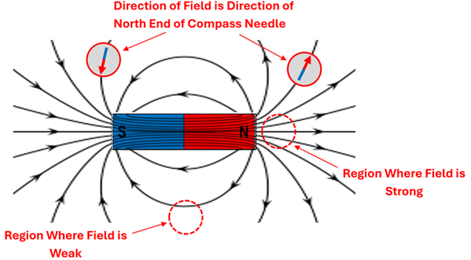

# Magnetism 🧲 <!--fit--->

## Regents Physics

---

# What is a Magnet?

## Historical Context
- **Ancient Navigation**: Naturally occurring magnets were used for navigation hundreds of years ago
- **Pole Names**: When freely suspended, one end pointed toward Earth's geographic north pole (called "north pole"), the other toward the south pole (called "south pole")
- **Dipoles**: All magnets have two poles - north and south

 

---

# Magnetic Interactions

## Fundamental Rule
> **Like poles repel, opposite poles attract**

This is similar to electric charges!

**Examples:**
- North ↔ North = **Repel**
- South ↔ South = **Repel** 
- North ↔ South = **Attract**

---

# What Happens When You Cut a Magnet?

## Think About It:
If you cut a bar magnet in half, what do you get?

**A)** One north pole and one south pole
**B)** Two smaller magnets, each with north and south poles
**C)** The magnet loses its magnetism

---

# Cutting Magnets

## You get **TWO smaller magnets!**

- Each piece still has both north and south poles
- Cut them again → four smaller magnets
- Continue to atomic level → atoms are tiny magnets
- **No magnetic monopoles exist** (unlike electric charges)

---

### Magnetic Domains - The Atomic Explanation

**Electrons are tiny magnets:**
- Every spinning electron creates a small magnetic field
- Electrons spinning in same direction → stronger magnet
- Electrons spinning in opposite directions → cancel out

**Magnetic Domains:**
- Groups of aligned atoms pointing in same direction
- All atoms in a domain act like one larger magnet

---

---

# Magnetic Fields

## Fields as "Force at a Distance"

Just like gravity and electric forces, magnets affect other magnets without touching.

**Scientists explain this through invisible fields that surround magnets**

*We can make these fields visible using iron filings!*

---

### Visualizing Magnetic Fields

**Purpose**: Show both **strength** and **direction** of magnetic field

**Field Strength**:
- **Dense lines** = strong field
- **Spaced out lines** = weak field

**Field Direction**:
- Direction a compass needle's north end would point
- Lines point **away from north poles**
- Lines point **toward south poles**

---

# Reading Magnetic Field Diagrams

## Bar Magnet Field Pattern

- **Strongest field**: At the poles (lines closest together)
- **Weakest field**: Sides of magnet (lines far apart)
- **Field lines**: Form continuous loops from north to south
- **Never cross**: Field lines never intersect

---

---

# The Compass - Nature's Field Detector

## How It Works
- **Tiny suspended magnet** that can freely rotate
- **North end aligns** with local magnetic field direction
- **Universal tool** used by sailors, hikers, and physicists

**Compass behavior reveals field direction at any point in space**

---

# Earth's Magnetic Field

## Our Planet is a Giant Magnet!

**Source**: Movement of molten iron in Earth's liquid outer core
- Moving iron → electric currents → magnetic field

**Important Fact**: 
- Geographic north pole = **Magnetic south pole**
- Geographic south pole = **Magnetic north pole**
- Compass north points to magnetic south!

---

# Magnetism vs Electric Charges

## Similarities
- Both have **two types** (N/S poles, +/- charges)
- **Like repels like, opposites attract**
- Both create **fields** around them
- Field lines point **away from positive/north**
- Field lines point **toward negative/south**

---

# Magnetism vs Electric Charges

## Key Differences

| **Magnetism** | **Electric Charges** |
|---------------|---------------------|
| Always dipoles (N-S together) | Can isolate + or - charges |
| Field lines form closed loops | Field lines start/end on charges |
| No monopoles | Monopoles exist |
| Complex distance relationship | Simple 1/r² relationship |

---

---

# Oersted's Discovery (1820)

### The Connection Between Electricity and Magnetism

**Hans Christian Oersted's Observation**:
- During a lecture, closed a switch to pass current through wire
- Nearby compass needle **deflected**!
- Electric current created a magnetic field

**Revolutionary Discovery**:
> **"Electricity causes magnetism"**
> **"Moving electric charges create magnetic fields"**

---

---

---

# Impact of Oersted's Discovery

## Birth of Electromagnetism

**This discovery led to**:
- Electric motors
- Speakers and headphones  
- Power plants and generators
- Wireless communication
- MRI machines
- And much more!

**Key Insight**: All magnetism comes from moving electric charges

---

# Summary

## Key Concepts to Remember

1. **Magnets always have two poles** (dipoles) - no monopoles exist
2. **Like poles repel, opposite poles attract**
3. **Magnetism comes from aligned atomic domains**
4. **Magnetic fields** show strength (line density) and direction
5. **Earth is a giant magnet** with magnetic poles opposite to geographic poles
6. **Electricity and magnetism are connected** - moving charges create magnetic fields parallel to path

---
