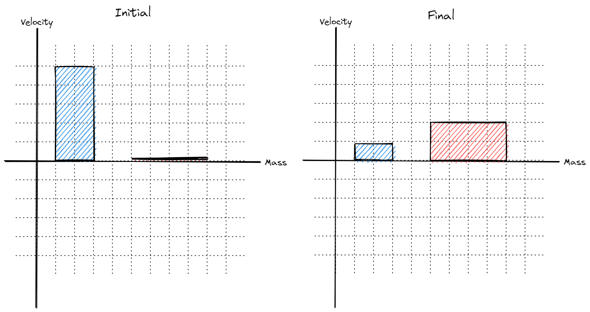

<!--- title ---> 

# <!---fit---> Momentum 💥

# <!---fit---> A model for collisions

### Mr. Porter 
### 2023 - Physics

---

# Linear Momentum 

The ***linear momentum*** $\vec{p}$ of a single object is the product of its mass $m$ and velocity $\vec{v}$: 

$$\boxed{\vec{p} = m\vec{v}}$$

---

# <!---fit---> Momentum is a
# <!---fit---> *vector* quantity!

---

# <!---fit---> Momentum is a 
# <!---fit---> *conserved* quantity
# <!---fit---> in closed systems

---

# Momentum conservation:

In general momentum of a system is conserved:

$$ \boxed{p_{before} = p_{after}} $$

Which can look like...

$$ \boxed{m_1\vec{v}_{1i} + m_2\vec{v}_{2i} = m_1\vec{v}_{1f} + m_2\vec{v}_{2f}}$$

---

---

# Collision Types

* Elastic  - Kinetic Energy is conserved, "*bouncy*"
* Inelastic - Kinetic energy is not conserved, "*sticky*"
* Explosions - Objects start together and *explode* away from each other

---

# Elastic Collisions 

<!-- 
- Do not exist in nature
- Close with very rigid objects, sometimes super cooled metals can get there
- Collisions between atoms are almost perfectly elastic 
-->

---

# Inelastic Collisions 

<!-- 
Examples:
- Volleyball bouncing off your arms, basketball dribbling, you jumping on a trampoline

These are most collisions
-->

---

# Totally Inelastic *Sticky* Collisions

<!-- 
You catching a football, car collisions where the cars stick together

Most of the energy goes to internal energy
-->

---

# Explosions

---

### Momentum Bar Graphs 

---

### Momentum Bar Graphs

* Y-axis represents *velocity* (direction matters!)
* x-axis represents *mass* (width shows size)
* Area of each "bar" represents the ***momentum***

---

# <!---fit---> How do you change

# <!---fit---> Momentum?

---

# <!---fit---> With   Forces!

---

# Changing Momentum 

* Why do baseball players wear gloves to catch baseballs?
* Why do gymnasts practice and perform on mats?
* Why do football players wear padding?
* Why do cars have air bags?
* Why does a boxer "roll with the punch"?
* Why or how are jackhammers able to break concrete?
* Why are tennis players, as well as players in many sports, taught to "follow through" with their swing?

---

<!---
- How would this change for eggs? In which situation would the egg break?
- How does the momentum change differ in these situations? 
- Why does the momentum change differ?
--->

---

#### Change in $\vec{p}$ and Forces

* Start with N2L:
$$\Sigma \vec{F} = m\vec{a}$$

* Sub in definition of acceleration $a = \frac{\Delta v}{\Delta t}$

$$ \Sigma \vec{F} = m \frac{\Delta v}{\Delta t} \rightarrow \Sigma \vec{F} \Delta t = m \Delta v $$ 

* Rearrange and sub in $\Delta \vec{p}$ for $m \Delta v$ 
$$ \boxed{\Sigma \vec{F} \Delta t = \Delta p} $$

---

# Impulse 

* Impulse is equal to the product of net force and the time interval
* $J = F_{net} \Delta t$
* Impulse is equal to the change in momentum of an object or system

--- 

#Impulse 

* Can make impulse changes with large *Forces*:

$$ \LARGE{F} \tiny{\Delta t} \normalsize =  \Delta P $$

* Can make impulse changes with large *time intervals*:

$$ \tiny{F} \LARGE{\Delta t} \normalsize =  \Delta P $$

---

# <!---fit---> I Bet you cannot break 

# <!---fit---> the Egg 🥚

---

# <!---fit---> Explain using the idea of   impulse and momentum   why we couldn't   break the egg.

---

## 🤔 Momentum Questions - Explain the Following with $J$ and $\vec{p}$:

- Why do baseball players wear gloves to catch baseballs?
- Why do gymnasts practice and perform on mats?
- Why do football players wear padding?
- Why do cars have air bags?
- Why does a boxer "roll with the punch"?
- Why or how are jackhammers able to break concrete?
- Why are tennis players, as well as players in many sports, taught to "follow through" with their swing?

---

# :1234: Calculating Momentum Change

#### Two ways:

- $\Delta p = m \Delta v$ 
- $\Delta p = F\Delta t$

#### Momentum Units:

- kg$\cdot$m/s
- N$\cdot$s

---

# 🔢 Calculating Momentum Change 

- We can combine the two equations for momentum change:

$$ J = F \Delta t = m \Delta v = m (v-v_0)$$

---

# Impulse & Graphs 

How can you calculate the change in momentum from a force vs. time graph?

---

# Changing Force?

How would you do this for a changing force? 

---

