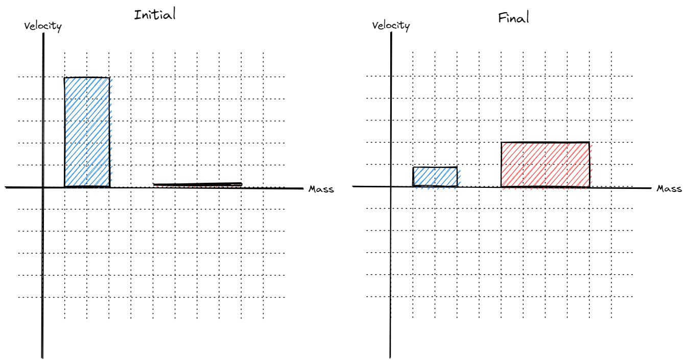

<!--- title ---> 

# <!---fit---> Momentum 💥

# <!---fit---> A model for collisions

### Mr. Porter 
### 2024 - Physics

---

<!--- _class: momentum-formula --->

# Linear Momentum 

The ***linear momentum*** $\vec{p}$ of a single object is the product of its mass $m$ and velocity $\vec{v}$: 

$$\boxed{\vec{p} = m\vec{v}}$$

---

# <!---fit---> Momentum is a
# <!---fit---> *vector* quantity!

---

# <!---fit---> Momentum is a 
# <!---fit---> *conserved* quantity
# <!---fit---> in closed systems

---

# Momentum conservation:

In general momentum of a system is conserved:

$$ \boxed{p_{before} = p_{after}} $$

Which can look like...

$$ \boxed{m_1\vec{v}_{1i} + m_2\vec{v}_{2i} = m_1\vec{v}_{1f} + m_2\vec{v}_{2f}}$$

---

---

# Collision Types

* Elastic  - Kinetic Energy is conserved, "*bouncy*"
* Inelastic - Kinetic energy is not conserved, "*sticky*"
* Explosions - Objects start together and *explode* away from each other

---

# Elastic Collisions 

<!-- 
- Do not exist in nature
- Close with very rigid objects, sometimes super cooled metals can get there
- Collisions between atoms are almost perfectly elastic 
-->

---

# Inelastic Collisions 

<!-- 
Examples:
- Volleyball bouncing off your arms, basketball dribbling, you jumping on a trampoline

These are most collisions
-->

---

# Totally Inelastic *Sticky* Collisions

<!-- 
You catching a football, car collisions where the cars stick together

Most of the energy goes to internal energy
-->

---

# Explosions

---

### Momentum Bar Graphs 

---

### Momentum Bar Graphs

* Y-axis represents *velocity* (direction matters!)
* x-axis represents *mass* (width shows size)
* Area of each "bar" represents the ***momentum***

---

On an icy road, a *$5000\textrm{ kg}$* truck rear-ends a  *$1200 \textrm{ kg}$* car that had been traveling at *$13\text{ m/s}$*, causing the truck to slow from *$14\text{ m/s}$* to *$12\text{ m/s}$* and the car to speed up.
1. Sketch the situation 
2. Complete the momentum conservation diagram 

3. Write momentum conservation equation 
4. What was the speed after the collision?

---
A *$6\text{ kg}$* puppy is riding on a skateboard (*$1.4\text{ kg}$*) moving at a speed of *$1.2\text{ m/s}$*. While gliding along, the puppy sees a squirrel and jumps off the back of the skateboard with a speed of *$0.5\text{ m/s}$* (backwards) relative to the ground. What is the speed of the skateboard just after the puppy jumps? (Be sure to keep careful track of all of the directions involved!)
1. Sketch the situation 
2. Complete the momentum conservation diagram 

3. Write momentum conservation equation 
4.  What is the speed of the skateboard just after the puppy jumps?

---
Two brand new ice skaters have a collision on the ice. Esme, a *$21\text{ kg}$* skater, overestimated her new abilities and was gliding across the ice at an ambitious *$4.6\text{ m/s}$*. Octavia, a *$37\text{ kg}$* skater, who was blissfully unaware of Esme’s presence, was gliding in the same direction at a more modest speed of *$1.2\text{ m/s}$*. When Esme collided with the unsuspecting Octavia, she clung to her for dear life. At what speed did the pair end up traveling at together after the collision?

1. Sketch the situation 
2. Complete the momentum conservation diagram 

3. Write momentum conservation equation 
4. At what speed did the pair end up traveling at together after the collision?

---

#### It’s moving day for Keanu’s family. A small dresser is strapped onto a rolling dolly, and Keanu is supposed to push the dresser out to the moving truck. Keanu is annoyed that they have to help, so instead they throw a *$300\text{ gram}$* rubber ball at the dresser. The ball is thrown with a speed of 15 m/s and bounces straight back with a speed of *$10\text{ m/s}$*. Unfortunately, this only results in the dresser rolling at a paltry speed of *$0.21\text{ m/s}$*, and Keanu eventually decides to just push the dresser anyway. What is the mass of the dresser and dolly combo?

---

#### In a railroad yard, a train is being assembled. An empty boxcar, coasting at *$3\text{ m/s}$*, strikes a loaded car that is stationary, and the cars couple together. Each of the boxcars has a mass of *$9000\text{ kg}$* when empty, and the loaded car contains *$55,000\text{ kg}$* of lumber.

---

#### An astronaut of mass *$80\text{ kg}$* carries an empty oxygen tank of mass *$10\text{ kg}$*. By pushing the tank away with a speed of *$2.0\text{ m/s}$*, the astronaut recoils in the opposite direction. Find the speed with which the astronaut moves off into space.

---

#### A *$50\text{ kg}$* cart is moving across a frictionless floor at *$2.0\text{ m/s}$*. A *$70\text{ kg}$* boy, riding in the cart, jumps off so that he hits the floor with zero velocity. What was the velocity of the cart after the boy jumped?

---

# <!---fit---> How do you change

# <!---fit---> Momentum?

---

# <!---fit---> With   Forces!

---

# Changing Momentum 

* Why do baseball players wear gloves to catch baseballs?
* Why do gymnasts practice and perform on mats?
* Why do football players wear padding?
* Why do cars have air bags?
* Why does a boxer "roll with the punch"?
* Why or how are jackhammers able to break concrete?
* Why are tennis players, as well as players in many sports, taught to "follow through" with their swing?

---

<!---
- How would this change for eggs? In which situation would the egg break?
- How does the momentum change differ in these situations? 
- Why does the momentum change differ?
--->

---

#### Change in $\vec{p}$ and Forces

* Start with N2L:
$$\Sigma \vec{F} = m\vec{a}$$

* Sub in definition of acceleration $a = \frac{\Delta v}{\Delta t}$

$$ \Sigma \vec{F} = m \frac{\Delta v}{\Delta t} \rightarrow \Sigma \vec{F} \Delta t = m \Delta v $$ 

* Rearrange and sub in $\Delta \vec{p}$ for $m \Delta v$ 
$$ \boxed{\Sigma \vec{F} \Delta t = \Delta p} $$

---

# Impulse 

* Impulse is equal to the product of net force and the time interval
* $J = F_{net} \Delta t$
* Impulse is equal to the change in momentum of an object or system

---

# <!---fit---> I bet you cannot break 

# <!---fit---> the Egg 🥚

--- 

# Impulse 

* Can make impulse changes with large *Forces*:

$$ \LARGE{F} \tiny{\Delta t} \normalsize =  \Delta P $$

* Can make impulse changes with large *time intervals*:

$$ \tiny{F} \LARGE{\Delta t} \normalsize =  \Delta P $$

---

# <!---fit---> Explain using the idea of   impulse and momentum   why we couldn't   break the egg.

---

## 🤔 Momentum Questions - Explain the Following with $J$ and $\vec{p}$:

- Why do baseball players wear gloves to catch baseballs?
- Why do gymnasts practice and perform on mats?
- Why do football players wear padding?
- Why do cars have air bags?
- Why does a boxer "roll with the punch"?
- Why or how are jackhammers able to break concrete?
- Why are tennis players, as well as players in many sports, taught to "follow through" with their swing?

---

# :1234: Calculating Momentum Change

#### Two ways:

- $\Delta p = m \Delta v$ 
- $\Delta p = F\Delta t$

#### Momentum Units:

- kg$\cdot$m/s
- N$\cdot$s

---

# 🔢 Calculating Momentum Change 

- We can combine the two equations for momentum change:

$$ J = F \Delta t = m \Delta v = m (v-v_0)$$

---

# Impulse & Graphs 

How can you calculate the change in momentum from a force vs. time graph?

---

# Changing Force?

How would you do this for a changing force? 

---

