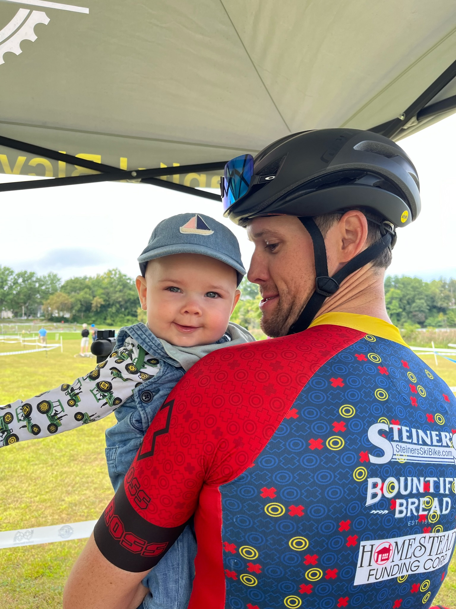
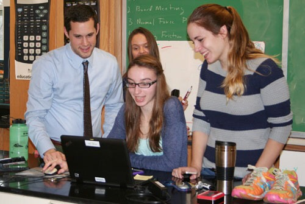
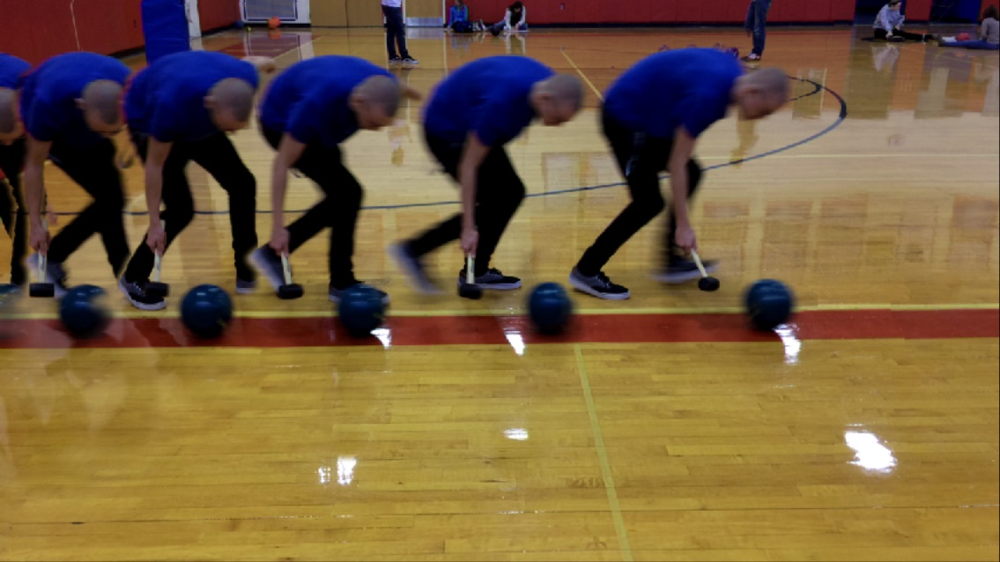
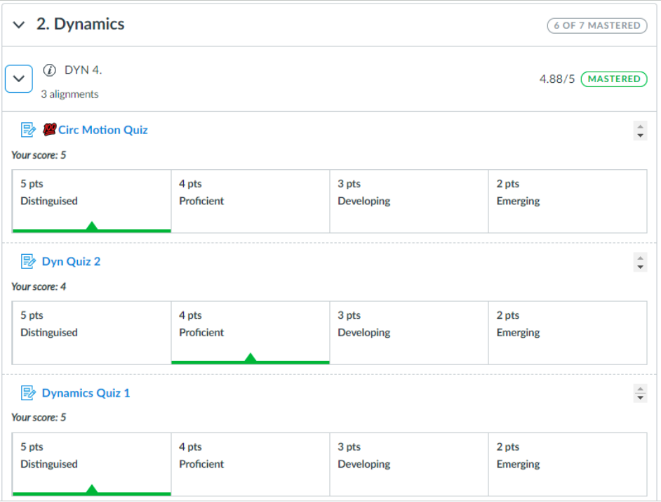
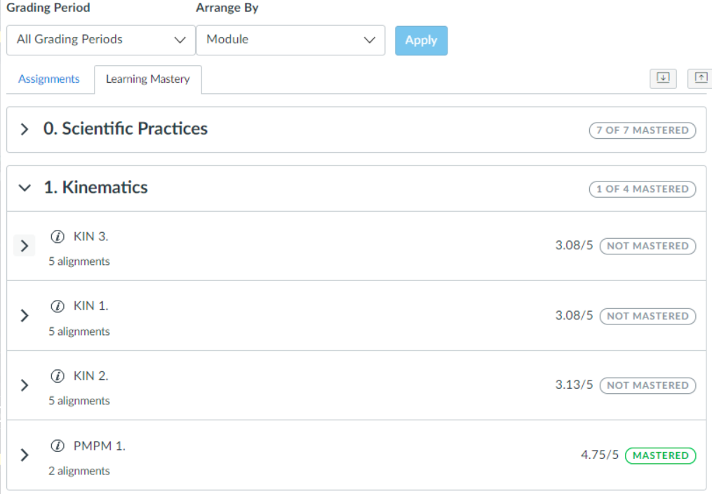

# [Physics](#physics-2024-25)
# [Earth Science](#earth-science--2024-25)

---

# Back to School Night 2024 <!---fit--->

# **Mr. Porter**

## Physics 2024-25

---

# **About Me..**

- 13th Year at Schodack
- Married and we have an 18 month old son
- Avid Cyclist
    - CBRC Board Member
- Like to vacation 🏕️ in Maine 🦞

---

---

# Questions for you

On an index card:

0. Your Name & Your Child's Name & Class
1. What is your proudest moment as parent in regards to the child I am teaching?
2. What motivates your child?
3. What are your expectations for your child this year?
4. Is there anything you want me to know about your child?

---

# One more question!

5. If we were on a deserted island what skills could you bring to ensure the survival of everyone in this room?

---

<!--- _backgroundColor: black --->

>  # _**Tell me and I forget. Teach me and I remember. Involve me and I learn.**_  
> ### Ben Franklin

---

# Teaching Physics <!--fit-->

# **Modeling Instruction** <!--fit--->

---

# Paradigm Lab - Model Development  :arrow_down: <!--fit--->

# Model Deployment & Problem Solving ⬇️ <!--fit--->

# Breaking the Model 🔁 <!--fit--->

--- 

       

# Model Development

---

# Model Deployment

<video controls width="350" >
  <source src="../figures/IMG_2814.MOV" type="video/webm" />

  <source src="../figures/IMG_2814.MOV" type="video/mp4" />
</video>

---

# Breaking the Model 🔨 <!--fit--->

---

# Standards Based Grading 

- Students graded by learning target 
    - _“I can solve projectile motion problems.”_
- Scored 1-5, Weighted Average (75% Most recent, 25% everything else)
- Can initial reassessments on any standard 
- Overall score is based on how many standards are mastered out of how many are assessed

| Descriptor | Score | 
|---|---| 
| Distinguished | 5|
| Proficient | 4|
| Developing | 3|
| Emerging | 2|
| Beginning | 1|
| No Evidence |0  |

---

# Quiz Grade

---

# Gradebook 

---

# Grades Overall 

- 15% Tests
- 25% (10% AP) Lab Completion (Lab work in Lab Notebook and Pivot Interactives)
    - Labs must be completed thoughtfully and thoroughly. 
- 60% (75% AP) Cumulative Standards Score 
    - Based on # of standards Mastered out of # assessed

---

# AP Physics vs. Regents Physics 

## AP Physics

- Deeper conceptual understanding and a greater use of algebraic representation
- Tests how multiple concepts are related and the effect they have on each other
- Adds in Rotational Mechanics and Dynamics

## Regents Physics 

- More calculation based
- Tests one concept at a time and questions are scaffolded more

---

#### <u>AP Physics</u>

1. Kinematics 
2. Translational Dynamics
3. Work, Energy and Power
4. Conservation of Linear Momentum
5. Torque and Rotational Dynamics
6. Energy and Momentum of Rotating Systems
7. Oscillations 
8. Fluids

 

#### <u>Regents</u> 

1. Kinematics 
2. Translational Dynamics
3. Work, Energy and Power
4. Conservation of Linear Momentum
5. Electrostatics 
6. DC Circuits 
7. Mechanical Waves
8. Electromagnetic Waves
9. Modern Physics

---

# What questions do you have? <!--fit--->

---

# Back to School Night 2024 <!---fit--->

# **Mr. Porter**

## Earth Science 🌎 2024-25

---

# **About Me..**

- 13th Year at Schodack
- Married and we have an 18 month old son
- Avid Cyclist
    - CBRC Board Member
- Like to vacation 🏕️ in Maine 🦞

---

---

# Questions for you

On an index card:

0. Your Name & Your Child's Name & Class
1. What is your proudest moment as parent in regards to the child I am teaching?
2. What motivates your child?
3. What are your expectations for your child this year?
4. Is there anything you want me to know about your child?

---

# One more question!

5. If we were on a deserted island what skills could you bring to ensure the survival of everyone in this room?

---

<!--- _backgroundColor: black --->

>  # _**Tell me and I forget. Teach me and I remember. Involve me and I learn.**_  
> ### Ben Franklin

---

# What is Earth Science?

1. Origin of the Universe and Solar System
2. Earth's Interior and Plate Tectonics
3. Landscapes and Surface Processes
4. Geologic History and Evolution of Life
5. The Earth-Sun-Moon System
6. Weather
7. Climate

---

# Learning Process

1) ⚓Phenomenon & Driving Question:
    * _"If we had to move off of Planet Earth where would we go?"_
2) Introduction to the performance task
3) Connecting Science Learning to Anchor and Performance Task
    * "Traditional Teaching" -> Labs, Notes, Quizzes, etc
    * Origin of Universe (_How did all matter in the universe come into exisitence?_)
4) Complete Performance Task
5) Unit Test

---

# Grading Policy

- Tests: 100 points (One test & One Performance Task per unit)
- Quizzes: 25-50 points (1-2 quizzes per unit)
- Labs: 25-50 points
- Homework and Classwork: 5-20 points (depending on length)

**Cumulative points will determine the final grade for the course.**

---

# What questions do you have? <!--fit--->

