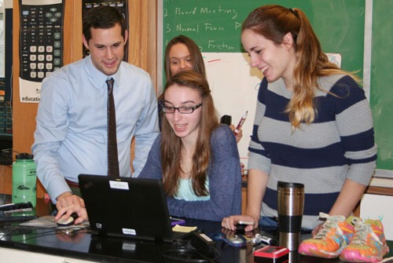
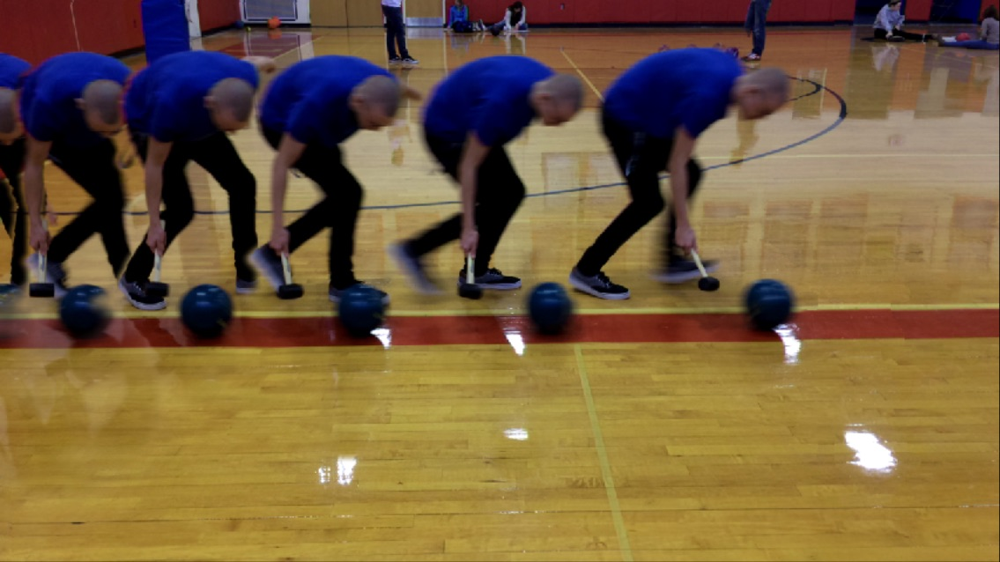
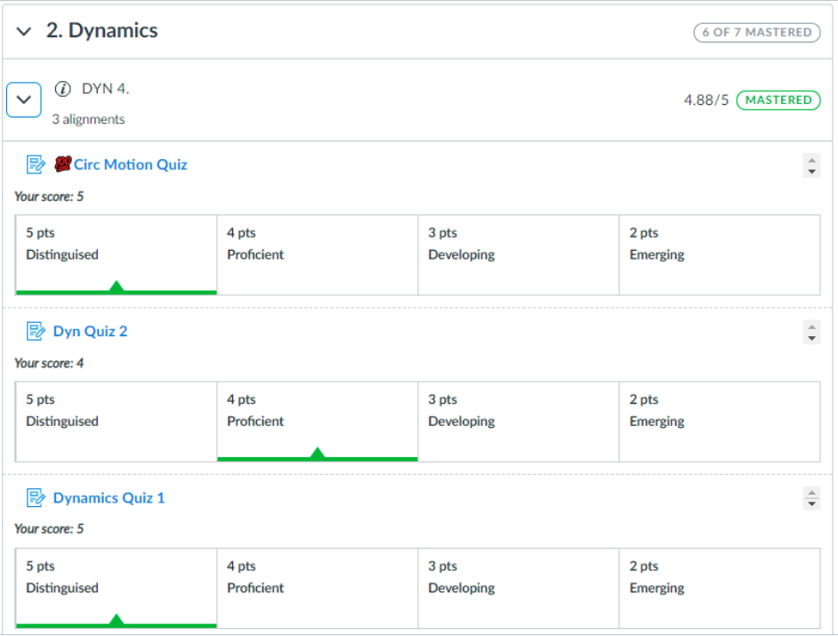

# CONTENTS: <!--fit--->

## 1. [Physics](#physics-2025-26)
## 2. [Earth Science](#earth-science--2025-26)

---

# Back to School Night 2025 <!---fit--->

# **Mr. Porter**

## Physics 2025-26

---

# Think about
    
- [x] Communication -> Parent Square
- [x] Fix slides with dates and information
- [ ] Update photos

---

# **About Me..**

- 14th Year at Schodack
- Married and we have an 2.5 year old son
- Avid Cyclist
    - CBRC Board Member
- Like to vacation 🏕️ in Maine 🦞

---

---

# Questions for you

On an index card:

0. Your Name & Your Child's Name & Class
1. What is your proudest moment as parent/guardian in regards to the child I am teaching?
2. What motivates your child?
3. What are your expectations for your child this year?
4. Is there anything else you want me to know about your child?

---

> # _**Tell me and I forget. Teach me and I remember. Involve me and I learn.**_  
> ### Ben Franklin

---

# Teaching Physics <!--fit-->

# **Modeling Instruction** <!--fit--->

---

# Paradigm Lab - Model Development  :arrow_down: <!--fit--->

# Model Deployment & Problem Solving ⬇️ <!--fit--->

# Breaking the Model 🔁 <!--fit--->

--- 

       

# Model Development

---

# Model Deployment

<video controls width="350" >
  <source src="../figures/IMG_2814.MOV" type="video/webm" />

  <source src="../figures/IMG_2814.MOV" type="video/mp4" />
</video>

---

# Breaking the Model 🔨 <!--fit--->

---

# Standards Based Grading 

- Students graded by learning target 
    - _“I can solve projectile motion problems.”_
- Scored 1-5, Weighted Average (75% Most recent, 25% everything else)
- Can initial reassessments on any standard 
- Overall score is based on how many standards are mastered out of how many are assessed

| Descriptor | Score | 
|---|---| 
| Distinguished | 5|
| Proficient | 4|
| Developing | 3|
| Emerging | 2|
| Beginning | 1|

---

# Quiz Grade

---

# Gradebook 

---

# Grades Overall AP/Regents

- 5%/10% Homework
- 15%/20% Tests
- 20% Lab Completion (Lab work in Lab Notebook and Pivot Interactives)
    - Labs must be completed thoughtfully and thoroughly. 
- 60%/50% Cumulative Standards Score 
    - Based on # of standards Mastered out of # assessed

---

# AP Physics vs. Regents Physics 

## AP Physics

- Deeper conceptual understanding and a greater use of algebraic representation
- Tests how multiple concepts are related and the effect they have on each other
- Adds in Rotational Mechanics and Dynamics

## Regents Physics 

- More calculation based
- Tests one concept at a time and questions are scaffolded more

---

#### <u>AP Physics</u>

1. Kinematics 
2. Translational Dynamics
3. Work, Energy and Power
4. Conservation of Linear Momentum
5. Torque and Rotational Dynamics
6. Energy and Momentum of Rotating Systems
7. Oscillations 
8. Fluids

 

#### <u>Regents</u> 

1. Kinematics 
2. Translational Dynamics
3. Work, Energy and Power
4. Conservation of Linear Momentum
5. Electrostatics 
6. DC Circuits 
7. Mechanical Waves
8. Electromagnetic Waves
9. Modern Physics

---

# What questions do you have? <!--fit--->

---

# Back to School Night 2025 <!---fit--->

# **Mr. Porter**

## Earth Science 🌎 2024-25

---

# **About Me..**

- 14th Year at Schodack
- Married and we have an 2.5 old son
- Avid Cyclist
    - CBRC Board Member
- Like to vacation 🏕️ in Maine 🦞

---

---

# Questions for you

On an index card:

0. Your Name & Your Child's Name & Class
1. What is your proudest moment as parent/guardian in regards to the child I am teaching?
2. What motivates your child?
3. What are your expectations for your child this year?
4. Is there anything else you want me to know about your child?

---

<!--- _backgroundColor: black --->

>  # _**Tell me and I forget. Teach me and I remember. Involve me and I learn.**_  
> ### Ben Franklin

---

# What is Earth Science?

1. Space Systems
2. Earth's History
2. Earth's Systems
3. Weather & Climate
4. Human Sustainability

---

# Transition to NYSSLS 

## Earth Science Test has changed to match the New York State Science Learning Standards

### New ESS

- Phenomena and systems driven, clusters around real-world contexts
- Shift towards scientific literacy and application

 

### Old

- traditional test, MC & FRQ
- Classic skills such as profiles, plotting, quantitative and recall items

---

<iframe src="https://www.nysedregents.org/earth_space_sciences/625/ess62025-exam.pdf" 
        width="100%" 
        height="600px" 
        type="application/pdf"
        style="border: 1px solid #ccc;">
</iframe>

---

# Grading Policy

- Tests: 100 points (One test & One Performance Task per unit)
- Quizzes: 25-50 points (1-2 quizzes per unit)
- Labs: 25-50 points
- Homework and Classwork: 5-20 points (depending on length)

**Cumulative points will determine the final grade for the course.**

---

# What questions do you have? <!--fit--->

## Contacts:

💻 Encouraged to start with **ParentSquare**
✉️ Email: nporter@schodack.k12.ny.us