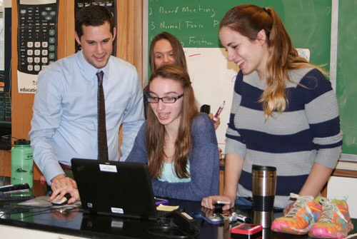
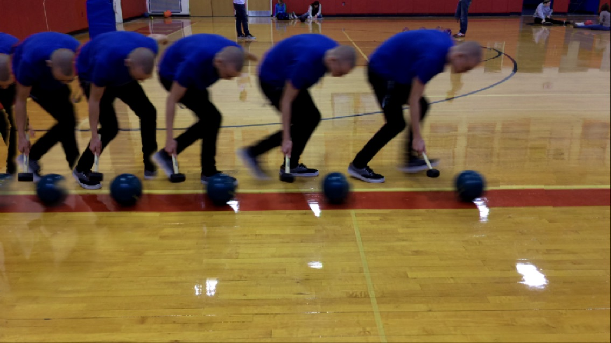
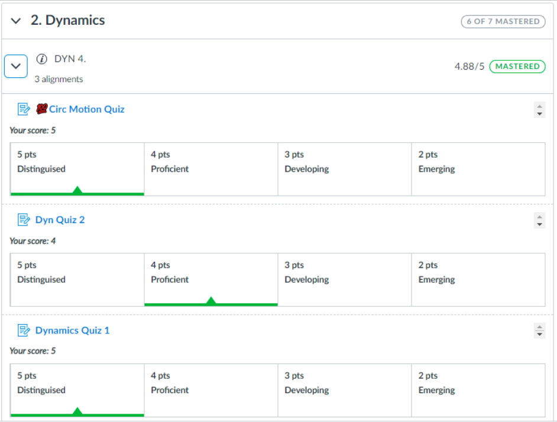
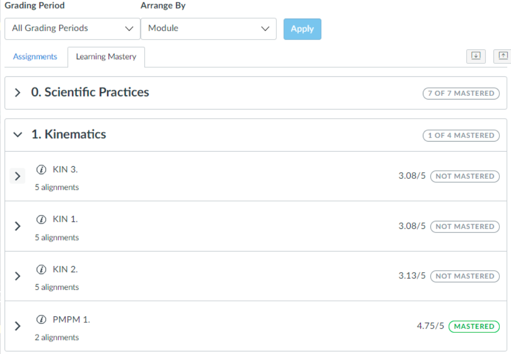

<!-- _class: light -->
<!-- _paginate: false -->

Back to School Night 2026

# Contents

1. [Physics](#2)
2. [Earth Science](#21)

---

<!-- _class: title -->
<!-- _footer: '' -->

### Back to School Night 2026

# Mr. Porter

## Physics 2026–27

#### 🤔 Questions for you

On an index card:

0. Your name & your child's name
1. What is your proudest moment as a parent/guardian in regards to the child I am teaching?
2. What motivates your child?
3. What are your expectations for your child this year?
4. Is there anything else you want me to know about your child?

---

<!-- _footer: '' -->

#### About Me

- 15th year at Schodack
- Married — a 3.5 year old son and a 10 week old daughter
- Avid cyclist
    - CBRC Board Member

---

<!-- _class: photo -->
<!-- _footer: '' -->

---

<!-- _class: quote -->
<!-- _footer: '' -->

> # Tell me and I forget. Teach me and I remember. Involve me and I learn.
> ### Benjamin Franklin

---

<!-- _class: section -->

#### How I Teach Physics

# Modeling Instruction

## Students build, use, and test models — the way physicists do.

---

<!-- _class: cycle -->

#### The Modeling Cycle

# Paradigm Lab — Model Development
# Model Deployment & Problem Solving
# Breaking the Model

---

<!-- _class: photo -->

#### Step 01

# Model Development

---

#### Step 02

# Model Deployment

Students apply the model they built to new situations and problems.

<video controls width="360">
  <source src="../figures/IMG_2814.MOV" type="video/mp4" />
</video>

---

<!-- _class: section -->

#### Step 03

# Breaking the Model 🔨

## Finding where a model stops working is where the next one begins.

---

#### Grading

# Standards Based Grading

- Students graded by learning target
    - _“I can solve projectile motion problems.”_
- Scored 1–5, weighted average (**75%** most recent, 25% everything else)
- Can initiate reassessments on any standard
- Overall score is based on how many standards are mastered out of how many are assessed

| Descriptor    | Score |
| ------------- | ----- |
| Distinguished | 5     |
| Proficient    | 4     |
| Developing    | 3     |
| Emerging      | 2     |
| Beginning     | 1     |

---

<!-- _class: light -->

#### Grading

# Quiz Grade

---

<!-- _class: light -->

#### Grading

# Gradebook

---

#### Grading

# Grades Overall — AP

| Category                     | Weight |
| ---------------------------- | ------ |
| Cumulative Standards Score   | 60%    |
| Lab Completion               | 20%    |
| Tests                        | 15%    |
| Homework                     | 5%     |

- **Labs** — Lab Notebook and Pivot Interactives; must be completed thoughtfully and thoroughly.
- **Standards score** — based on # of standards mastered out of # assessed.

<!-- 
#### Two Courses

# AP Physics vs. Regents Physics

## AP Physics

- Deeper conceptual understanding and a greater use of algebraic representation
- Tests how multiple concepts are related and the effect they have on each other
- Adds in Rotational Mechanics and Dynamics

## Regents Physics

- More calculation based
- Tests one concept at a time and questions are scaffolded more

 -->

---

<!-- _class: light -->

#### Course Units

## AP Physics

1. Kinematics
2. Translational Dynamics
3. Work, Energy and Power
4. Conservation of Linear Momentum
5. Torque and Rotational Dynamics
6. Energy and Momentum of Rotating Systems
7. Oscillations
8. Fluids

## Regents Physics

1. Kinematics
2. Translational Dynamics
3. Work, Energy and Power
4. Conservation of Linear Momentum
5. Electrostatics
6. DC Circuits
7. Mechanical Waves
8. Electromagnetic Waves
9. Modern Physics

---

#### Partnering at Home

# 💯 How do I help my child succeed?

### Practice

Complete the homework & practice — encourage them to **stay after school** to do this!

### Reassess

Encourage them to **sign up for reassessments**.

---

<!-- _class: contact -->

# What questions do you have?

#### Contact

💻 Encouraged to start with **ParentSquare**
✉️ nporter@schodack.k12.ny.us
🔗 Presentation → scan the code

---

<!-- _class: title -->
<!-- _footer: '' -->

### Back to School Night 2025

# Mr. Porter

## Earth Science 🌎 2025–26

---

<!-- _footer: '' -->

#### About Me

- 14th year at Schodack
- Married — we have a 2.5 year old son
- Avid cyclist
    - CBRC Board Member
- Like to vacation 🏕️ in Maine 🦞

---

<!-- _class: photo -->
<!-- _footer: '' -->

---

#### Index Cards

# Questions for you

On an index card:

0. Your name, your child's name & class
1. What is your proudest moment as a parent/guardian in regards to the child I am teaching?
2. What motivates your child?
3. What are your expectations for your child this year?
4. Is there anything else you want me to know about your child?

---

<!-- _class: quote -->
<!-- _footer: '' -->

> # Tell me and I forget. Teach me and I remember. Involve me and I learn.
> ### Benjamin Franklin

---

#### The Course

# What is Earth Science?

1. Space Systems
2. Earth's History
3. Earth's Systems
4. Weather & Climate
5. Human Sustainability

---

#### Transition to NYSSLS

# A New Earth Science Exam

The Earth Science test has changed to match the **New York State Science Learning Standards**.

## New ESS

- Phenomena and systems driven, clusters around real-world contexts
- Shift towards scientific literacy and application

## Old

- Traditional test, MC & FRQ
- Classic skills such as profiles, plotting, quantitative and recall items

---

<!-- _class: light -->
<!-- _footer: '' -->

<iframe src="https://www.nysedregents.org/earth_space_sciences/625/ess62025-exam.pdf"
        width="100%"
        height="600px"
        style="border: 1px solid #ccc; border-radius: 10px;">
</iframe>

---

#### Grading

# Grading Policy

| Category                | Points                     |
| ----------------------- | -------------------------- |
| Tests                   | 100 — one test & one performance task per unit |
| Quizzes                 | 25–50 — 1–2 per unit       |
| Labs                    | 25–50                      |
| Homework & Classwork    | 5–20 — depending on length |

**Cumulative points determine the final grade for the course.**

---

#### Partnering at Home

# 💯 How do I help my child succeed?

### Practice

Complete the homework & practice — **stay after school** to do this!

### Ask

Ask for **extra practice** when a concept is a struggle.

---

<!-- _class: contact -->

# What questions do you have?

#### Contact

💻 Encouraged to start with **ParentSquare**
✉️ nporter@schodack.k12.ny.us
🔗 Presentation → scan the code

