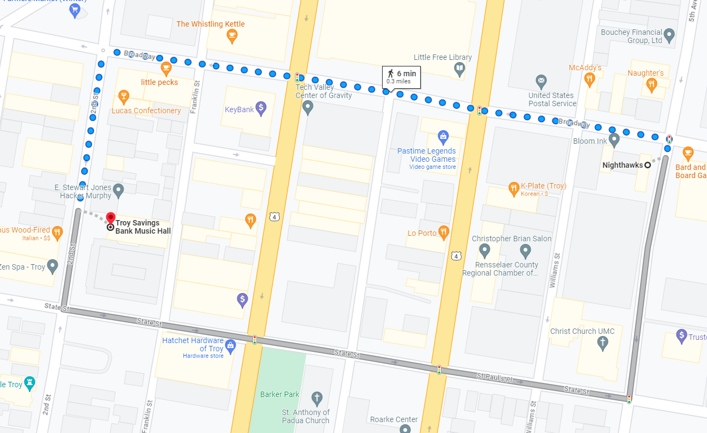

# Two Dimensional Motion 

## Regents Physics 

### Maple Hill High School 2024-25

---

# **Review:** Vectors  <!--fit--->

# :arrow_upper_left: ↗️ ↘️ ⬆️ ⬇️ <!--fit--->

---

# Vctor Quantities:

### A *<u>vector</u>* is a quantity with both **magnitude** (size) and **direction**.

#### Examples:

  - The child was displaced 9 meters North.
  - The car has a velocity of 10 meters per second East
  - $\vec{F}$, $\vec{p}$, $\vec{a}$, $\vec{v}$, $\Delta \vec{x}$, etc

---

# Scalar Quantities

### A *<u>scalar</u>* is a quantity with just **magnitude**.

#### Examples

  - The child traveled a distance of 12 meters
  - The car is moving 20 miles per hour
  - The frog has mass of 0.5 kg.
  - $m$, $t$, $r$, etc

---

# Representing Vectors 

---

# Representing Vector Components

---
<!--- _footer:   --->

# Vector Components

* Parts of a two-dimensional vector
* The *component* of a vector is the influence of that vector in a given direction.
    * i.e. How far _East_ of a North East displacement did you walk?
* We look at the ***perpendicular components***
    * How much of the vector is in the *x-direction*
    * How much of the vector is in the *y-direction*
* Vector $\vec{A}$ is made up of components $\vec{A}_x$ and $\vec{A}_y$
    * $\vec{A} = \vec{A}_x + \vec{A}_y$

---

# Vector Components Math

- Notice this is a right triangle
    * $\vec{A}^2 = \vec{A}_x^2 + \vec{A}_y^2$
    * Depending on the angle...
        * $A_x = \pm A \cos \theta$
        * $A_y = \pm A \sin \theta$

---

## What are the components of Vector $\vec{A}$?

---

## What are the components of Vector $\vec{A}$ and $\vec{B}$?

---

## Use Trig to Find $\vec{A}_x$ and $\vec{A}_y$

---

# Practice 🎯 <!--fit--->

## [Vector Components 1](https://www.physicsclassroom.com/calcpad/launch/CPVP3)

## [Vector Components 2](https://www.physicsclassroom.com/calcpad/launch/CPVP4)

---

# Try It...

Mr. Porter and his wife walk from Nighthawks to Troy Savings Bank Music Hall. They walk 6 blocks East and then 2 Blocks South. [1 Block = 100 Meters]

1. Determine the **distance** that they traveled.
2. Determine their  **displacement**.

---

<!--- _footer:  --->

## Adding Vectors 

Vectors are added ___"tip to tail"___, that is redraw the vectors so that the tip of one vector is attached to the tail of the second vector. 

$$\vec{C} = \vec{a} + \vec{b}$$

>_The **resultant** vector S is equal to the addition of vectors a and b_

---

# Adding Vectors 

Mr. Porter's brother is on a hike. He walks:

- 2 KM North
- 3 KM East 
- 5 KM Exactly South East 

**Draw a the vector addition diagram** to represent this motion

---

## Adding Vectors 

#### Using Components

You can sum the components of the two vectors to find the components of the **resultant** vector 

If $\vec{C} = \vec{A} + \vec{B}$...

* $C_x = A_x + B_x$
* $C_y = A_y + B_y$
* $|C| = \sqrt{C_x^2 + C_y^2 }$

---

# Practice 🎯 <!--fit--->

## [Adding 2 Perpendicular Vectors](https://www.physicsclassroom.com/calcpad/launch/CPVP5)

## [Adding 3 or More Perpendicular Vectors](https://www.physicsclassroom.com/calcpad/launch/CPVP6)

---

# Adding Angled Vectors 

## Make a Chart

| Vector | $x$ component | $y$ compnents | 
|---|---|---|
|$A$ | | |
|$B$| | | 
|$\vdots$ | | | 
|Resultant | $A_x + B_x + \dots$ | $A_y + B_y + \dots$ |
