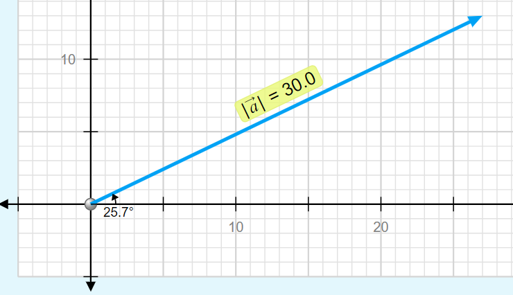
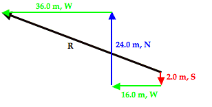

# Two Dimensional Motion 

## Regents Physics 

### Maple Hill High School 2024-25

---

# Contents:

1. [Vector Quantities](#vector-quantities)
2. [Vector Component Math](#vector-components-math)
3. [Vector Components Practice](#practice)
4. [Adding Vectors](#adding-vectors)
5. [Adding Perpendicular Vectors Example](#adding-perpendicular-vectors)
6. [Practice Adding Perpendicular Vectors](#practice-1)
7. [Adding Angled Vectors](#adding-angled-vectors)
8. [Angled Vectors Addition Practice](#practice-2)

---

# **Review:** Vectors  <!--fit--->

# :arrow_upper_left: ↗️ ↘️ ⬆️ ⬇️ <!--fit--->

---

# Vector Quantities:

### A *<u>vector</u>* is a quantity with both **magnitude** (size) and **direction**.

#### Examples:

  - The child was displaced 9 meters North.
  - The car has a velocity of 10 meters per second East
  - $\vec{F}$, $\vec{p}$, $\vec{a}$, $\vec{v}$, $\Delta \vec{x}$, etc

---

# Scalar Quantities

### A *<u>scalar</u>* is a quantity with just **magnitude**.

#### Examples

  - The child traveled a distance of 12 meters
  - The car is moving 20 miles per hour
  - The frog has mass of 0.5 kg.
  - $m$, $t$, $r$, etc

---

# Representing Vectors 

---

# Representing Vector Components

---
<!--- _footer:   --->

# Vector Components

* Parts of a two-dimensional vector
* The *component* of a vector is the influence of that vector in a given direction.
    * i.e. How far _East_ of a North East displacement did you walk?
* We look at the ***perpendicular components***
    * How much of the vector is in the *x-direction*
    * How much of the vector is in the *y-direction*
* Vector $\vec{A}$ is made up of components $\vec{A}_x$ and $\vec{A}_y$
    * $\vec{A} = \vec{A}_x + \vec{A}_y$

---

# Vector Components Math

- Notice this is a right triangle
    * $\vec{A}^2 = \vec{A}_x^2 + \vec{A}_y^2$
    * Depending on the angle...
        * $A_x = \pm A \cos \theta$
        * $A_y = \pm A \sin \theta$

---

## What are the components of Vector $\vec{A}$?

---

## What are the components of Vector $\vec{A}$ and $\vec{B}$?

---

## Use Trig to Find $\vec{A}_x$ and $\vec{A}_y$

---

# Practice 🎯 <!--fit--->

## [Vector Components 1](https://www.physicsclassroom.com/calcpad/launch/CPVP3)

## [Vector Components 2](https://www.physicsclassroom.com/calcpad/launch/CPVP4)

---

# Try It...

Mr. Porter and his wife walk from Nighthawks to Troy Savings Bank Music Hall. They walk 6 blocks East and then 2 Blocks South. [1 Block = 100 Meters]

1. Determine the **distance** that they traveled.
2. Determine their  **displacement**.

---

<!--- _footer:  --->

## Adding Vectors 

Vectors are added ___"tip to tail"___, that is redraw the vectors so that the tip of one vector is attached to the tail of the second vector. 

$$\vec{C} = \vec{a} + \vec{b}$$

>_The **resultant** vector S is equal to the addition of vectors a and b_

---

# Adding Vectors 

Mr. Porter's brother is on a hike. He walks:

- 2 KM North
- 3 KM East 
- 5 KM Exactly South East 

**Draw a the vector addition diagram** to represent this motion

---

## Adding Vectors 

#### Using Components

You can sum the components of the two vectors to find the components of the **resultant** vector 

If $\vec{C} = \vec{A} + \vec{B}$...

* $C_x = A_x + B_x$
* $C_y = A_y + B_y$
* $|C| = \sqrt{C_x^2 + C_y^2 }$

---

### Adding Perpendicular Vectors

Mac and Tosh are doing the Vector Walk Lab. Starting at the door of their physics classroom, they walk 2.0 meters, south. They make a right hand turn and walk 16.0 meters, west. They turn right again and walk 24.0 meters, north. They then turn left and walk 36.0 meters, west. What is the magnitude of their overall displacement?

_A graphical representation of the given problem will help visualize what is happening. The diagram below depicts such a representation._

---

## Step 1: Tip-to-tail

---

## Step 2: Sum $X$ and $Y$ directions

---

# Practice 🎯 <!--fit--->

## [Adding 2 Perpendicular Vectors](https://www.physicsclassroom.com/calcpad/launch/CPVP5)

## [Adding 3 or More Perpendicular Vectors](https://www.physicsclassroom.com/calcpad/launch/CPVP6)

---

# Vector Treasure Hunt 🪙

1. Create a Vector Map (draw this on the map of the school) -> start at one of the entrances of the school.
2. Record all vectors in component form and Magnitude-direction from (use the convention degrees clockwise from North...this is the setting your iPhone compass uses)
3. Exchange vector directions with another group and draw their vector map on your grid in another color or symbol (i.e. dotted line)
4. Calculate the displacement of the the vector map
5. Go walk the map and record the landmarks at the end of each vector.

---

# Vector Descriptions

- Component Form:
    - $\vec{a} = \langle a_x, a_y\rangle$
    - $\vec{a} = \langle 20,10 \rangle$
- Magnitude-direction form:
    - $|\vec{a}|=22.4$ units at $\theta = 26.6$ degrees

---

# In Your Lab Notebook

1. Tape/staple in vector maps (you can fold in half to fit)
2. Show any calculations you make for any individual vectors, and the resultant displacement for your map and the exchanged map you receive. 
3. A brief reflection
    - Challenges faced in creating/following the vectors
    - Real-world applications of vector navigation
    - How this activity enhanced your understanding of vectors

---

# Adding Angled Vectors

Max plays middle linebacker for South's football team. During one play in last Friday night's game against New Greer Academy, he made the following movements after the ball was snapped on third down. First, he back-pedaled in the southern direction for 2.6 meters. He then shuffled to his left (west) for a distance of 2.2 meters. Finally, he made a half-turn and ran downfield a distance of 4.8 meters in a direction of 240° counter-clockwise from east (30° W of S) before finally knocking the wind out of New Greer's wide receiver. Determine the magnitude and direction of Max's overall displacement.

---

# Visually

 

---

### How to Solve...Find Components of Angled Vector

This..

 

Becomes...

---

### Summing the Components

 

---

# Adding Angled Vectors 

## Make a Chart

| Vector | $x$ component | $y$ compnents | 
|---|---|---|
|$A$ | | |
|$B$| | | 
|$\vdots$ | | | 
|Resultant | $A_x + B_x + \dots$ | $A_y + B_y + \dots$ |

---

# 🎯 Practice 

## [Adding Non-Perpendicular Vectors 1](https://www.physicsclassroom.com/calcpad/launch/CPVP7)

## [Adding Non-Perpendicular Vectors 2](https://www.physicsclassroom.com/calcpad/launch/CPVP8)

---

# [Riverboat Problems](https://www.physicsclassroom.com/PhysicsClassroom/media/interactive/RiverBoatSim/index.html)

- River current is 4 m/s North
- Boat Velocity 4 4 m/s
- What does a drone see?
- How can we predict this **resultant velocity**?

---

# Example Riverboat

A motorboat traveling 4 m/s, East encounters a current traveling 3.0 m/s, North.

1. What is the resultant velocity of the motorboat?
2. If the width of the river is 80 meters wide, then how much time does it take the boat to travel shore to shore?
3. What distance downstream does the boat reach the opposite shore?

---

# [Riverboat Practice](https://www.physicsclassroom.com/calcpad/launch/CPVP10) <!--fit--->
