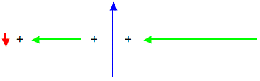
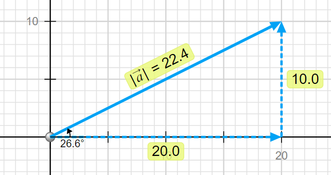
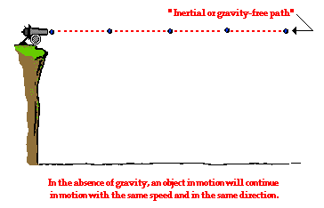
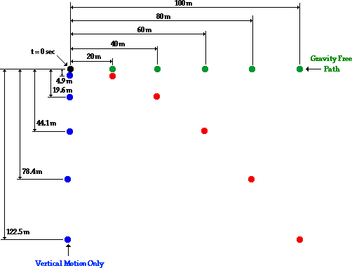
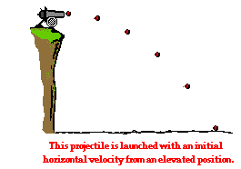
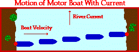
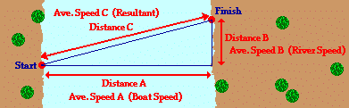

# Two Dimensional Motion 

## Regents Physics 

### Maple Hill High School 2024-25

---

# Contents:

1. [Vector Quantities](#vector-quantities)
2. [Vector Component Math](#vector-components-math)
3. [Vector Components Practice](#practice)
4. [Adding Vectors](#adding-vectors)
5. [Adding Perpendicular Vectors Example](#adding-perpendicular-vectors)
6. [Practice Adding Perpendicular Vectors](#practice-1)
7. [Adding Angled Vectors](#adding-angled-vectors)

 

8. [Angled Vectors Addition Practice](#practice-2)
9. [Free Fall](#free-fall)
10. [Horizontal Projectiles](#horizontal-projectiles)

---

# **Review:** Vectors  <!--fit--->

# :arrow_upper_left: ↗️ ↘️ ⬆️ ⬇️ <!--fit--->

---

# Vector Quantities:

### A *<u>vector</u>* is a quantity with both **magnitude** (size) and **direction**.

#### Examples:

  - The child was displaced 9 meters North.
  - The car has a velocity of 10 meters per second East
  - $\vec{F}$, $\vec{p}$, $\vec{a}$, $\vec{v}$, $\Delta \vec{x}$, etc

---

# Scalar Quantities

### A *<u>scalar</u>* is a quantity with just **magnitude**.

#### Examples

  - The child traveled a distance of 12 meters
  - The car is moving 20 miles per hour
  - The frog has mass of 0.5 kg.
  - $m$, $t$, $r$, etc

---

# Representing Vectors 

---

# Representing Vector Components

---
<!--- _footer:   --->

# Vector Components

* Parts of a two-dimensional vector
* The *component* of a vector is the influence of that vector in a given direction.
    * i.e. How far _East_ of a North East displacement did you walk?
* We look at the ***perpendicular components***
    * How much of the vector is in the *x-direction*
    * How much of the vector is in the *y-direction*
* Vector $\vec{A}$ is made up of components $\vec{A}_x$ and $\vec{A}_y$
    * $\vec{A} = \vec{A}_x + \vec{A}_y$

---

# Vector Components Math

- Notice this is a right triangle
    * $\vec{A}^2 = \vec{A}_x^2 + \vec{A}_y^2$
    * Depending on the angle...
        * $A_x = \pm A \cos \theta$
        * $A_y = \pm A \sin \theta$

---

## What are the components of Vector $\vec{A}$?

---

## What are the components of Vector $\vec{A}$ and $\vec{B}$?

---

## Use Trig to Find $\vec{A}_x$ and $\vec{A}_y$

---

# Practice 🎯 <!--fit--->

## [Vector Components 1](https://www.physicsclassroom.com/calcpad/launch/CPVP3)

## [Vector Components 2](https://www.physicsclassroom.com/calcpad/launch/CPVP4)

---

# Try It...

Mr. Porter and his wife walk from Nighthawks to Troy Savings Bank Music Hall. They walk 6 blocks East and then 2 Blocks South. [1 Block = 100 Meters]

1. Determine the **distance** that they traveled.
2. Determine their  **displacement**.

---

<!--- _footer:  --->

## Adding Vectors 

Vectors are added ___"tip to tail"___, that is redraw the vectors so that the tip of one vector is attached to the tail of the second vector. 

$$\vec{C} = \vec{a} + \vec{b}$$

>_The **resultant** vector S is equal to the addition of vectors a and b_

---

# Adding Vectors 

Mr. Porter's brother is on a hike. He walks:

- 2 KM North
- 3 KM East 
- 5 KM Exactly South East 

**Draw a the vector addition diagram** to represent this motion

---

## Adding Vectors 

#### Using Components

You can sum the components of the two vectors to find the components of the **resultant** vector 

If $\vec{C} = \vec{A} + \vec{B}$...

* $C_x = A_x + B_x$
* $C_y = A_y + B_y$
* $|C| = \sqrt{C_x^2 + C_y^2 }$

---

### Adding Perpendicular Vectors

Mac and Tosh are doing the Vector Walk Lab. Starting at the door of their physics classroom, they walk 2.0 meters, south. They make a right hand turn and walk 16.0 meters, west. They turn right again and walk 24.0 meters, north. They then turn left and walk 36.0 meters, west. What is the magnitude of their overall displacement?

_A graphical representation of the given problem will help visualize what is happening. The diagram below depicts such a representation._

---

## Step 1: Tip-to-tail

---

## Step 2: Sum $X$ and $Y$ directions

---

# Practice 🎯 <!--fit--->

## [Adding 2 Perpendicular Vectors](https://www.physicsclassroom.com/calcpad/launch/CPVP5)

## [Adding 3 or More Perpendicular Vectors](https://www.physicsclassroom.com/calcpad/launch/CPVP6)

---

# Vector Treasure Hunt 🪙

1. Create a Vector Map (draw this on the map of the school) -> start at one of the entrances of the school.
2. Record all vectors in component form and Magnitude-direction from (use the convention degrees clockwise from North...this is the setting your iPhone compass uses)
3. Exchange vector directions with another group and draw their vector map on your grid in another color or symbol (i.e. dotted line)
4. Calculate the displacement of the the vector map
5. Go walk the map and record the landmarks at the end of each vector.

---

# Vector Descriptions

- Component Form:
    - $\vec{a} = \langle a_x, a_y\rangle$
    - $\vec{a} = \langle 20,10 \rangle$
- Magnitude-direction form:
    - $|\vec{a}|=22.4$ units at $\theta = 26.6$ degrees

---

# In Your Lab Notebook

1. Tape/staple in vector maps (you can fold in half to fit)
2. Show any calculations you make for any individual vectors, and the resultant displacement for your map and the exchanged map you receive. 
3. A brief reflection
    - Challenges faced in creating/following the vectors
    - Real-world applications of vector navigation
    - How this activity enhanced your understanding of vectors

---

# Adding Angled Vectors

Max plays middle linebacker for South's football team. During one play in last Friday night's game against New Greer Academy, he made the following movements after the ball was snapped on third down. First, he back-pedaled in the southern direction for 2.6 meters. He then shuffled to his left (west) for a distance of 2.2 meters. Finally, he made a half-turn and ran downfield a distance of 4.8 meters in a direction of 240° counter-clockwise from east (30° W of S) before finally knocking the wind out of New Greer's wide receiver. Determine the magnitude and direction of Max's overall displacement.

---

# Visually

 

---

### How to Solve...Find Components of Angled Vector

This..

 

Becomes...

---

### Summing the Components

 

---

# Adding Angled Vectors 

## Make a Chart

| Vector | $x$ component | $y$ compnents | 
|---|---|---|
|$A$ | | |
|$B$| | | 
|$\vdots$ | | | 
|Resultant | $A_x + B_x + \dots$ | $A_y + B_y + \dots$ |

---

# 🎯 Practice 

## [Adding Non-Perpendicular Vectors 1](https://www.physicsclassroom.com/calcpad/launch/CPVP7)

## [Adding Non-Perpendicular Vectors 2](https://www.physicsclassroom.com/calcpad/launch/CPVP8)

---

# Free Fall Motion <!--fit--->

---

# Free Fall 

## An object in **free fall** experiences *only* the force of gravity.

* This means that is accelerates at $g$ which is referred to as "_acceleration due to gravity_" or "_gravitational field strength_
* Units N/kg and m/s/s are the ***same***

---

<iframe width="1150" height="715" src="https://www.youtube.com/embed/E43-CfukEgs?si=8DZF93LgcQA3LuZy" title="YouTube video player" frameborder="0" allow="accelerometer; autoplay; clipboard-write; encrypted-media; gyroscope; picture-in-picture; web-share" referrerpolicy="strict-origin-when-cross-origin" allowfullscreen></iframe>

---

# Free Fall Facts

## $a = g = -9.8 \text{ m/s/s}$ &rarr; Always when near the surface of the Earth

---

# Free Fall Facts
## If object is _dropped_ $v_i = 0$ 

---

# Free Fall Facts
## If object is projected upwards it will slow down as it rises. The y-velocity will be zero at its heights point or peak

### You can treat $v_f =0$ at the peak
    
---

# Free Fall Facts

## If an object is projected upwards the velocity at which it is projected is equal and magnitude and opposite in direction when it returns to its initial height. 

### i.e. a ball projected upwards at $+30 \text{m/s}$ will have a downward velocity of $-30 \text{m/s}$ when it returns to its launch height

---

# Problem-Solving Process

1) Draw a diagram/picture of physical situation
2) Sketch Physics motion graphs (XT & VT)
3) Fill out cross diagram with givens and unknowns 
    - (remember $a = g = -9.8 \text{ m/s/s}$ for all free fall questions)
4) Identify equation with cross diagram
5) Substitute and solve

---

# Free Fall Kinematics 

1. A ball is thrown downward with an initial speed of 20 m/s on Earth.
    1. Calculate the displacement of the ball during the first 4 seconds.
    2. Calculate the time required to reach 50 m/s.
    3. Calculate the time required to reach 50 m/s.
    4. Calculate the speed after falling 100 meters.

---

# Free Fall Kinematics 

2. A rock is thrown upward with an initial speed of 15 m/s on Earth.
    1. Calculate the rock's height after 1 second 
    2. Calculate the time required for the rock to reach an upward speed of 3 m/s.
    3. Calculate the time required for the rock to reach a downward speed of 5 m/s

---

# Free Fall - Calculator Free <!--fit--->

## [🔗 **Free Fall 1** 🔗](https://www.physicsclassroom.com/calcpad/launch/CPK19)

---

# Free Fall Kinematics 

3. NASA operates a drop tower in which they test the response of materials to situations in which the only force which acts upon them is gravity. Objects are dropped from rest and free fall for 5.27 seconds through the drop tower.
    1. Determine the distancw which the objects fall through the tower. 

---

# [🔗 Free Fall - Dropped Objects 🔗](https://www.physicsclassroom.com/calcpad/launch/CPK20 ) <!--fit--->

---

# Free Fall Kinematics 

4. During a parachuting mishap (it could be worse), a parachutist who is falling at 12.2 m/s drops his new camera from an altitude of 78.9 m. What speed will the camera have when it strikes the ground?
5. A ball is thrown vertically upwards with a speed of 44.5 m/s. 
    1. How high does the it rise above the point of release?
    2. How much time does it take the ball to reach the peak of its trajectory?

---

## Additional Free Fall Practice 

### [Free Fall 3](https://www.physicsclassroom.com/calcpad/launch/CPK21)

### [Free Fall 4](https://www.physicsclassroom.com/calcpad/launch/CPK22)

### [Rocket Science](https://www.physicsclassroom.com/calcpad/launch/CPK23)

---

# Horizontal **Projectiles** <!--fit--->

---

Two toy trucks roll off the ends of identical tables. The speeds and masses of the trucks are given.

**Will Truck A be in the air for (i) _a longer time_, (ii) a _shorter time_, or (iii) the _same time_ as Truck B before it reaches the floor?**

Explain your reasoning.

---

Two toy trucks roll off the ends of identical tables. The speeds and masses of the trucks are given.

**Will Truck A be in the air for (i) _a longer time_, (ii) a _shorter time_, or (iii) the _same time_ as Truck B before it reaches the floor?**

Explain your reasoning.

---

# **Launcher** Demo <!--fit--->

---

# Horizontal Projectiles 

* A ***projectile*** is an object that *only* experiences a gravitational force
* For _**horizontal projectiles**_ the $v_{0y} = 0$
* We can separate motion in the $x$ and $y$ planes and solve separately

---

# Path of a Projectile 

 

---

# Path of a Projectile

 

 

---

|                                                                                 | Horizontal Motion | Vertical Motion     |
| ------------------------------------------------------------------------------- | -------------------------------------- | --------------------------------------------- |
| **Forces** (Present? - Yes or No) (If present, what dir'n?)       | No                                     | Yes The force of gravity acts downward |
| **Acceleration** (Present? - Yes or No) (If present, what dir'n?) | No                                     | Yes $g$ is downward at 9.8 m/s/s       |
| **Velocity** (Constant or Changing?)                                     | Constant                               | Changing (by 9.8 m/s each second)      |

---

## Horizontal and Vertical Velocity 

---

## Horizontal and Vertical displacement 

---

# Horizontally Launched Projectiles

* Projectile launched with an initial horizontal velocity from an elevated position. 
* Predictable unknowns include the initial speed of the projectile, the initial height of the projectile, the time of flight, and the horizontal distance of the projectile.

---

# Horizontal Projectils 

## X-Plane Motion

- $v_x$ is ***constant***

$$d = v_x t$$

## Y-Plane Motion 

- constant acceleration $a_y = g$

$$d = v_{iy}t + \frac{1}{2}gt^2$$

$$v_{fy} = v_{iy} + at$$

$$v_{fy}^2 = v_{iy}^2 + 2ad$$

---

# Problem-solving Process

1) Read & sketch problem
2) Identify given information & fill out double cross diagram 
3) Identify the quantity you are solving for
4) **Using either horizontal or vertical information, find the flight time of the projectile**
5) With the time find the quantity you are solving for. 

---

# Example 

A pool ball leaves a 0.60-meter high table with an initial horizontal velocity of 2.4 m/s. Predict the time required for the pool ball to fall to the ground and the horizontal distance between the table's edge and the ball's landing location.

---

# Practice 

## A soccer ball is kicked horizontally off a 22.0-meter high hill and lands a distance of 35.0 meters from the edge of the hill. Determine the initial horizontal velocity of the soccer ball.

---

# Practice 

In many locations, old abandoned stone quarries have become filled with water once excavating has been completed. While standing on a quarry wall, a boy tosses a piece of granite into the water below. If he throws the rock horizontally with a velocity of 3.0 m/s, and it strikes the water 4.5 meters away, how high above the water is the wall?

---

# Practice w/ Table 

Suppose that an airplane flying 60 m/s, at a height of 300 meters, dropped a sack of flour. How far from the point of release would the sack have traveled when it struck the ground? Where will the plane be in relation to the sack when it hits the ground?

---

# Practice 

A stone is thrown horizontally to the right at a speed of 17.2 m/s from the top of a cliff that is 91.4 m high. Consider up and to the right positive directions.

1. How long does it take the stone to reach the bottom of the cliff?
2. How far from the base of the cliff does the stone hit the ground?
3. What is the horizontal component of the stone's velocity just before it hits the ground?
4. What is the vertical component of the stone's velocity just before it hits the ground?

---

# <!--fit---> Marble Mini-Experiment

1. Determine the launch velocity of your marble.

Equipment:

- Ruler track
- Marble
- Carbon paper
- Meterstick

2. Use to predict landing spot from new height (like off top of cabinets)

---

<iframe src="https://phet.colorado.edu/sims/html/projectile-motion/latest/projectile-motion_all.html" style="border:0px #ffffff none;" name="myiFrame" scrolling="no" frameborder="1" marginheight="0px" marginwidth="0px" height="700px" width="1000px" allowfullscreen></iframe>

---

### Finding x & y components of initial velocity 

$$v_{ix} = v \cos \theta $$

$$v_{iy} = v \sin \theta$$

---

# Problem-solving Process

1) Read & sketch problem
1) _**Calculate x & y components of initial velocity**_
2) Identify given information & fill out double cross diagram
3) Identify the quantity you are solving for
4) Using either horizontal or vertical information, find the flight time of the projectile
5) With the time find the quantity you are solving for. 

---

# [Riverboat Problems](https://www.physicsclassroom.com/PhysicsClassroom/media/interactive/RiverBoatSim/index.html)

- River current is 4 m/s North
- Boat Velocity 4 4 m/s
- What does a drone see?
- How can we predict this **resultant velocity**?

---

# Example Riverboat

A motorboat traveling 4 m/s, East encounters a current traveling 3.0 m/s, North.

1. What is the resultant velocity of the motorboat?
2. If the width of the river is 80 meters wide, then how much time does it take the boat to travel shore to shore?
3. What distance downstream does the boat reach the opposite shore?

---

# [Riverboat Practice](https://www.physicsclassroom.com/calcpad/launch/CPVP10) <!--fit--->
