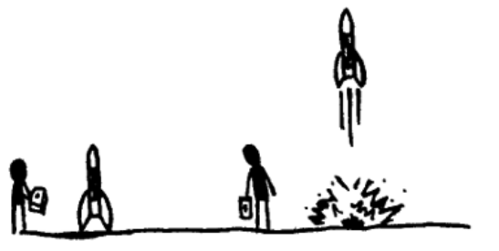
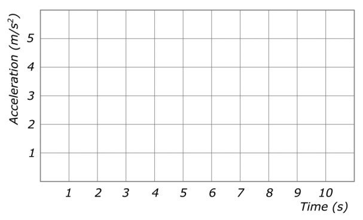
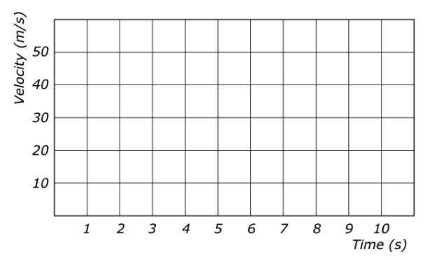

# Projectile Motion 

## AP Physics 

### 2023-24

---

# Free Fall - **Rocket Science**

A rocket fires its engines to launch straight up from rest with an upward acceleration of $5 \textrm{ m/s}^2$ for $10\textrm{ seconds}$. After this time, the engine shuts off, and the rocket freely falls straight down back to Earth’s surface.

---

# Free Fall - **Rocket Science**

A rocket fires its engines to launch straight up from rest with an upward acceleration of $5 \textrm{ m/s}^2$ for $10\textrm{ seconds}$. After this time, the engine shuts off, and the rocket freely falls straight down back to Earth’s surface.

1. Draw the FBD for the rocket:
    1. when the engine is firing
    2. when the engine is off

---

# Free Fall - **Rocket Science**

A rocket fires its engines to launch straight up from rest with an upward acceleration of $5 \textrm{ m/s}^2$ for $10\textrm{ seconds}$. After this time, the engine shuts off, and the rocket freely falls straight down back to Earth’s surface.

2. Determine the upward thurst force while the engine is firing
3. Determine the acceleration when the engine is off (use N2L)

---

# Free Fall - **Rocket Science**

A rocket fires its engines to launch straight up from rest with an upward acceleration of $5 \textrm{ m/s}^2$ for $10\textrm{ seconds}$. After this time, the engine shuts off, and the rocket freely falls straight down back to Earth’s surface.

Sketch a graph of the ***acceleration*** as a function of time from $t = 0\textrm{ seconds}$ to $t = 10\textrm{ seconds}$.

---

# Free Fall - **Rocket Science**

A rocket fires its engines to launch straight up from rest with an upward acceleration of $5 \textrm{ m/s}^2$ for $10\textrm{ seconds}$. After this time, the engine shuts off, and the rocket freely falls straight down back to Earth’s surface.

Sketch a graph of the ***velocity*** as a function of time from $t = 0\textrm{ seconds}$ to $t = 10\textrm{ seconds}$.

---

# Free Fall - **Rocket Science**

A rocket fires its engines to launch straight up from rest with an upward acceleration of $5 \textrm{ m/s}^2$ for $10\textrm{ seconds}$. After this time, the engine shuts off, and the rocket freely falls straight down back to Earth’s surface.

Blake takes this rocket to another planet. This planent has $3m_E$ and $2r_E$. What is the acceleration of the rocket when it is off on this new planet?

---

# Free Fall 

## An object in **free fall** experiences *only* the force of gravity.

* This means that is accelerates at $g$ which is referred to as "_acceleration due to gravity_" or "_gravitational field strength_
* Units N/kg and m/s/s are the ***same***

---

# Free Fall Kinematics 

1. A ball is thrown downward with an initial speed of 20 m/s on Earth.
    1. Calculate the displacement of the ball during the first 4 seconds.
    2. Calculate the time required to reach 50 m/s.
    3. Calculate the time required to reach 50 m/s.
    4. Calculate the speed after falling 100 meters.

---

# Free Fall Kinematics 

2. A rock is thrown upward with an initial speed of 15 m/s on Earth.
    1. Calculate the rock's height after 1 second 
    2. Calculate the time required for the rock to reach an upward speed of 3 m/s.
    3. Calculate the time required for the rock to reach a downward speed of 5 m/s

---

# Free Fall Kinematics 

3. NASA operates a drop tower in which they test the response of materials to situations in which the only force which acts upon them is gravity. Objects are dropped from rest and free fall for 5.27 seconds through the drop tower.
    1. Determine the distancw which the objects fall through the tower. 

---

# Free Fall Kinematics 

4. During a parachuting mishap (it could be worse), a parachutist who is falling at 12.2 m/s drops his new camera from an altitude of 78.9 m. What speed will the camera have when it strikes the ground?
5. A ball is thrown vertically upwards with a speed of 44.5 m/s. 
    1. How high does the it rise above the point of release?
    2. How much time does it take the ball to reach the peak of its trajectory?

---

# Free Fall Derivation <!--fit--->

## Derive an expression for the amount of time $t$ it takes an object to fall a vertical distance $h$ when dropped (released from rest). 

---
<!--- _class: inverse --->

# Rock on Asteroid 

An astronaut stands on the surface of a spherical asteroid that has a weak gravitational field but no atmosphere. The astronaut throws a small rock straight upward, as shown at right. The rock travels upward until it reaches a distance of $2R$ from the center of the asteroid, where $R$ is the asteroid’s radius, and then falls back down to the asteroid’s surface.

---

<!--- _class: inverse --->

The dots below represent the rock immediately after being thrown and when it is a distance $2R$ from the asteroid’s center. On each dot, draw and label the forces (not components) exerted on the rock at the indicated time. Each force must be represented by a distinct arrow starting on, and pointing away from, the appropriate dot.

---
<!--- _class: inverse --->

The graph at left below shows the rock’s velocity as a function of time after being thrown upward with an initial velocity $v_{01}$. The dashed line shows what the velocity would be if the rock experienced a constant acceleration, and the solid curve shows the rock’s actual velocity.

After the rock lands back on the surface, the astronaut then throws the rock straight upward a second time but with a greater force so that the rock’s initial speed $v_{02}$ is greater than initial speed $v_{01}$ for the first throw. The graph at right below shows the rock’s velocity as a function of time after being thrown upward the second time.

---

<!--- _class: inverse --->

In a clear, coherent, paragraph-length response that may also contain equations and/or drawings, make claims for the following aspects of the rock’s motion.

- For the first throw, state a claim for what is happening at time $t_1$.
- State a claim about the strength of the gravitational force exerted on the rock as the rock gets farther from the asteroid.
- For the first throw, state a claim about the relationship about the strength of the gravitational force exerted on the rock as the rock gets farther from the asteroid and the behavior indicated between time 0 and $t_1$ in the velocity-time graph.
- For the second throw, state a claim about why there is a horizontal asymptote for the velocity.

---

# Horizontal **Projectiles** <!--fit--->

---

Two toy trucks roll off the ends of identical tables. The speeds and masses of the trucks are given.

**Will Truck A be in the air for (i) _a longer time_, (ii) a _shorter time_, or (iii) the _same time_ as Truck B before it reaches the floor?**

Explain your reasoning.

---

Two toy trucks roll off the ends of identical tables. The speeds and masses of the trucks are given.

**Will Truck A be in the air for (i) _a longer time_, (ii) a _shorter time_, or (iii) the _same time_ as Truck B before it reaches the floor?**

Explain your reasoning.

---

Rank the situations from the ***greatest to least time*** that it will take for the sphere to hit the ground. Make your ranking on a single line, using > and = signs. Ties are possible.

Rank the situations from the ***greatest to the least horizontal distance*** that the sphere will travel. Make your ranking on a single line, using only the > and = signs. Ties are possible.

---

# Horizontal Projectiles 

* A ***projectile*** is an object that *only* experiences a gravitational force
* For _**horizontal projectiles**_ the $v_{0y} = 0$
* We can separate motion in the $x$ and $y$ planes and solve separately

---

# Horizontal Projectils 

## X-Plane Motion

- $v_x$ is ***constant***

$$\Delta x = v_x t$$

## Y-Plane Motion 

- constant acceleration $a_y = g$

$$\Delta y = \frac{1}{2}gt^2$$

$$v_y = gt$$

$$v_y^2 = 2g\Delta y$$

---

# Double Cross Diagram <!--fit--->