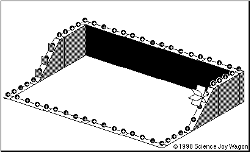
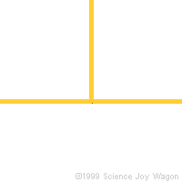
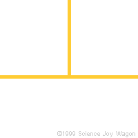
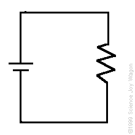
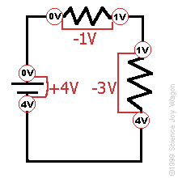
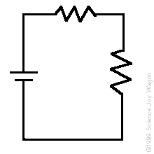
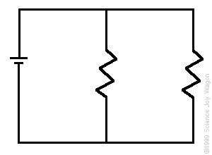
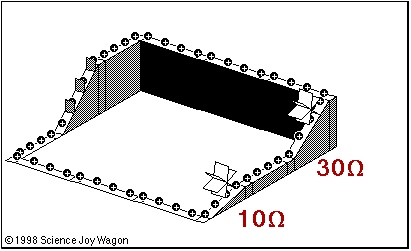
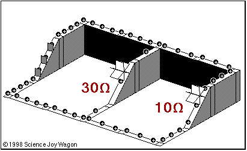

# Circuits ⚡ 🔌 <!---fit--->

# A Model for Moving Charge 🔋 <!---fit--->

#### 👨‍🏫 Mr. Porter 
#### 📆 2023 - Physics

---

# Current 

* The flow of charge
* By convention, flow is in the direction that positive charge carriers move 
    * But we now know that it is actually the electrons moving...

---

<iframe src="https://phet.colorado.edu/sims/html/circuit-construction-kit-dc-virtual-lab/latest/circuit-construction-kit-dc-virtual-lab_en.html"
        width="1120"
        height="600"
        allowfullscreen>
</iframe>

---

# Current

$$I = \frac{\Delta q}{t}$$

- I :arrow_right: Current (Amperes, A)
- q ➡️: Charge (Coulombs, C)
- t ➡️: time (seconds, s)

---

# Quick Practice 

1. 30 C flow through a 24 ohm resistor in 6 seconds what is the current? 
2. $2.5 \times 10^{15}$ elementary charges flow per second. What is the current?
3. Current through a light bulb is 2 amperes. How much charge flows through the light bulb in 1 minute?

---

# My Milkshake Brings All the Physics to the yard 🥛🥤🍨

## Consider:

In a speed milkshake drinking contest

- What advantages does your straw provide?
- What disadvantages does your straw provide?

---

# Straw as a Resistor

- How does length affect your sip rate?
- How does size (cross-sectional area) affect your sip rate?
- How does your milkshake's thickness (viscosity) affect your sip rate?

---

# Conductivity

* A material’s ability to conduct electrical charge
* Based on the materials:
    * Density of available free charges to move
* Mobility of those free charges

---

# Resistivity

* A material's ability to resist movement of electrical charge. 
    * Symbol: $\rho$
    * Measured in: $\Omega$ m
* based on the same properties as conductivity, but inverse 

---

# Electrical Resistance 

* The opposition of conductance of electrical current 
* Based on:
    * Materials Resistivity
    * Shape of material
    * Length of Material 
    * Temperature of Material 

---

# Electrical Resistance

$$ R = \frac{\rho L}{A}$$

- $R$ ➡️ Resistance (Ohms, $\Omega$)
- $L$ ➡️ Length (meters, m)
- $A$ ➡️ Cross sectional area (meters$^2$, m$^2$)

---

# Quick Practice 

## A $3.5$ m length of wire with a  cross-sectional area of $3.14 \times 10^{-6}$ m at $20$ degrees C has a resistance of $0.0625$ $\Omega$. Determine the resistivity of the wire and what the material is made out. 

---

# Quick Practice 

The Electrical resistance of a metallic conductor is inversely proportional to its:

1. Temperature
2. Length
3. cross-sectional area
4. resistivity

---

# Quick Practice 

At 20 degrees C, four conducting wires made of different materials have the same length and the same diameter. Which wire has the least electrical resistance?
1. aluminum
2. gold
3. nichrome
4. tungsten

---

# Quick Practice 

## A length of copper wire and a 1 meter long silver wire have the same cross-sectional area and a resistance at 20 degrees C. Calculate the length of the copper wire. 

---

# Quick Practice 

## A $10$-meter length of copper wire is at $20$ degrees C. The radius of the wire is $1 \times 10^{-3}$ m. Find the resistance of the wire.

---

# Ohm's Law 

## Who is Georg Ohm?

- German Physicist who stared as a high school science teacher
- Researched the electrochemical cell and discovered the relationship between *voltage*, *current*, and *resistance*. 

---

# Ohm's Law Lab 

### 🎯: Find the relationship between *voltage*, *current*, and *resistance*

1. What is a circuit diagram?
2. How do we measure *voltage* and *current*

---

# Ohm's Law 

$$\boxed{R = \frac{V}{I}}$$

- $R$ ➡️ Electrical Resistance (Ohms, $\Omega$)
- $V$ ➡️ Voltage (Potential Difference) (Volts, V)
- $I$ ➡️ Current (Amperes, A)

---

# Ohm's Law 

$$\boxed{R = \frac{V}{I}}$$

* Resistance slows current flow 
* Voltage causes current flow 
* So they should have a mathematical relationship

---

# Ohm's Law

---

## Practice 

1. The current in a wire is 24 amperes when connected to a 1.5 volt battery. Find the resistance of the wire.
2. A 24 ohm resistor is connected across a 6 volt battery. What is the current in the circuit?

--- 

# Electrical Work & Power

$$ V = \frac{W}{q}$$

$$ W = Vq$$ 

$$ P = VI = I^2 R = \frac{V^2}{R}$$

$$ W = Pt = VIt = I^2Rt = \frac{V^2 t}{R} $$

---

# The Simple Circuit 

1. A source of electrical potential difference or voltage. (typically a battery or electrical outlet)
2. A conductive path which would allow for the movement of charges. (typically made of wire)
3. An electrical resistance (resistor) which is loosely defined as any object that uses electricity to do work. (a light bulb, electric motor, heating element, speaker, etc.)

---

# Circuit Diagrams 

<iframe src="https://phet.colorado.edu/sims/html/circuit-construction-kit-dc-virtual-lab/latest/circuit-construction-kit-dc-virtual-lab_en.html"
        width="1120"
        height="550"
        allowfullscreen>
</iframe>

---

# Kirchhoff's Laws:

1. The algebraic sum of the currents flowing through a junction is zero. Currents approaching the junction are + while currents going away from the junction are -.
    - i.e. Current in = current out 
2. The algebraic sum of the potential differences in a circuit loop must be zero.  Potential rises are + while potential drops are -.
    - i.e. around any loop in a circuit, the voltage rises must equal the voltage drops
    - Whatever energy a charge starts with at the beginning of the circuit is what it loses by the end. 

---

# Kirchhoff's 1st Law

  

---

# Kirchhoff's 2nd Law

  

---

# Kirchhoff's 2nd Law

---

# Series Circuit 

* A ***series*** circuit has more than one resistor (anything that uses electricity to do work) and gets its name from only having one path for the charges to move along. 
* Charges must move in "series" first going to one resistor then the next. 
    - If one of the items in the circuit is broken then no charge will move through the circuit because there is only one path. There is no alternative route. 
* Old style electric holiday lights were often wired in series. If one bulb burned out, the whole string of lights went off.

---

# Series Circuit 

Animation models electrical energy as Gravitational Potential Energy, the greater change in height, the more energy used, or work done. 

---

# Parallel Circuit 

* A ***parallel*** circuit has more than one resistor (anything that uses electricity to do work) and gets its name from having multiple (*parallel*) paths to move along . 
* Charges can move through any of several paths. 
    - If one of the items in the circuit is broken then no charge will move through that path, but other paths will continue to have charges flow through them. 
* Parallel circuits are found in most household electrical wiring. This is done so that lights don't stop working just because you turned your TV off.

---

# Parallel Circuit 

---

# Ohm's Law in circuits 

You can use the total circuit values:

$$ V_{total} = I_{total}R_{total}$$

OR You can use the partial values:

$$ V_{part} = I_{part}R_{part}$$

---
# Series Circuit Rules 

* Sum of potential drops equals the potential rise of the source:
    - $V = V_1 + V_2 + V_3 + \ldots$
* The current is the same **everywhere** in the circuit:
    - $I = I_1 = I_2 = I_3 = \ldots$
* The **equivalent resistance** or effective resistance of the circuit is equal to the sum of resistors
    - $R_{eq} = R_1 + R_2 + R_3 + \ldots$

---

# Parallel Circuit Rules 

* The potential drops of each branch equals the potential rise of the source.
    - $V_T = V_1 = V_2 = V_3 = \ldots$
* The total current is equal to the sum of the currents in the branches.
    - $I_T = I_1 + I_2 + I_3 + \ldots$
* The inverse of the total resistance of the circuit (also called **equivalent resistance**) is equal to the sum of the inverses of the individual resistances. $\frac{1}{R_{eq}}= \frac{1}{R_{1}} + \frac{1}{R_{2}} + \frac{1}{R_{3}} + \ldots$

---

# Calculator Hint for Parallel Equivalent Resistance

1. Type in your 1/Rs: $1/10 + 1/25 + 1/75$
2. Type 1/ans and hit enter 

---

# VIRP Table - Series Circuit

The following table shows the values of three resistors in series with a 9V battery. Draw the circuit and calculate the missing values. 

| | V | I | R | P | 
|---|---|---|---|---|
| $R_1$ | &ensp; &ensp; &ensp;  | &ensp; &ensp; &ensp;  | 50 $\Omega$ | &ensp; &ensp; &ensp;  |
| $R_2$ |  |  | 75 $\Omega$ |  |
| $R_3$ |  |  | 100 $\Omega$ |  |
| Total|  |  |  |  | 

---

# VIRP Table - Parallel Circuit

The following table shows the values of three resistors in series with a 9V battery. Draw the circuit and calculate the missing values. 

| | V | I | R | P | 
|---|---|---|---|---|
| $R_1$ | &ensp;&ensp; &ensp;   | &ensp; &ensp; &ensp;  | 50 $\Omega$ | &ensp; &ensp; &ensp;  |
| $R_2$ |  |  | 75 $\Omega$ |  |
| $R_3$ |  |  | 100 $\Omega$ |  |
| Total |  |  |  |  | 
