

# Electric Potential ⚡ <!-- fit -->

# & Potential Difference 🔋 <!-- fit -->

#### 👨‍🏫 Mr. Porter
#### 📆 2025 - Physics

---

# Where We Left Off... 🔙

### From the *electrostatics* unit:

* Charges create **electric fields** in the space around them
* Fields exert *action-at-a-distance* forces on other charges
* Field direction = direction a **positive test charge** would be pushed

### ❓ Big question for this unit:
### How does a field make charge *move* through a circuit?

---

# The Gravitational Analogy ⬇️

### Before we talk about electric fields doing work...

### Let's think about *gravity* doing work.

* Earth creates a **gravitational field** around it
* The field exerts forces on masses placed in it
* Gravity is a *conservative force* (remember energy unit?)

---

# Gravity & Work ⚙️

### Moving a mass **up** (against the field):
* Requires *work* by an external force
* Mass *gains* potential energy ⬆️

### Moving a mass **down** (with the field):
* Happens *naturally* — no external work needed
* Mass *loses* potential energy ⬇️

---

# The Key Idea 🔑

### Objects naturally move from **high PE** → **low PE**

### Work is required to move objects from **low PE** → **high PE**

### This is true for:
* Masses in a *gravitational* field ⬇️
* Charges in an *electric* field ⚡

---

# Electric Fields & Work 💼

Consider a positive test charge near a positive source charge:
- Moving it **toward** the source (against the field):
    * Requires **work** ⚙️
    * Charge *gains* electric PE ⬆️
- Moving it **away** (with the field):
    * Happens *naturally*
    * Charge *loses* electric PE ⬇️

---

# High Energy vs. Low Energy ⚡

### For a **positive** test charge:

### Near a **(+) source charge**:
* *Close* = HIGH electric PE
* *Far* = LOW electric PE

### Near a **(-) source charge**:
* *Close* = LOW electric PE
* *Far* = HIGH electric PE

### Think: *which direction would the charge naturally go?*

---

# A Problem With Potential Energy ⚠️ <!--fit--->

 Consider two masses at two heights:

* A 1 kg mass held 2 m high
* A 2 kg mass held 1 m high

Both have the *same* potential energy!
- $PE = mgh = (1)(9.8)(2) = (2)(9.8)(1) = 19.6 \text{ J}$

So "high up" doesn't automatically mean "high PE"
-  PE depends on **mass** *AND* **location**

---

# A Better Way: Potential ✨

What if we defined a quantity that's **only about location**?

**Gravitational potential** = $\dfrac{PE}{\text{mass}}$
* Units: J/kg
* Mass-independent
* Purely location-dependent
* Tells you *how much PE per kg* any mass would have there

---

# Electric Potential ⚡

### Same idea, but for charges:

### **Electric Potential** = $\dfrac{\text{Electric PE}}{\text{charge}}$

* Charge-independent 🎯
* Purely location-dependent
* Tells you *how much PE per coulomb* any charge would have there

### 📏 **Units: Joules / Coulomb = VOLT (V)**
### *Named after Alessandro Volta*

---

# Electric Potential - Example 🧮

### Suppose a location has an electric potential of **12 V**

### That means: **every 1 coulomb** of charge placed there has **12 J** of PE

| Charge at location | Electric PE  |
|:---:|:---:|
| 1 C  | 12 J |
| 2 C  | 24 J |
| 0.5 C | 6 J |
| 3 C | 36 J |

### The *potential* (V) is the same. The *PE* depends on the charge.

---

# Check Your Understanding 🧠

### Electric potential is defined as the amount of ___.

### a) electric potential energy
### b) force acting upon a charge
### c) *potential energy per charge*
### d) force per charge

---

# From Potential → Potential *Difference* <!-- fit -->

### In circuits, we don't care about potential at one point

### We care about the *difference* between two points 🔄

### 💡 The charge moves *between* locations. What matters is how much energy it gains or loses along the way.

---

# Electric Potential Difference 🎢

### When work is done to move charge $q$ from one point to another:

$$\boxed{\Delta V = \frac{W}{q}}$$

- $\Delta V$ ➡️ electric potential difference (Volts, V)
- $W$ ➡️ work done on the charge (Joules, J)
- $q$ ➡️ charge moved (Coulombs, C)

### Also called **voltage** 🔌

---

# What Does 1 Volt Mean? 📏

### $1 \text{ V} = 1 \text{ J/C}$

### If $\Delta V$ between two points is **1 volt**, then moving **1 C** between them changes the charge's PE by **1 J**.

| $\Delta V$ | Energy change per 1 C moved |
|:---:|:---:|
| 1 V | 1 J |
| 9 V | 9 J |
| 12 V | 12 J |
| 120 V | 120 J |

---

# Quick Practice 📝

1. A battery does 48 J of work moving 4 C of charge from one terminal to the other. What is the potential difference across the battery?

2. How much work is done by a 9 V battery moving 2 C of charge from its (-) to (+) terminal?

3. A potential difference of 120 V exists between two points. How much charge must move between the points for 600 J of work to be done?

---

# Potential Difference in Circuits 🔋 <!-- fit -->

### A **battery** creates a potential difference between its two terminals

* *Chemical energy* → electrical PE
* Does work on charges to *pump* them from (-) terminal to (+) terminal

### (+) terminal = **high potential**
### (-) terminal = **low potential**

---

# The Water Park Analogy 🎢💧

### A battery is like a **pump** at a water park:

| Water Park | Electric Circuit |
|:---:|:---:|
| Pump lifts water up | Battery raises charge to high V |
| Water at top = high PE | Charge at (+) = high electric PE |
| Water flows *down* naturally | Charge flows *through wires* naturally |
| Water does work on paddles | Charge does work on bulbs/motors |
| Water returns to pump | Charge returns to battery |

---

# Internal vs. External Circuit 🔄

### **Internal Circuit** (inside the battery):
* Charge moves (-) → (+)
* Work done *on* the charge
* Energy gained ⬆️

### **External Circuit** (the wires and devices):
* Charge moves (+) → (-)
* Work done *by* the charge
* Energy lost to light, heat, motion ⬇️

---

# Charge is a *Cycle* 🔄

### A circuit is an **energy conversion system**:

### 🔋 Battery: chemical → electrical PE
### ⬇️
### Wires carry charge to resistor
### ⬇️
### 💡 Resistor: electrical PE → light/heat/motion
### ⬇️
### Wires return charge to battery
### ⬇️
### *(repeat)*

### ⚠️ Charge is **NOT** used up. Only *energy* is transformed.

---

# Voltage Drops 💧

### As charge moves through a circuit element (like a bulb):

* It *loses* electric PE
* This is called a **voltage drop**

### The charge enters at *high* potential
### The charge leaves at *low* potential
### The difference = how much energy was delivered per coulomb

---

# Conservation of Energy 🔄 <!-- fit -->

### Energy gained in the battery = Energy lost in the circuit

### **Voltage rise** (from battery) = **Sum of voltage drops** (across elements)

### ⚡ *This is a preview of Kirchhoff's 2nd Law* ⚡

### Whatever energy each coulomb of charge gets from the battery, it must give up by the time it returns.

---

# Electric Potential Diagrams 📊

### A tool to show how potential changes around a circuit:

* **x-axis**: position around the circuit
* **y-axis**: electric potential (V)
* (-) terminal set to 0 V
* (+) terminal set to battery voltage

### Each component's *voltage drop* appears as a downward step 📉

---

# Reading a Potential Diagram 📈

### Circuit A: 1.5 V battery, one bulb
* Rise at battery: +1.5 V
* Drop at bulb: -1.5 V
* Returns to 0 V ✅

### Circuit B: 6 V battery, two bulbs
* Rise at battery: +6 V
* Drop at bulb 1 + bulb 2 = -6 V total
* Returns to 0 V ✅

### The drops *must* sum to the rise!

---

# Check Your Understanding 🧠

### If a circuit were like a water park, the **battery voltage** would be comparable to:

### a) the rate water flows
### b) the speed water flows
### c) the distance water flows
### d) *the water pressure between top and bottom*
### e) the hindrance of obstacles

---

# Check Your Understanding 🧠

### True or False?

1. The battery supplies the *charge* (electrons) that moves through the wires.
2. Charge is used up as it passes through the light bulb.
3. The battery supplies *energy* that raises charge from low to high voltage.
4. Charge moves around a circuit at nearly the speed of light.

---

# Quick Practice 📝

A 12 V car battery is connected to a light bulb.

1. How much energy does each coulomb of charge gain in the battery?
2. How much energy does each coulomb lose in the bulb?
3. If 5 C of charge flow through the circuit, how much energy is transferred to the bulb?
4. Where in the circuit is the electric potential 0 V?

---

# Quick Practice 📝

### Complete each statement:

1. A 9 V battery increases the PE of 1 C by ___ J.
2. A 9 V battery increases the PE of 2 C by ___ J.
3. A 9 V battery increases the PE of 0.5 C by ___ J.
4. A ___ V battery increases the PE of 3 C by 18 J.
5. A 1.5 V battery increases the PE of ___ C by 0.75 J.

---

# Key Takeaways 🎯

### 1️⃣ **Electric potential (V)** = PE per coulomb at a location
### 2️⃣ **Potential difference (ΔV)** = energy transferred per coulomb *between* two locations
### 3️⃣ Batteries *pump* charge from low V → high V
### 4️⃣ Circuit elements convert electrical PE → other forms
### 5️⃣ Voltage *rises* = voltage *drops* (energy is conserved)

---

# Up Next: Current & Circuits ➡️ <!-- fit -->

### Now that we know what *causes* charge to flow...

### ...let's talk about *how fast* it flows.

### ⚡ **Current** ⚡

---

# Building a 💡 Circuit

### 1. **Need a Power Source** (source of potential difference)

### 2. **Current needs a closed loop to flow**

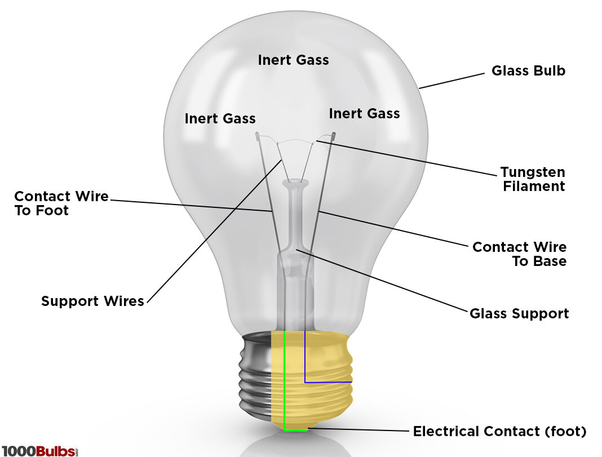

---

# Current 

* The flow of charge
* By convention, flow is in the direction that positive charge carriers move 
    * But we now know that it is actually the electrons moving...

---

<iframe src="https://phet.colorado.edu/sims/html/circuit-construction-kit-dc-virtual-lab/latest/circuit-construction-kit-dc-virtual-lab_en.html"
        width="1120"
        height="600"
        allowfullscreen>
</iframe>

---

# Current

$$I = \frac{\Delta q}{t}$$

- I :arrow_right: Current (Amperes, A)
- q ➡️: Charge (Coulombs, C)
- t ➡️: time (seconds, s)

---

# Quick Practice 

1. 30 C flow through a 24 ohm resistor in 6 seconds what is the current? 
2. $2.5 \times 10^{15}$ elementary charges flow per second. What is the current?
3. Current through a light bulb is 2 amperes. How much charge flows through the light bulb in 1 minute?

<!-- 
---
# My Milkshake Brings All the Physics to the yard 🥛🥤🍨

## Consider:

In a speed milkshake drinking contest

- What advantages does your straw provide?
- What disadvantages does your straw provide?

---

# Straw as a Resistor

- How does length affect your sip rate?
- How does size (cross-sectional area) affect your sip rate?
- How does your milkshake's thickness (viscosity) affect your sip rate? -->

---

# Electrical Resistance 

* The opposition of conductance of electrical current 
* Based on:
    * Materials Resistivity
    * Shape of material
    * Length of Material 
    * Temperature of Material 

---

# Conductivity

* A material’s ability to conduct electrical charge
* Based on the materials:
    * Density of available free charges to move
* Mobility of those free charges

---

# Resistivity

* A material's ability to resist movement of electrical charge. 
    * Symbol: $\rho$ (rho)
    * Measured in: $\Omega \text{m}$
* based on the same properties as conductivity, but inverse 

---

# ⚠️ NOTE ⚠️ <!--fit--->
 
# **Resistance** and **Resistivity** <!--fit--->

# are different <!--fit--->

---

# Electrical Resistance

$$ R = \frac{\rho L}{A}$$

- $R$ ➡️ Resistance (Ohms, $\Omega$)
- $L$ ➡️ Length (meters, m)
- $A$ ➡️ Cross sectional area (meters$^2$, m$^2$)

---

# Quick Practice 

## A $3.5$ m length of wire with a  cross-sectional area of $3.14 \times 10^{-6}$ m at $20$ degrees C has a resistance of $0.0625$ $\Omega$. Determine the resistivity of the wire and what the material is made out. 

---

# Quick Practice 

The Electrical resistance of a metallic conductor is inversely proportional to its:

1. Temperature
2. Length
3. cross-sectional area
4. resistivity

---

# Quick Practice 

At 20 degrees C, four conducting wires made of different materials have the same length and the same diameter. Which wire has the least electrical resistance?
1. aluminum
2. gold
3. nichrome
4. tungsten

---

# Quick Practice 

## A length of copper wire and a 1 meter long silver wire have the same cross-sectional area and a resistance at 20 degrees C. Calculate the length of the copper wire. 

---

# Quick Practice 

## A $10$-meter length of copper wire is at $20$ degrees C. The radius of the wire is $1 \times 10^{-3}$ m. Find the resistance of the wire.

---

# Measuring Voltage and Current 

- A ***Voltmeter*** is used to measure Potential Difference in a circuit
- A ***Ammeter*** is used to measure the current in a circuit

---

# Voltmeter

- Used to measure the potential difference between two points in a circuit (i.e. the change in height)
- Measured ***in parallel*** to the circuit
    - current does **not** go through the voltmeter

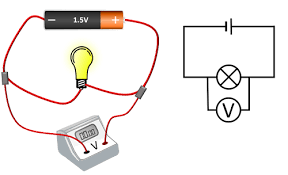

---

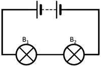

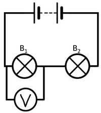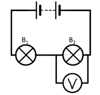

---

# Ammeter

- Used to measure the current flowing through a circuit at certain points
- Measured ***in series*** to the circuit
    - Current flows through the ammeter

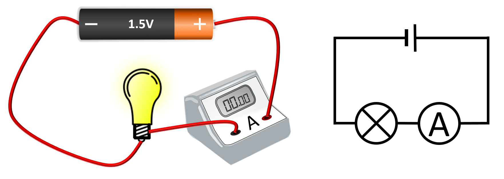

---

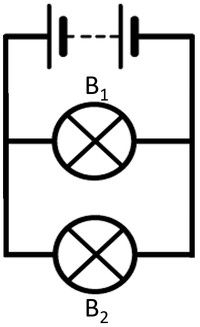

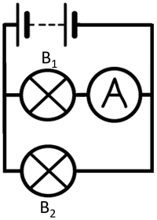 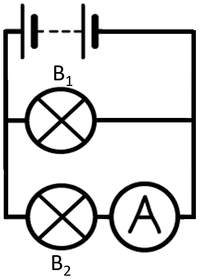

---

<iframe src="https://phet.colorado.edu/sims/html/circuit-construction-kit-dc-virtual-lab/latest/circuit-construction-kit-dc-virtual-lab_en.html"
        width="1120"
        height="600"
        allowfullscreen>
</iframe>

---

# Voltage-Current-Resistance

**Question:**
What is the mathematical relationship between voltage, current and resistance?

**Purpose:**
To determine the mathematical relationship (i.e., equation) relating the voltage, current and resistance in a simple circuit.

**Equipment:**

- Variable Power Source, 2 Resistors, Wires, Voltmeter, Ammeter 

---

Notebook Includes Title, a Purpose, a Data section, a Conclusion and a Discussion of Results. 
- Data section: table and graph - completed and taped in. 
  - A linear regression should be performed and the results (slope, y-intercept) reported. 
- Conclusion should report a general equation relating V, I and R. 
- The Discussion of Results should discuss the evidence which supports the equation reported in the Conclusion; specific attention should be devoted to the slope-resistance relationship. 

---

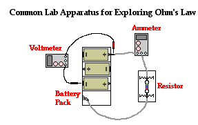

---

# Notes 

- Make measurement and turn off power source
    - ⚠️ DO NOT leave on to get too hot
- No water bottles on table with circuits
- Some wires may be dead, try switching them out before giving up
- Use voltage scale that goes up to 10 V (power source puts out less than that)
- Ammeter can be on scale 0-1 A

---

# Voltage-Current-Resistance

**Question:**
What is the mathematical relationship between voltage, current and resistance?

**Purpose:**
To determine the mathematical relationship (i.e., equation) relating the voltage, current and resistance in a simple circuit.

**Equipment:**

- Variable Power Source, 2 Resistors, Wires, Voltmeter, Ammeter 

---

Notebook Includes Title, a Purpose, a Data section, a Conclusion and a Discussion of Results. 
- Data section: table and graph - completed and taped in. 
  - A linear regression should be performed and the results (slope, y-intercept) reported. 
- Conclusion should report a general equation relating V, I and R. 
- The Discussion of Results should discuss the evidence which supports the equation reported in the Conclusion; specific attention should be devoted to the slope-resistance relationship. 

---

# Ohm's Law 

## Who is Georg Ohm?

- German Physicist who stared as a high school science teacher
- Researched the electrochemical cell and discovered the relationship between *voltage*, *current*, and *resistance*. 

---

# Ohm's Law Lab 

### 🎯: Find the relationship between *voltage*, *current*, and *resistance*

1. What is a circuit diagram?
2. How do we measure *voltage* and *current*

---

# Ohm's Law 

$$\boxed{R = \frac{V}{I}}$$

- $R$ ➡️ Electrical Resistance (Ohms, $\Omega$)
- $V$ ➡️ Voltage (Potential Difference) (Volts, V)
- $I$ ➡️ Current (Amperes, A)

---

# Ohm's Law 

$$\boxed{R = \frac{V}{I}}$$

* Resistance slows current flow 
* Voltage causes current flow 
* So they should have a mathematical relationship

---

# Ohm's Law

---

## Practice 

1. The current in a wire is 24 amperes when connected to a 1.5 volt battery. Find the resistance of the wire.
2. A 24 ohm resistor is connected across a 6 volt battery. What is the current in the circuit?

--- 

# Electrical Work & Power

$$ V = \frac{W}{q}$$

$$ W = Vq$$ 

$$ P = VI = I^2 R = \frac{V^2}{R}$$

$$ W = Pt = VIt = I^2Rt = \frac{V^2 t}{R} $$

---

# The Simple Circuit 

1. A source of electrical potential difference or voltage. (typically a battery or electrical outlet)
2. A conductive path which would allow for the movement of charges. (typically made of wire)
3. An electrical resistance (resistor) which is loosely defined as any object that uses electricity to do work. (a light bulb, electric motor, heating element, speaker, etc.)

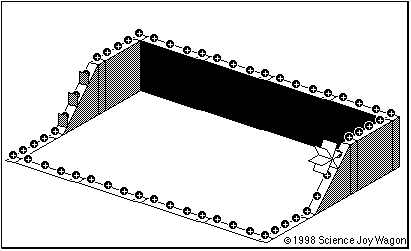

---

# Circuit Diagrams 

<iframe src="https://phet.colorado.edu/sims/html/circuit-construction-kit-dc-virtual-lab/latest/circuit-construction-kit-dc-virtual-lab_en.html"
        width="1120"
        height="550"
        allowfullscreen>
</iframe>

---

# Kirchhoff's Laws:

1. The algebraic sum of the currents flowing through a junction is zero. Currents approaching the junction are + while currents going away from the junction are -.
    - i.e. Current in = current out 
2. The algebraic sum of the potential differences in a circuit loop must be zero.  Potential rises are + while potential drops are -.
    - i.e. around any loop in a circuit, the voltage rises must equal the voltage drops
    - Whatever energy a charge starts with at the beginning of the circuit is what it loses by the end. 

---

# Kirchhoff's 1st Law

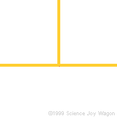 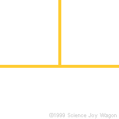 

---

# Kirchhoff's 2nd Law

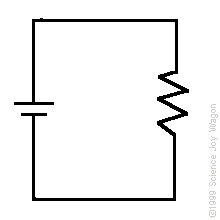 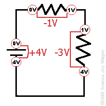 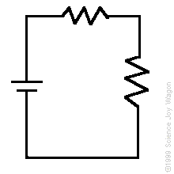

---

# Kirchhoff's 2nd Law

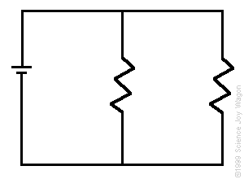

---

# Series Circuit 

* A ***series*** circuit has more than one resistor (anything that uses electricity to do work) and gets its name from only having one path for the charges to move along. 
* Charges must move in "series" first going to one resistor then the next. 
    - If one of the items in the circuit is broken then no charge will move through the circuit because there is only one path. There is no alternative route. 
* Old style electric holiday lights were often wired in series. If one bulb burned out, the whole string of lights went off.

---

# Series Circuit 

Animation models electrical energy as Gravitational Potential Energy, the greater change in height, the more energy used, or work done. 

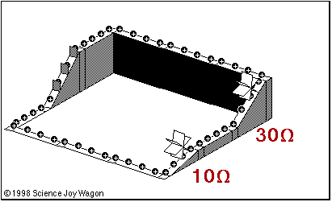

---

# Parallel Circuit 

* A ***parallel*** circuit has more than one resistor (anything that uses electricity to do work) and gets its name from having multiple (*parallel*) paths to move along . 
* Charges can move through any of several paths. 
    - If one of the items in the circuit is broken then no charge will move through that path, but other paths will continue to have charges flow through them. 
* Parallel circuits are found in most household electrical wiring. This is done so that lights don't stop working just because you turned your TV off.

---

# Parallel Circuit 

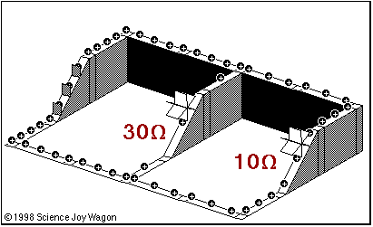

---

# Ohm's Law in circuits 

You can use the total circuit values:

$$ V_{total} = I_{total}R_{total}$$

OR You can use the partial values:

$$ V_{part} = I_{part}R_{part}$$

---
# Series Circuit Rules 

* Sum of potential drops equals the potential rise of the source:
    - $V = V_1 + V_2 + V_3 + \ldots$
* The current is the same **everywhere** in the circuit:
    - $I = I_1 = I_2 = I_3 = \ldots$
* The **equivalent resistance** or effective resistance of the circuit is equal to the sum of resistors
    - $R_{eq} = R_1 + R_2 + R_3 + \ldots$

---

# Parallel Circuit Rules 

* The potential drops of each branch equals the potential rise of the source.
    - $V_T = V_1 = V_2 = V_3 = \ldots$
* The total current is equal to the sum of the currents in the branches.
    - $I_T = I_1 + I_2 + I_3 + \ldots$
* The inverse of the total resistance of the circuit (also called **equivalent resistance**) is equal to the sum of the inverses of the individual resistances. $\frac{1}{R_{eq}}= \frac{1}{R_{1}} + \frac{1}{R_{2}} + \frac{1}{R_{3}} + \ldots$

---

# Calculator Hint for Parallel Equivalent Resistance

1. Type in your 1/Rs: $1/10 + 1/25 + 1/75$
2. Type 1/ans and hit enter 

---

# VIRP Table - Series Circuit

The following table shows the values of three resistors in series with a 9V battery. Draw the circuit and calculate the missing values. 

| | V | I | R | P | 
|---|---|---|---|---|
| $R_1$ | &ensp; &ensp; &ensp;  | &ensp; &ensp; &ensp;  | 50 $\Omega$ | &ensp; &ensp; &ensp;  |
| $R_2$ |  |  | 75 $\Omega$ |  |
| $R_3$ |  |  | 100 $\Omega$ |  |
| Total|  |  |  |  | 

---

# VIRP Table - Parallel Circuit

The following table shows the values of three resistors in series with a 9V battery. Draw the circuit and calculate the missing values. 

| | V | I | R | P | 
|---|---|---|---|---|
| $R_1$ | &ensp;&ensp; &ensp;   | &ensp; &ensp; &ensp;  | 50 $\Omega$ | &ensp; &ensp; &ensp;  |
| $R_2$ |  |  | 75 $\Omega$ |  |
| $R_3$ |  |  | 100 $\Omega$ |  |
| Total |  |  |  |  | 
