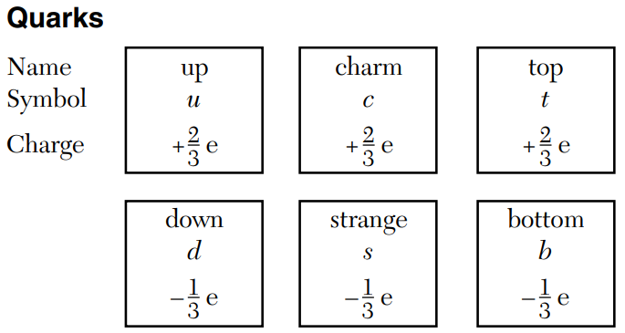

<!-- _class: invert--->

# Modern Physics <!--fit--->

## ...like after 1900 "_Modern_"

---

<!-- class: left--->

 ***Einstein*** Published 4 Papers in 1905 that laid the foundation for modern physics:
* 6/9/1905 Photoelectric Effect: *On the Heuristic Viewpoint Concerning the Production and Transformation of Light*
* 7/18/1905 *Brownian Motion: On the Motion of Small Particles Suspended in a Stationary Liquid, as Required by the Molecular Kinetic Theory of Heat*
* 9/26/1905 S*pecial Relativity: On the Electrodynamics of Moving Bodies*
* 11/21/1905 *E = mc$^2$: Does the Inertia of a Body Depend Upon Its Energy Content?*

---

<!-- class: left--->

# Wave - Particle Duality

- Light behaves both like a wave and a particle! 🤔

---

# Dual Nature of Light

### Wave

- Diffraction -- Young’s Double Slit Experiment
- Polarization
- Interference
- Refraction

### Particle

- Photoelectric Effect
- Blackbody Radiation
- Compton Effect

**Particles** of light are known as ***Photons***

---

# Photons 

- Smallest possible piece of E&M Light 
    * No rest mass
    * No charge 
    * Move with a velocity of $3 \times 10^8$ m/s

--- 

# Energy of a Photon

* Energy of a photon is quantized.
    * Can only come in certain amounts.
* Discovered by Max Karl Ernst Ludwig Planck to explain blackbody radiation.
* Discovered that $E_{photon} = hf = hc/\lambda$
* Planck’s constant, h, h = 6.63 x 10$^{-34}$ Js
* Energy of a photon can come in amounts proportional to Planck’s constant.

---

# Photon Energy 

---

# 🤔 Check Yourself

A photon with a wavelength of $6 \times 10^{-7}$ meters has how much energy?

---

The spectrum of visible light emitted during transitions in excited hydrogen atoms is composed of blue, green, red, and violet lines. What characteristic of light determines the amount of energy carried by the photon. 

1. amplitude 
2. frequency
3. phase
4. velocity 

---

<!-- _class: uncover invert-->

# Photoelectric Effect <!--fit--->
 

---

<iframe src="https://phet.colorado.edu/sims/cheerpj/photoelectric/latest/photoelectric.html?simulation=photoelectric"
        width="1100"
        height="600"
        allowfullscreen>
</iframe>

---

# Photoelectric Problem

* EM radiation striking a metal may emit electrons (photoelectrons).
* Not all EM radiation creates electrons.
* Higher intensity (brighter) light doesn’t affect whether photoelectrons are created.
* Higher frequencies of light affect creation of photoelectrons. 

---

### Photoelectric Effect with Einstein

* Electrons in the metal are held by an “energy well.”
* Electrons must absorb at least enough energy to get out of the well in order to become free of the metal.
* Electrons had to absorb a single photon with that minimum amount of energy, known as the work function. 
* Any excess energy absorbed becomes the free electron’s kinetic energy. 

---

# Work Function 

---

# So do particles have wave behavior?

---

# Compton Effect

* Arthur Compton shot x-rays so that they collided with electrons in graphite. 
    * Photoelectron is emitted
    * Original x-ray was reemitted with a lower wavelength
    * So the photon lost energy and momentum
* Conclusion: photons has momentum and obey the laws of conservation of momentum and energy. 

---

# Compton Effect 

---

# Compton Effect Equations 

- Combine $E = mc^2$, $E = hf$, and $c=f\lambda$ the momentum of a photon can be expressed as:

$$ p = \frac{E}{C}=\frac{hf}{c}=\frac{h}{\lambda}$$

---

# de Broglie Wavelength 

* EM waves behave as particles
* Moving particles can exhibit wave properties
* Confirmed by shooting electrons through a double slit and seeing a diffraction pattern. 
* Smaller particles have more wavelike behavior
* $\lambda = h/p = h/mv$

---

**Moving electrons are found to exhibit properties of**

1. Particles only
1. waves only
1. both particles and waves
1. neither particles or waves

---

**Which phenomenon best supports the theory that matter has a wave nature?**

1. electron momentum
1. electron diffraction
1. photon momentum
1. photon diffraction

---

**Wave particle duality is most apparent in analyzing the motion of a**

1. baseball
1. space shuttle
1. galaxy
1. electron

---

**Calculate the wavelength for a tennis ball (57 grams) moving at a speed of 30 m/s.**

Note: $\lambda = h/p = h/mv$

---

> # All science is either physics   or stamp collecting.    -**Ernest Rutherford**<!---fit--->

---

### Rutherford’s Gold Foil Experiment

* Shot alpha particles (helium nuclei) at a thin sheet of gold foil
    * Most particles went through undeflected
    * Some particles were deflected by large amounts
* Conclusions:
    * Atoms have a small, massive, positive nucleus
    * Electrons must orbit the nucleus
    * Most of the atom is empty space

---

# Rutherford

---

# Rutherfords *Foils*

- The lack of emission radiation as electrons move about the nucleus
- The unique spectrum of each element
- The stability of the atom

---

---

# Bohr 

* Electrons can only exist at discrete energy levels
* Each atom allows only a limited number of specific orbits (electrons) per energy level
* Electrons can change energy levels
    * Absorbs a photon of exactly the energy needed to reach a higher level.
    * Emit a photon of exactly the energy difference as electron falls to a lower level.
    * $E_{photon} = E_i - E_f$

---

 

---

# Energy Level Diagram 

- Allows us to visualize energy levels in an atom 
- Lowest energy level is the ground state

---

# Hydrogen Atom

- Negative energy levels indicate electron is bound to the atom.
- If the electron reaches 0 eV, it is no longer bound and can be emitted as a photoelectron.
    - Any excess energy becomes the electrons kinetic energy.

---

# Hydrogen Atom

An electron in a hydrogen atom drops from the n = 3 level to n = 2 state. Determine the energy of the emitted radiation.

---

# Hydrogen Atom

What is the frequency of a photon emitted when an electron in a hydrogen atom drops from the n = 2 to the n = 1 energy level?

---

# Mercury Atom

- Energy Levels differ by atoms
- Levels named by letters instead of numbers 

---

# Mercury Atom

An electron in a mercury atom drops from energy level f to energy level c by emitting a photon of what energy?

---

# Mercury Atom

A mercury atom in the ground state absorbs 20 electronvolts of energy and is ionized by losing an electron. How much kinetic energy does this electron have after the  ionization?

---

# Atomic Spectra 

- Atoms can only emit and absorb photons of certain frequencies
- Photon frequencies correspond to transitions in electron energy levels.
- Result: unique atomic spectra

---

# Incandescence 

Objects heated until they glow emit a continuous spectrum, described as blackbody radiation.

---

# Gas Discharge Lamp 💡

* Gas discharge lamps excited electrons by application of high electrical potential.
    * Electrons jump to higher energy.
    * As they relax to lower energy levels, photons of specific frequencies are emitted.
    * Spectrum is not continuous and is unique to the element.
* Analysis of spectra allows determination of gas composition.

---

---

# The Standard Model 

- An atom is the smallest part of an element that has the characteristics of that element.
- 1930s - scientists begin to discover even smaller particles
- This launches the Particle Physics movement.

---

# Antimatter

* Antimatter is made up of particles with the same mass as regular particles, but opposite charges and other characteristics
    * Antiproton - same mass a proton, negative charge
    * Antineutron - same mass as a neutron, opposite magnetic moment.
    * Positron - same mass as an electron, positive charge.

---

# Annihilation 

* Matter particle corresponding to antiparticle meet to annihilate each other. 
    * Complete conversion of both particles into energy
    * Conservation laws still apply
        * Mass-energy
        * Charge
        * Momentum

---

#### Structure of the Standard Model

* All 4 fundamental forces act on Hadrons
* Strong nuclear force doesn’t act on Leptons (electron is a lepton)
* Baryons charge is always a whole number (protons and neutrons)
* Mesons: Pion, neutral pion, Kaon, J/psi, Upsilon, Charmed meson, Bottom meson.

---

# Quarks 

- Corresponding anti-quark with opposite charge also exists. 
- Proton = uud
- Neutron = udd

---

---

# What is the charge of the down anti-quark?

---

### Compared to the mass and charge of a proton, an antiproton has

1. the same mass and the same charge
1. greater mass and the same charge
1. the same mass and the opposite charge
1. greater mass and the opposite charge

---

# Leptons

Corresponding anti-lepton with opposite charge also exists. 

---

### A particle unaffected by an electric field could have a quark composition of

1. css
2. bbb
3. udc
4. uud

---

# What is the charge of an antistrange quark in Coulombs?

---

<!-- class: invert--->

# Proton-Proton Collision

---

# The Equation:

# $E = mc^2$

---

# Mass Energy Equivalence 

- 1905: Einstein publishes “Does the Inertia of a Body Depend Upon its Energy Content?”
    - mass is measure of the energy in an object
    - Ultimately, the source of all energy in the universe is conversion of mass into energy. 

---

## Universal Conservation Laws

- Conservation of Mass-Energy
- Conservation of Charge
- Conservation of Momentum

---

## Conservation of Mass Energy

- Mass is conserved
- Energy is conserved
- Mass-Energy cannot be created or destroyed

---

# What is the energy equivalent of 1 kg of matter?

--- 

### Converting Small Masses to Energy

- Universal mass unit (u) is equal in mass to 1/12 of a single atom of Carbon-12
- $m_{proton}$, $m_{neutron}$, are approximately $1u$.
- $m_{electron}$ is close to $5 \times 10^{-4}$ $u$.
- $1 u$ = $1.66053885 \times 10^{-27}$ kg
- $1 u$ = $931$ MeV

---

# If a deuterium nucleus has a mass of $1.53 \times 10^{-3}$ $u$ less than its components, how much energy does its mass represent?

---

# The Nucleus

* Consists of positive protons and neutral neutrons.
* Why does electric repulsion cause it to fly apart?
* Strong nuclear force holds particles together.
    * Extremely strong
    * Very small effective range

--- 

# Binding Energy

* Energy required to break apart the nucleus and overcome the strong nuclear force is known as the binding energy.
* Mass of stable nucleus is actually less than the mass of component nuclear particles (nucleons)
    * Difference in mass is known as the mass defect
    * $E_{binding} = (\Delta m)c^2$

---

# Nuclear Fission

* Nucleus splits into two or more nuclei
    * For heavy (larger) nuclei, mass of original nucleus is greater than the mass of the products. 
* Nuclear power plants

---

# Nuclear Fusion 

* Two or more smaller nuclei form a larger nucleus. 
    * For small nuclei, product may have smaller mass precursors.
    * Releases energy as part of the reaction
* Fuels sun and stars
* Potential clean power source

--- 

### A tritium nucleus is formed by combining two neutrons and a proton. the mass of this nucleus is $9.106 \times 10^{-3}$ $u$ less than the combined mass of the particles which it is formed. Approximately how much energy is released when this nucleus is formed?

---

## After a uranium nucleus emits an alpha particle, the total mass of the new nucleus and the alpha particle is less than the mass of the original uranium nucleus. Explain what happens to the missing mass.
