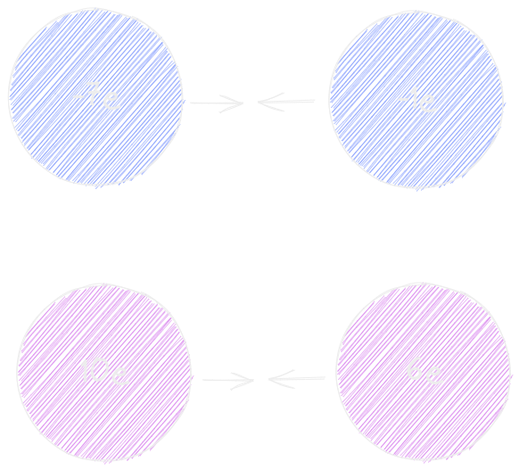
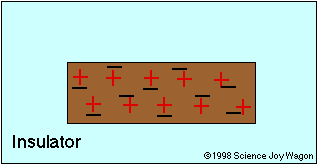
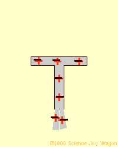

# Static Electricity ⚡ <!---fit--->

# A Model for Charged :sparkler: Particles <!---fit--->

 
 
 

#### 👨‍🏫 Mr. Porter 
#### 📆 2025 - Physics

---

:max_bytes(150000):strip_icc():format(webp)/static-electricity-on-comb-bending-water-554472527-57e9730d3df78c690f7bb09f.jpg)

 
 
 
 
 
 
 

# Why does the water bend? <!---fit--->

---

# Sticky Tape Lab 

* When Tape is pulled apart the individual pieces of tape become *charged*. 

---

# Sticky Tape Lab 

- When Tape is pulled apart the individual pieces of tape become *charged*. 

## 🎯 How do these charged pieces of tape interact with each other?

---

# Charge 

* All objects have charge 
* Charge is based on number of protons (➕) or electrons (➖)
* Charge is negative or positive

--- 

# Elementary Charge 

* A fundamental property of matter
* Charge is quantized ➡️ Comes in specific amounts 
* An elementary charge is the smallest sized charge (like a penny in USD)
* Charge can be measured in:
    * Elementary Charges ($e$) (small amounts)
    * Coulombs ($C$)

---

 
 

## ➕ Protons: 1e = $1.6 \times 10^{-19}$ Coulombs

 
 

## ➖ Electrons: -1e = $-1.6 \times 10^{-19}$ Coulombs

---

# ❓ Check Your Understanding

How many extra electrons does an object with a charge of $-9.6 \times 10^{-19}$ C have?

---

# Conservation of Charge 

The total change in a system is constant 

---

# Conservation of Charge 

❓ What will the charge of each sphere be after the spheres are touched together and removed?

---

# Conservation of Charge 

- Total Charge is conserved
- Total Charge is distrubuted evenly

---

# Laws of attraction

1. Opposite Charges Attract
2. Like Charges Repel 
3. Charge objects *always* **attract** neutral objects

---

<iframe src="https://phet.colorado.edu/sims/html/balloons-and-static-electricity/latest/balloons-and-static-electricity_en.html"
        width="1100"
        height="600"
        allowfullscreen>
</iframe>

---

---
<!---class:--->

# Getting Charged

---

<!---class: invert--->

## Electroscope

---
## Electroscope Contact Conduction

---

# Induction

---

# Coulomb's Law 

$$ F_e = k\frac{q_1 q_2}{r^2} $$

* $F_e$ :arrow_right: electrostatic force
* $k$ ➡️ electrostatic constant = $8.99 \times 10^{9}$ Nm$^2$/C$^2$
* $q$ ➡️ charge 
* $r$ ➡️ distance between the centers

---

# Example:

## What is the electrical force between two very small objects located 0.5 m apart when the charge on one object is 4.0 $\times$ 10$^{-8}$ C and the charge on the second object is 6.0 $\times$ 10$^{-5}$ C?

---

# Graph Example:

What shows the relationship between the electrostatics force and the distance?

---

# Example:

## Two charges attract each other with a force of F. If one charge was doubled and the other charge was tripled, how would that change the attractive force between those charges?

---

# Practice Time: 

1. *Physics Classroom* Packet **pages 13 & 14**
2. *APlusPhysics* **pages 112-115** 

---

# Mapping the Electric Field 

1. Using a ruler measure the distance between the charges.
2. Calculate the electrostatic force between the two charges.
3. Draw a *scaled* vector starting on the test charge that represents the force between the test charge and the central charge.

***Note: You can make a spreadsheet to help with the calculations***

---

# *Electric Field*

## A region in space where electric forces will act on charges. 

---

# Electric Field Lines 

Field Lines point in the direction that a positive point charge would experience a force. 

<iframe src="https://phet.colorado.edu/sims/html/charges-and-fields/latest/charges-and-fields_en.html"
        width="1100"
        height="400"
        allowfullscreen>
</iframe>

---

# Electric Field 

$$ E = \frac{F_e}{q} $$

- $E$ ➡️ Electric Field Strength (N/C)
- $F_e$ ➡️ Electrostatic Force (N)
- $q$ ➡️ Charge of object in field (C)

---

# Comparison to Gravity

## $E = \frac{F_e}{q}$ *vs.* $g = \frac{F_g}{m}$ <!---fit--->

---

# Example:

## What is the magnitude of the electric field intensity at a point in the field where an electron experiences 1 N of force?

---

# Potential & Gravity Comparison

- What is Potential?
    - What is gravity?
    - Where does it come from?
    - How do you know it is present?
    - What do you change an object's $PE_g$?
    - What is Earth's gravitational field strength?

---

# Bleacher Example 

---

## Electric Energy 

The work needed or energy required by moving a positive charge in an electric field

$$ W = Fd = (qE)d = \overbrace{qV}^{\textrm{EPE}} = \underbrace{mgh}_{\textrm{PEg}} = \frac{1}{2}mv^2$$ 

---

# Potential Difference (AKA *Voltage*)

This is the potential energy difference per unit charge between two points. 

$$V = \frac{W}{q}$$