# Waves <!---fit--->

## A Model For Periodic Motion

---

# Waves

* Sound 
* Visible 
* Ultraviolet 
* Radio 
* Gamma
* Infrared 
* X-Ray 
* Water Waves 
* Waves on a slinky 

* Waves on a string 
* Human Waves 
* Mechanical Waves 
* Electromagnetic Waves 
* Longitudinal Waves 
* Transverse 
* You!? 
* Waves are everywhere 

---

# A Wave...

> a *disturbance* or *variation* that **transfers energy** progressively from point to point in a medium and that may take the form of an elastic deformation or of a variation of pressure, electric or magnetic intensity, electric potential, or temperature.

---

# Initial Definitions 

* A *pulse* is a single vibratory disturbance which moves from point to point through a medium.
* A *wave* is several pulses generated at regular time intervals.

---

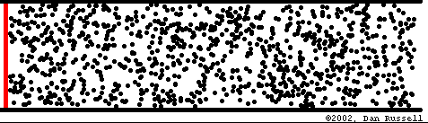

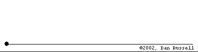

---

# A Wave 

---

# Another Wave 

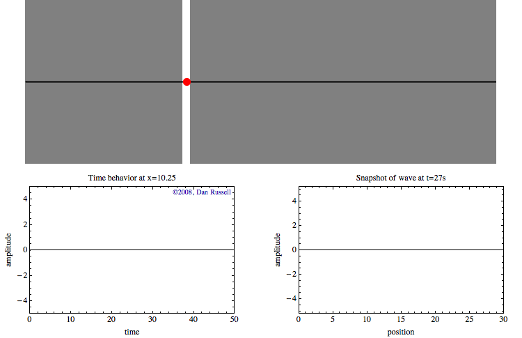

---

# 💡 BIG IDEA 💡 <!---fit--->

# Waves transfer ***energy*** without transfering ***mass*** <!---fit--->

---

# Wave Classifications 

## Mechanical Waves 

- *Mechanical Waves* need a material medium to travel through 
    - i.e. medium such as water, string, air 

## Electromagnetic Waves 

- *Electromagnetic Waves* (such a light and radio waves) are periodic distrubances in an electromagnetic field and do not need a medium to travel through 
    - How the sun light gets to us through space!

---

# Wave Classifications 

## Longitudinal Waves 

- Particles in a *longitudinal wave* vibrate parallel to the direction of the wave motion.
- Examples:
    - Sound 
    - Seismic P-Waves
    - Slinky

## Transverse Waves

- Particles in a *transverse wave* vibrate perpendicular to the direction of waves. 
- Examples:
     - E&M Waves
    - Seismic S-Waves
    - Water Waves
    - Human Waves

---

---

# Water Waves

---

# Talk 🗣️ and Notes 📝 <!---fit--->

---

# Wave Characteristics 

* The ***frequency*** ($f$) is the number of waves passing a point per unit time. 
    - Frequency is measured in Hertz (Hz) or 1/s (s$^{-1}$)
* The ***period*** of a wave ($T$) is the time for one complete cycle to pass a point
    - It is the reciprocal of frequency. $T = \frac{1}{f}$, where $T$ is the period in second and $f$ is the frequency in hertz.

---

# Check Your Understanding 

What is the period of a $60$ Hz electromagnetic wave traveling at $3 \times 10^8$ m/s?

---

# Wave Characteristics 

- The ***wavelength*** ($\lambda$, greek lambda, "lamb-duh") is the distance between corresponding points in phase on successive waves. 
    - Measured in meters. 

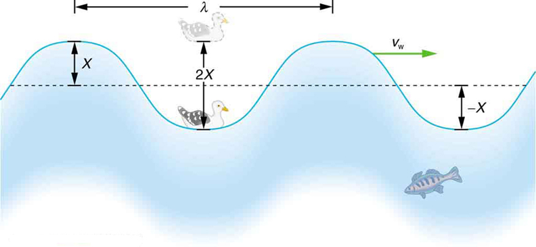

---

# Wave Characteristics 

The **amplitude** of a wave is related to the energy of a wave.

* In a transverse wave it is defined as the maximum distance above, or below, the wave axis (or equilibrium position)
* In a *longitudinal wave* it is determined by the *maximum displacement* of a particle.
* As the amplitude of a *light wave* increases the *brightness* of the light increases.
* As the amplitude of a *sound wave* increases the *loudness* increases

---

# Check your understanding

Draw the following 4 waves: A, B, C, and D

1. A has twice the amplitude of B and half the period of B. 
2. B has twice the amplitude of C and C has 5 times the frequency of B. 
3. D has the same period of A, but half the amplitude. 
4. A should be drawn with 2 full waves 

---

# Pivot - Wave Speed Experiment <!---fit--->

---

# Wave Characteristics 

* The _**velocity**_ of a wave is determined by the medium it is traveling in
    * Example: Sound waves travel faster in water and solids than it does in air 
* Wave Equation: $v = f\lambda$ or $\lambda = \frac{v}{f}$
* For Electromagnetic (E&M) Waves: they move at the speed of light, $c$, in a vacuum.
    * $c = 3 \times 10^8$ m/s

---

# Check your understanding

1. The sound produced by a trumpet has a frequency of 440 Hz. What is the distance between successive compressions in the sound wave as it travels through the air at STP?
2. A stationary research  ship uses sonar to send a 1180 Hz sound wave down through ocean water. The reflected sound wave from the flat ocean bottom 324 meters below the ship is detected 0.425 s after it was sent from the ship
    1. Calculate the speed of the sound wave in the ocean water
    2. Calculate the wavelength of the sound wave in the water.
    3. Determine the period of the sound wave in the water.

---

# Wave Front 

- A *wave front* is the locus of adjacent points of a propogated wave that are in phase. 

---

# Wave Phase

- We can think of a wave cycle as 360 degrees
- If we look at the sine graph of a wave 

---

# Wave Phase

---

# Wave Phase 

---

# Pivot - Pulse Reflections <!---fit--->

---

# Pivot - Pulse "Collisions" <!---fit--->

---

# Pulse Reflections 

- Pulse at a fixed boundaary 
    - The pulse is inverted (flipped), amplitude remains the same, but opposite sign.

---

# Pulse Reflections 

- Pulse at a free boundaary 
    - The pulse is reflected and remains the same

---

# Pulse Reflections 

- From a low density to a high density:
    - Original pulse is reflected and inverted
    - A new pulse moves slower through the higher density medium.

---

# Pulse Reflections 

- From a high density to a low density:
    - Original wave is reflected and is not inverted
    - New pulse moves with a faster velocity through the lower density medium

---

# Interference

* ***Interference*** is the effect produced by two or more waves which are passing simultaneously through a region.
* ***Superposition*** is the resultant disturbance at any point is the algebraic sum of displacements due to individual waves.

---

# Interference 

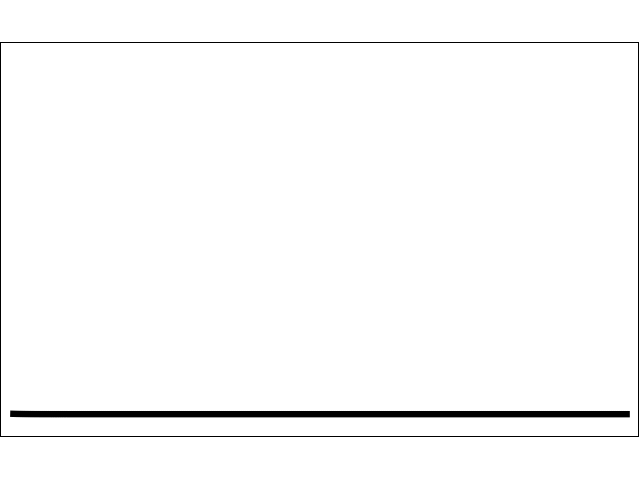

---

<iframe src="http://physics.bu.edu/~duffy/HTML5/interference_of_pulses.html" width = "1100px" height = "900px" ></iframe>

---

# Constructive Interferece

- Occurs at points where path distances to the two different sources differ by an even number of half wavelengths.
    - This means a phase difference of 0º or 360º for maximum constructive interference. 

---

# Destructive Interference 

- Occurs when crests meet troughs or compressions meet rarefactions. 
    - This is where path differences to the two sources differ by an odd number of half wavelengths.
    - This is at 180º out of phase.

--- 

# Sound Wave Interference - Monopole

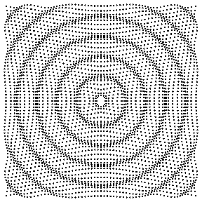

---

# Sound Wave Interference - Dipole 

---

# SWI - Lateral Quadrupole Source 

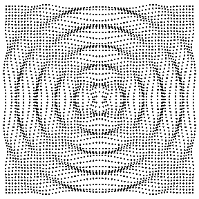

---

# Standing Waves 

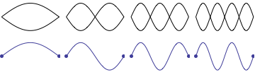

---

# Standing Waves 

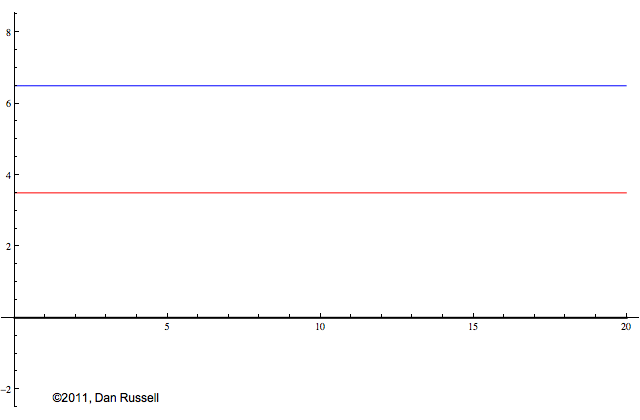

---

# Standing Waves - Soft Boundary 

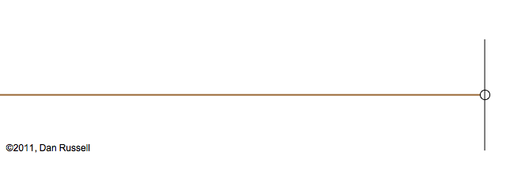

---

# Standing Waves - Hard Boundary

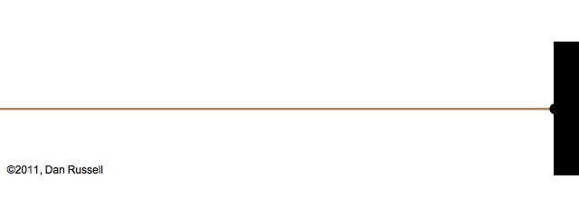

---

# Standing Waves - Sound 

---

# Standing Waves - Closed Tube 

#### 1st Harmonic

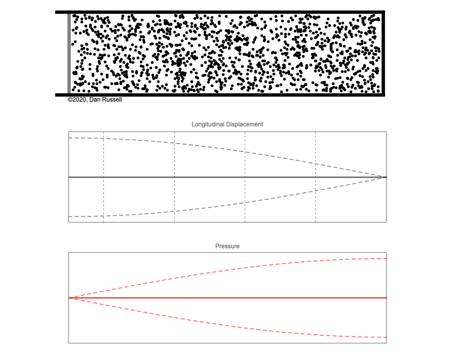

#### 3rd Harmonic

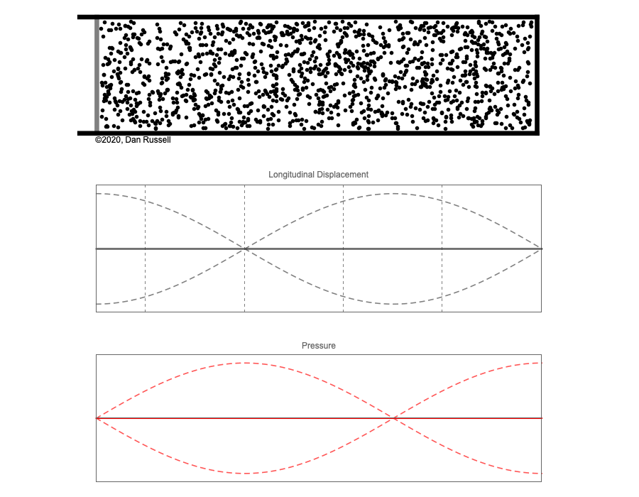

---

# Standing Waves - Closed Tube

#### 5th Harmonic

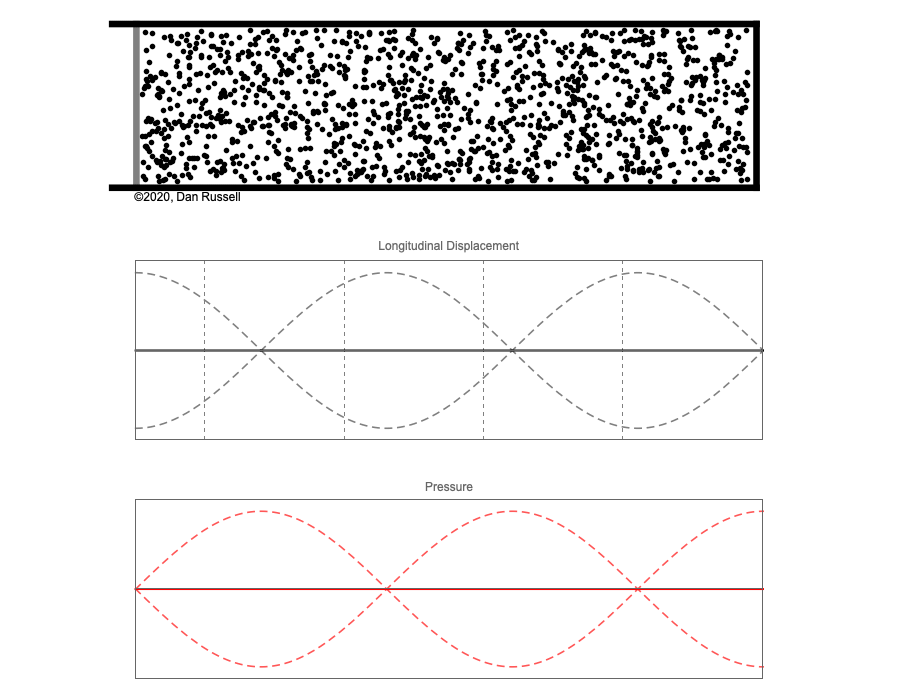

#### 7th Harmonic

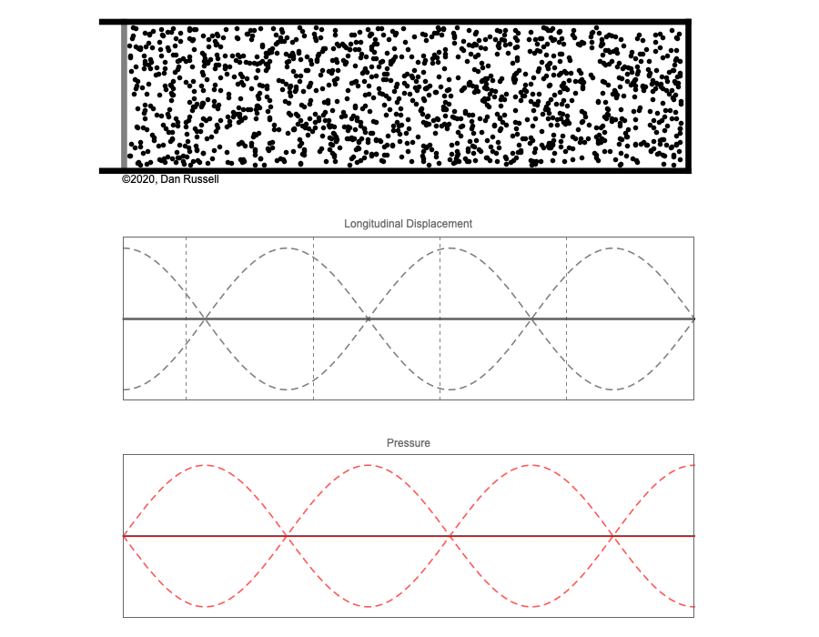

---

# Standing Waves 

* ***Standing waves*** are produced when two waves of the same frequency and amplitude travel in opposite directions in the same medium. 
* ***Nodes*** appear to be standing still.
* ***Anti-nodes*** vibrate between the maximum amplitude above and below the axis.
* Standing waves are often produced by reflection of a wave train at a fixed boundary of a medium.
* Standing waves are the result of the interference of two waves. 

---

# Resonance Demo 🔊 <!---fit--->

---

# Resonance 

* *Resonance* occurs when one vibrating body sympathetically causes another body to vibrate. 
* *Natural frequency* is a particular frequency that a body will vibrate if disturbed. 
* Musical instruments can change notes by making different resonant frequencies.  They do this by changing the length of the “tube” that vibrates creating standing waves of different lengths. 

---

# Doppler Effect Demo 🚓🚒 <!---fit--->

---

# The Doppler Effect

* The *Doppler Effect* is observed when the source or the observer of a wave is moving.
* When the source and observer are moving <mark>closer together</mark> the frequency of the wave is <mark>increased</mark>. 
* When the source and observer are **moving further** apart the frequency of the wave is **decreased**. 

---

# Doppler Effect 

#### Stationary Source

#### Moving Source 

---

# Doppler Effect - Sonic Boom

#### Mach 1 

#### Mach 1.4

