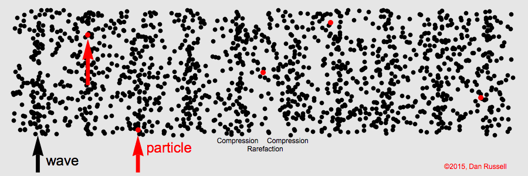
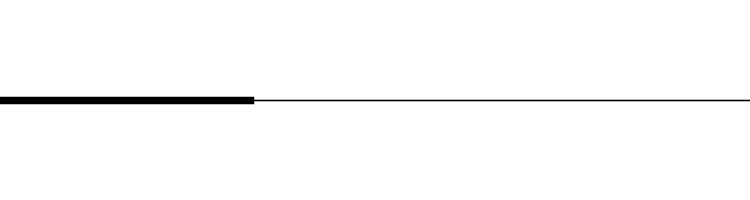
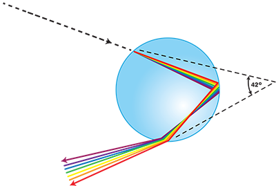

# Waves <!---fit--->

## A Model For Periodic Motion

---

# Quick Links 

1. [Speed of Sound Lab](#tube-resonance-lab---determine-speed-of-sound)

---

# Waves

* Sound 
* Visible 
* Ultraviolet 
* Radio 
* Gamma
* Infrared 
* X-Ray 
* Water Waves 
* Waves on a slinky 

* Waves on a string 
* Human Waves 
* Mechanical Waves 
* Electromagnetic Waves 
* Longitudinal Waves 
* Transverse 
* You!? 
* Waves are everywhere 

---

# A Wave...

> a *disturbance* or *variation* that **transfers energy** progressively from point to point in a medium and that may take the form of an elastic deformation or of a variation of pressure, electric or magnetic intensity, electric potential, or temperature.

---

# Initial Definitions 

* A *pulse* is a single vibratory disturbance which moves from point to point through a medium.
* A *wave* is several pulses generated at regular time intervals.

---

---

# A Wave 

---

# Another Wave 

---

# 💡 BIG IDEA 💡 <!---fit--->

# Waves transfer ***energy*** without transfering ***mass*** <!---fit--->

---

# Wave Classifications 

## Mechanical Waves 

- *Mechanical Waves* need a material medium to travel through 
    - i.e. medium such as water, string, air 

## Electromagnetic Waves 

- *Electromagnetic Waves* (such a light and radio waves) are periodic distrubances in an electromagnetic field and do not need a medium to travel through 
    - How the sun light gets to us through space!

---

# Wave Classifications 

## Longitudinal Waves 

- Particles in a *longitudinal wave* vibrate parallel to the direction of the wave motion.
- Examples:
    - Sound 
    - Seismic P-Waves
    - Slinky

## Transverse Waves

- Particles in a *transverse wave* vibrate perpendicular to the direction of waves. 
- Examples:
     - E&M Waves
    - Seismic S-Waves
    - Water Waves
    - Human Waves

---

---

# Water Waves

---

# Talk 🗣️ and Notes 📝 <!---fit--->

---

# Wave Characteristics 

* The ***frequency*** ($f$) is the number of waves passing a point per unit time. 
    - Frequency is measured in Hertz (Hz) or 1/s (s$^{-1}$)
* The ***period*** of a wave ($T$) is the time for one complete cycle to pass a point
    - It is the reciprocal of frequency. $T = \frac{1}{f}$, where $T$ is the period in second and $f$ is the frequency in hertz.

---

# Check Your Understanding 

What is the period of a $60$ Hz electromagnetic wave traveling at $3 \times 10^8$ m/s?

---

# Wave Characteristics 

- The ***wavelength*** ($\lambda$, greek lambda, "lamb-duh") is the distance between corresponding points in phase on successive waves. 
    - Measured in meters. 

---

# Wave Characteristics 

The **amplitude** of a wave is related to the energy of a wave.

* In a transverse wave it is defined as the maximum distance above, or below, the wave axis (or equilibrium position)
* In a *longitudinal wave* it is determined by the *maximum displacement* of a particle.
* As the amplitude of a *light wave* increases the *brightness* of the light increases.
* As the amplitude of a *sound wave* increases the *loudness* increases

---

# Check your understanding

Draw the following 4 waves: A, B, C, and D

1. A has twice the amplitude of B and half the period of B. 
2. B has twice the amplitude of C and C has 5 times the frequency of B. 
3. D has the same period of A, but half the amplitude. 
4. A should be drawn with 2 full waves 

---

# Pivot - Wave Speed Experiment <!---fit--->

---

# Wave Characteristics 

* The _**velocity**_ of a wave is determined by the medium it is traveling in
    * Example: Sound waves travel faster in water and solids than it does in air 
* Wave Equation: $v = f\lambda$ or $\lambda = \frac{v}{f}$
* For Electromagnetic (E&M) Waves: they move at the speed of light, $c$, in a vacuum.
    * $c = 3 \times 10^8$ m/s

---

# Check your understanding

1. The sound produced by a trumpet has a frequency of 440 Hz. What is the distance between successive compressions in the sound wave as it travels through the air at STP?
2. A stationary research  ship uses sonar to send a 1180 Hz sound wave down through ocean water. The reflected sound wave from the flat ocean bottom 324 meters below the ship is detected 0.425 s after it was sent from the ship
    1. Calculate the speed of the sound wave in the ocean water
    2. Calculate the wavelength of the sound wave in the water.
    3. Determine the period of the sound wave in the water.

---

# Wave Front 

- A *wave front* is the locus of adjacent points of a propogated wave that are in phase. 

---

# Wave Phase

- We can think of a wave cycle as 360 degrees
- If we look at the sine graph of a wave 

---

# Wave Phase

---

# Wave Phase 

---

# Pivot - Pulse Reflections <!---fit--->

---

# Pivot - Pulse "Collisions" <!---fit--->

---

# Pulse Reflections 

- Pulse at a fixed boundaary 
    - The pulse is inverted (flipped), amplitude remains the same, but opposite sign.

---

# Pulse Reflections 

- Pulse at a free boundaary 
    - The pulse is reflected and remains the same

---

# Pulse Reflections 

- From a low density to a high density:
    - Original pulse is reflected and inverted
    - A new pulse moves slower through the higher density medium.

---

# Pulse Reflections 

- From a high density to a low density:
    - Original wave is reflected and is not inverted
    - New pulse moves with a faster velocity through the lower density medium

---

# Interference

* ***Interference*** is the effect produced by two or more waves which are passing simultaneously through a region.
* ***Superposition*** is the resultant disturbance at any point is the algebraic sum of displacements due to individual waves.

---

# Interference 

---

<iframe src="http://physics.bu.edu/~duffy/HTML5/interference_of_pulses.html" width = "1100px" height = "900px" ></iframe>

---

# Constructive Interferece

- Occurs at points where path distances to the two different sources differ by an even number of half wavelengths.
    - This means a phase difference of 0º or 360º for maximum constructive interference. 

---

# Destructive Interference 

- Occurs when crests meet troughs or compressions meet rarefactions. 
    - This is where path differences to the two sources differ by an odd number of half wavelengths.
    - This is at 180º out of phase.

--- 

# Sound Wave Interference - Monopole

---

# Sound Wave Interference - Dipole 

---

# SWI - Lateral Quadrupole Source 

---

# Standing Waves 

---

# Standing Waves 

---

# Standing Waves - Soft Boundary 

---

# Standing Waves - Hard Boundary

---

# Standing Waves - Sound 

---

# Standing Waves - Closed Tube 

#### 1st Harmonic

#### 3rd Harmonic

---

# Standing Waves - Closed Tube

#### 5th Harmonic

#### 7th Harmonic

---

# Standing Waves 

* ***Standing waves*** are produced when two waves of the same frequency and amplitude travel in opposite directions in the same medium. 
* ***Nodes*** appear to be standing still.
* ***Anti-nodes*** vibrate between the maximum amplitude above and below the axis.
* Standing waves are often produced by reflection of a wave train at a fixed boundary of a medium.
* Standing waves are the result of the interference of two waves. 

---

# Resonance Demo 🔊 <!---fit--->

---

# Resonance 

* *Resonance* occurs when one vibrating body sympathetically causes another body to vibrate. 
* *Natural frequency* is a particular frequency that a body will vibrate if disturbed. 
* Musical instruments can change notes by making different resonant frequencies.  They do this by changing the length of the “tube” that vibrates creating standing waves of different lengths. 

---

# Tube Resonance Lab - Determine Speed of Sound

**Question**: What is the speed of sound? (closed end air column) 

**Purpose**: To determine the speed of sound using a closed end air column. 

**Lab write‐up includes** 

- *Title, Purpose and Essential Question*
- *Procedure*: should include step-by-step procedure and diagram of setup 
- *Data section*: should include collected data; data should be organized and labeled. Calculations of speed should be organized, labeled and clearly shown.
- Con*clusion and a Discussion of Results*:  should respond to the question raised in the Purpose section. The Discussion of Results should include an error analysis. The reliability of the results should be evaluated based upon the theoretical value for the speed of sound. A percent error calculation should be performed.

---

# Background Information

#### 1st Harmonic

- Resonant Frequencies will be the first harmonic
- Lube length = $\frac{\lambda}{4}$ (1/4 wavelength)
- Wave equation: $\boxed{v = f \lambda}$
    - We will graph as $L = v * \frac{1}{f}$ where $L = \frac{\lambda}{4}$
    * This means your slope is 4 $\times$ speed of sound
        - $\frac{\text{slope}}{4} = v_{sound}$
- Speed of Sound Theoretical:
    - $v = 331 + (0.6 T)$ 

---

# Tube Resonance Lab - Determine Speed of Sound

**Question**: What is the speed of sound? (closed end air column) 

**Purpose**: To determine the speed of sound using a closed end air column. 

**Lab write‐up includes** 

- *Title, Purpose and Essential Question*
- *Procedure*: should include step-by-step procedure and diagram of setup 
- *Data section*: should include collected data; data should be organized and labeled. Calculations of speed should be organized, labeled and clearly shown.
- Con*clusion and a Discussion of Results*:  should respond to the question raised in the Purpose section. The Discussion of Results should include an error analysis. The reliability of the results should be evaluated based upon the theoretical value for the speed of sound. A percent error calculation should be performed.

---

# Doppler Effect Demo 🚓🚒 <!---fit--->

---

# The Doppler Effect

* The *Doppler Effect* is observed when the source or the observer of a wave is moving.
* When the source and observer are moving <mark>closer together</mark> the frequency of the wave is <mark>increased</mark>. 
* When the source and observer are **moving further** apart the frequency of the wave is **decreased**. 

---

# Doppler Effect 

#### Stationary Source

#### Moving Source 

---

# Doppler Effect - Sonic Boom

#### Mach 1 

#### Mach 1.4

---

# Electromagnetic Spectrum 🌈 <!---fit--->

---

# 🌈 Electromagnetic Spectrum 

* Light waves are electromagnetic waves!
* All E&M waves move through a vacuum at $3 \times 10^8$ m/s
* The <mark>*electromagnetic spectrum*</mark> is the complete range of frequencies and wavelengths of electromagnetic waves.

---

# 📏 Some Facts 

* No sharp divisions between types of E&M waves.
* Classified by the methods that are used to generate them.
    * i.e. Radio waves are produced by charges accelerating in a wire.
* Microwaves are used in radar systems, for transmitting long distance telephone communications in space, and to cook food.
    * Microwaves that cook food produces a frequency that is the same as the natural rotational frequency of water molecules. 
* Infrared waves appear as heat when absorbed by objects. This is why we use infrared lamps to keep food warm!

---

# 📏 More Facts

* Visible light is about 1% of the E&M spectrum.
    * Produced by the rearrangement of electrons in atoms and molecules…more to come later.
    * The human eye can see from ~400 nm to ~700 nm
* Ultraviolet light causes sunburn! Ouch!
* X-rays are used as a diagnostic tool by physicians
* Gamma rays are emitted by radioactive nuclei. It is harmful to living tissue.

---

# Waves at Boundaries

* When a wave hits a boundary three different things can occur:
    * ***Reflection***: Waves bounce off the boundary 
    * ***Transmission***: Wave is transmitted into a new medium
    * ***Absorption***: energy of the wave is transferred into the boundary medium

---

# Light and Rays 

* We can model incoming light waves as “rays” or lines that represent the direction that our light wave is moving.
* When light interacts with objects several times larger than its wavelength, it travels in straight lines and acts as a ray 

---

# Law of Reflection 

* The angle that a light ray strikes a reflective medium is known as the *angle of incidence* or $\theta_i$
* The angle that a light ray reflects off of the medium is known as the *angle of reflection* or $\theta_r$
* The law of reflection states that the angle of incidence of a light ray is equal to the angle of reflection:
    * Mathematically: $\theta_i = \theta_r$

---

# Law of Reflection 

## The *Normal Line* 

- The *normal line*, often referred to as the normal, is an imaginary line that is perpendicular to the surface at the point of incidence.

---

# Specular Reflection 

* *Specular* (regular) Reflection: reflection off of smooth surfaces such as mirrors or a calm body of water.
* *Diffuse Reflection*: reflection off of rough surfaces such as clothing, paper, and an asphalt roadway.

  

---

---

---

# Refraction 

> *Refraction* is the bending of the path of light when it travels from one medium to another.

---

# Refraction 

* When light hits a boundary a portion of the light is reflected and a portion of the light is transmitted into the new boundary.
* In the new boundary the frequency remains the same, but the speed and wavelength change.
* In the new medium the path of light is bent.

---
<!-- _class: invert--->

# Why do we get rainbows? <!---fit--->

---

# 🌈 Refraction! 

---

# 🌈 Refraction & Reflection

--- 

# Why does light slow down?

...its complicated 

* Waves: oscillating particles & superposition 
* Quantum Mechanics...

---

# Index of Refraction 

* Speed of light is dependent upon the *optical density* of the material that it is traveling through:
    - Does not depend on actual density of material 
    - Greater optical density the slower the speed of light 
* The indicator of optical density is a material's ***index of refraction***
* $n_{material} = \frac{c}{v}$
    - $n$ ➡️ index of refraction
    - $c$ ➡️ speed of light ($3\times 10^8$ m/s)
    - $v$ ➡️ speed of light in new medium

---

# Index of Refraction (p. 2 ref table)

---

# 🤔 Check Yourself 

What is the speed of light in glycerol?

---

# What way does light bend?

* Light traveling from a fast to slow medium:
    - If light travels from a material with a low n to a higher n the light will bend towards the normal.
    - Example: Light traveling from air to water.
* Light traveling from a slow medium to a fast medium:
    - If a light travels from a medium with a high n to a lower n the light will bend away from the normal line.
    - Example: From Diamond to water.

---

# Snell's Law 

$$\boxed{n_1 \sin \theta_1 = n_2 \sin \theta_2}$$ 

- $n_1$ ➡️ index of refraction 1
- $n_2$ ➡️ index of refraction 2
- $\theta_1$ ➡️ angle of incidence
- $\theta_2$ ➡️ refracted angle 

# ***❗Remember to measure from the normal!*** 

---

# Practice 

Packet questions 2-4

--- 

# Snell's Law 

* Snell's Law: $n_1 \sin \theta_1 = n_2 \sin \theta_2$ 
* Remember $n = \frac{c}{v}$ which can be rearranged to $c = nv$
* So we can write Snell's Law as: $n_1v_= n_2v_2$
* Which can also be written as: $\frac{n_2}{n_1} = \frac{v_1}{v_2} = \frac{\lambda_1}{\lambda_2}$

---

<!--_class: invert--->

# Let's take a look at [Kay's Pizza](https://www.google.com/maps/place/Kay's+Burden+Lake+Restaurant/@42.6048538,-73.5626363,175m/data=!3m1!1e3!4m6!3m5!1s0x89de0749b4d5a9d3:0xa82ca515de6bba27!8m2!3d42.6049876!4d-73.5633467!16s%2Fg%2F1tgq7nfs?entry=ttu) <!---fit--->

---

# Diffraction 

- *Diffraction* is the spreading of waves into a regio behind a barrier in the wave's path

---

# Wave Behavior Summary:

* *Reflection*: Waves bounce off of a new medium.
* *Refraction*: Waves bends in a new medium.
* *Diffraction*: Waves change direction of when traveling through an opening or around an obstacle. 

---

# ❓ Why is Diffraction Important?

* Newton believed that light was made of a stream of particles of called corpuscles. 
    * This was the corpuscular theory of light.
* Diffraction proved that light behaved like a wave. 

---

# Young's Double Slit Experiment

- The year was 1801…
- And Thomas Young proved that light behaved as a wave.
- A two-point interference pattern always has alternating pattern of nodal and anti-nodal lines. 

---

## Young's Double Slit 

<iframe width="1100" height="700" src="https://www.youtube.com/embed/Iuv6hY6zsd0" title="YouTube video player" frameborder="0" allow="accelerometer; autoplay; clipboard-write; encrypted-media; gyroscope; picture-in-picture; web-share" allowfullscreen></iframe>

---

# Diffraction 

* The amount of diffraction depends on:
    * Wavelength
    * Slit size
* The relationship for both are:
    * Larger wavelength = more diffraction
    * Smaller Slit = more diffraction

$$ d \sin \theta = n \lambda$$
